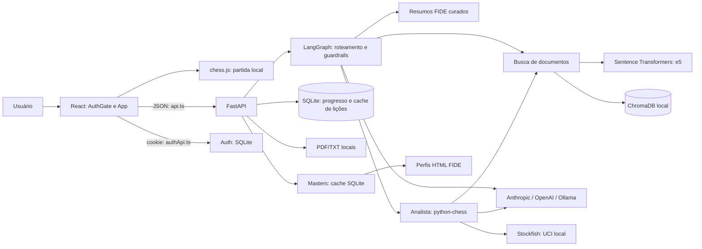
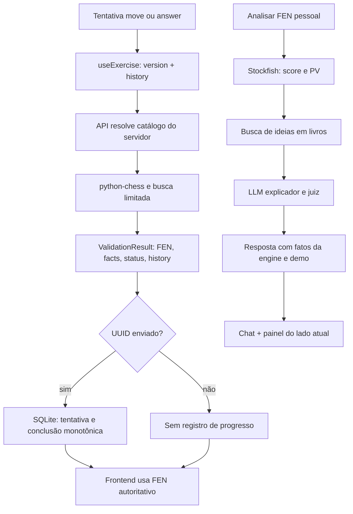

# Auditoria do Projeto

Data: **05/10/2026**, contexto do usuário em America/Sao_Paulo. Escopo: estado da cópia local, código rastreado, configurações, dependências, assets, testes e documentação. O repositório começou sem alterações indicadas por `git status --short`.

Foram inventariados 290 arquivos rastreados; fontes, testes e configurações textuais foram lidos, e assets binários foram inventariados por caminho/tamanho. Documentos e bancos locais ignorados pelo Git foram inspecionados apenas quanto à existência e estrutura/contagens necessárias. Não foram consultados valores privados de `.env`, senhas, hashes de usuários ou tokens de sessões. Documentos acadêmicos privados e internals de `.git`/dependências geradas não são código do produto.

Esta auditoria combina **evidência estática** e **verificação automatizada local**. “Implementado” significa encontrado no código; “funcionando” está limitado ao que os testes/build comprovaram. Não houve execução integrada em navegador, chamadas reais ao LLM/FIDE, reingestão, instalação de dependências ou alteração funcional. Onde falta evidência operacional, registra-se **não foi possível confirmar**. Todas as recomendações abaixo permanecem propostas.

## 1. Resumo executivo

Xadrez Multiagente é um tutor de xadrez com uma arena manipulável pelo usuário, análise Stockfish, perguntas documentais, indicações de leitura, demonstrações, 12 lições e seis exercícios fixos. O frontend React apresenta esses recursos; a API FastAPI responde consultas, valida prática e persiste parte do progresso.

**Magnus e Hans são nomes dos lados e dos painéis visuais.** A partida normal só avança por `Board.onLance`, após movimento feito pela pessoa. Não há laço de decisão de dois agentes, bot de resposta na partida, engine dedicada a cada personagem, partida remota ou comunicação por WebSocket. Os agentes reais são papéis de linguagem com roteamento documental, não os jogadores anunciados em algumas descrições da interface.

| Categoria | Estado encontrado | Evidência |
| --- | --- | --- |
| Implementada e verificada localmente | Build, movimentos/controles, componentes e fluxos pedagógicos cobertos por 190 testes frontend aprovados | `frontend/src/**/*.test.*`, resultado da seção 19 |
| Implementada, operação externa não confirmada | Tutor/LLM/RAG aberto, análise completa, atualização FIDE | `backend/agents/`, `llm.py`, `retrieval.py`, `masters.py` |
| Parcial | Entrada protegida só no frontend; progresso anônimo; formulário de cadastro desativado; área separada de curiosidades | `auth/`, `backend/main.py`, `App.tsx` |
| Código aparentemente fora do produto atual | `Avatar`, `Sidebar`, coleção textual de curiosidades, tiles da prévia e algumas funções auxiliares | Seção 21 |
| Documentação sem implementação correspondente | Magnus/Hans autônomos, RAGAS/golden set completo, backend de partidas/comentários | `Sobre.tsx`, `PROMPTS.md`, inventário de rotas |
| Conteúdo fixo/demonstrativo | Biografias, catálogo de exercícios, resumos FIDE, demonstrações, carrossel, comentário/like | Seções 12–15 e 21 |

O frontend compila, mas a suíte não está inteiramente verde: **190 aprovados / 1 falha**. O backend tem extensa suíte no repositório, mas não foi possível executá-la no Python apropriado disponível. Nesta cópia há quatro documentos locais, três coleções com **775 trechos** e cache de três ratings; um clone do Git não recebe esses dados.

## 2. Arquitetura atual

### Camadas e comunicação

- **Entrada:** `frontend/src/main.tsx` importa fontes/CSS e monta StrictMode, AuthProvider e AuthGate.
- **Produto:** `App.tsx` mantém áreas por hash, partida, chat, lições, demonstrações, análises, modais e exercício separado.
- **HTTP:** `api.ts` usa `fetch`, JSON e AbortController; `auth/authApi.ts` usa `credentials: include`. Chamadas de xadrez não enviam explicitamente credenciais entre origens.
- **API:** `backend/main.py` inclui routers de auth, Masters e exercises. Pipeline bloqueante de linguagem/engine roda no threadpool; exercícios/Masters/auth usam endpoints síncronos FastAPI.
- **Xadrez:** chess.js no cliente; python-chess no servidor; Stockfish local via UCI.
- **Linguagem:** grafo LangGraph classifica/encaminha/verifica. LangChain fornece clientes dos três provedores.
- **Conhecimento:** referências curadas ou Sentence Transformers + ChromaDB; biblioteca local PDF/TXT para leitura original.
- **Persistência:** SQLite e ChromaDB no disco do servidor. Sem ORM, servidor de banco externo, worker de fila ou infraestrutura de deploy encontrada.



Não há aresta de decisão automática entre Magnus/Hans e `CJ`: os nomes pertencem à apresentação. A autenticação está num ramo separado e não é dependência das rotas pedagógicas.

### Configurações completas

`backend/config.py:Settings` lê `.env` da raiz e de `backend`, ignorando campos extras; ambiente de processo também é suportado. Todos os nomes abaixo podem ser definidos em maiúsculas. Valores são padrões **do código**, não valores privados da instalação.

| Grupo | Variáveis e padrões |
| --- | --- |
| Provedor | `LLM_PROVIDER=anthropic`; `OPENAI_API_KEY` e `ANTHROPIC_API_KEY` vazias; `OPENAI_MODEL=gpt-4o-mini`; `OLLAMA_MODEL=llama3.1` |
| Papéis Anthropic | `CLASSIFIER_MODEL=claude-haiku-4-5-20251001`; `AGENT_MODEL=claude-sonnet-5-5`; `JUDGE_MODEL=claude-haiku-4-5-20251001`; `ANTHROPIC_EFFORT=low` |
| Limites de linguagem | `LLM_TIMEOUT=60`; `LLM_TIMEOUT_RAPIDO=15`; `LLM_MAX_TOKENS=4000` |
| Busca | `MIN_SCORE=0.79`; `EMBEDDING_MODEL=intfloat/multilingual-e5-base`; `PREFIXO_CONSULTA='query: '`; `PREFIXO_DOCUMENTO='passage: '` |
| Caminhos de corpus | `DOCS_DIR=backend/docs`; `CHROMA_DIR=backend/chroma` (paths absolutos derivados de BASE_DIR) |
| Guardrails | `MAX_PERGUNTA=500`; `MAX_FEN=100`; `MAX_RESPOSTA=3000`; `VERIFICAR_FUNDAMENTACAO=true`; `LOG_GUARDRAILS=backend/logs/guardrails.jsonl` |
| API | `TIMEOUT_REQUISICAO=30`; `RATE_LIMIT=20/minute`; `CORS_ORIGENS=["http://localhost:5173"]`; `ADMIN_TOKEN` vazio |
| Bancos | `DB_PROGRESSO=backend/progresso.sqlite`; `DB_AUTH=backend/auth.sqlite` |
| Inicialização/auth | `AUTH_COOKIE_SECURE=false`; `AQUECER_NA_INICIALIZACAO=true` |
| Engine | `STOCKFISH_PATH=/opt/homebrew/bin/stockfish`; `STOCKFISH_TEMPO=1.0` |
| Masters, fora de Settings | `MASTERS_CACHE_PATH`: `os.environ` ou `backend/masters-ratings.sqlite`; TTL constante 86400 s |
| Frontend | `VITE_API_URL=http://localhost:8000`; `BASE_URL` é valor do Vite usado por imagens públicas |

A variável de Masters deve estar no ambiente do processo (por exemplo, exportada no terminal). Apenas escrevê-la no `.env` não implica que `os.environ` a receba. `.env.example` documenta só parte das opções; não registra auth, CORS, bancos, aquecimento ou Masters. Não há declaração de versão mínima Python em `pyproject.toml` nem dependências Python travadas em lockfile.

### Inicialização e execução

Comandos reais estão no README: venv Python 3.11 em `backend`, `pip install -r requirements.txt`, corpus/`python ingest.py` quando necessário, `python configure_owner.py`, `uvicorn main:app --reload`; em `frontend`, `npm ci` e `npm run dev`. FastAPI cria tabelas de progresso no lifespan e carrega embeddings/abre Chroma se habilitado; auth cria tabelas ao conectar. Uma falha de download/cache do modelo pode impedir a API inteira de subir, incluindo login e exercícios que não precisam dele.

## 3. Fluxo completo da aplicação

1. Vite entrega `index.html`; React monta AuthProvider e AuthGate em StrictMode.
2. AuthProvider remove a antiga chave de sessão demo e chama `GET /auth/session` com cookie. Uma falha deixa o usuário sem autenticação; não há sessão offline simulada.
3. AuthGate aguarda a verificação. Sem usuário, aceita `#/login` e `#/cadastro`; outros hashes redirecionam para login. Autenticado em login/cadastro ou sem hash, redireciona para `#/partida`.
4. AuthPage valida campos e chama login; cadastro passa pela validação visual, mas `register()` lança erro de recurso desativado. Login correto muda hash e usuário do Context.
5. App monta FEN inicial e histórico `[FEN_INICIAL]`, sem buscar partida no backend. StatusSaude consulta `/health`, repetindo a cada 60 s.
6. Se existe UUID no localStorage, consulta a lição atual uma vez; 400 apaga UUID inválido, outros erros são silenciosos nesse efeito. Não há relação entre esse UUID e a conta autenticada.
7. Usuário move peça; chess.js valida, devolve FEN e App acrescenta histórico. Não ocorre chamada HTTP por lance normal.
8. Pedir análise envia apenas o FEN atual da partida. Resultado vai para o chat e para o painel do lado que jogava na posição analisada; depois de um lance aparece indicação de análise antiga.
9. Tutor mantém mensagens locais, envia apenas a pergunta atual e FEN opcional. “Qual documento me ajuda?” chama `/recomendar`, que pode usar classificador LLM mesmo sem redigir resposta por agente.
10. Lições usam UUID e `/licao/proxima`; cache é compartilhado entre usuários. Avanço ocorre somente com fontes, sem prova de leitura/domínio.
11. Demonstração coloca o tabuleiro em modo de leitura e toca passos a cada 1200 ms. Histórico pessoal continua intacto.
12. Prática fecha o modal/demo e carrega um exercício fixo. O servidor controla FEN/history resultantes. Fechar prática restaura o tabuleiro pessoal.
13. Navegar para Masters/Lições/Sobre/Curiosidades/home define pausa. A arena permanece montada e oculta; efeitos de componentes montados, como polling de saúde/carrossel, podem continuar.
14. Logout revoga sessão e desmonta App; UUID fica no navegador. Partida/chat em memória se perdem. Não há expiração de sessão acompanhada por polling no frontend.

## 4. Inventário de telas e rotas

Arquivo coordenador das áreas autenticadas: `frontend/src/App.tsx:46–49`, `pageFromHash`. Hashes não reconhecidos caem na partida. Arquivo coordenador de acesso: `auth/AuthGate.tsx`. A barra muda hashes com âncoras; não há roteador com contrato centralizado.

| Nome / URL | Arquivos/componentes | Funcionalidades e backend | Estado e problemas |
| --- | --- | --- | --- |
| Login `/#/login` | AuthGate, AuthPage, AuthContext, authApi | Validação, mostrar senha, POST login, GET sessão | loading, user, errors, submitting; depende da API; cookie só em `/auth` |
| Cadastro `/#/cadastro` | AuthPage `register=true` | Campos nome/e-mail/senha/confirmação; nenhum endpoint de criação | errors/showPassword; submissão sempre recusa; texto “É uma demo” diverge do acesso pessoal |
| Partida `/#/partida` e `/#partida` | App, Board, MatchControls, AgentHeaderCard, CurrentTurn, MoveHistory, AgentThinking | Movimentos locais; `/analisar`, health; acesso a tutor/lições | histórico FEN, pausa, índice, clocks, análises; não há bots nem gravação da partida |
| Histórico `/#historico-partida` | MatchArena.MoveHistory, MatchControls | Expande details e mostra posições gravadas, sem backend | expanded/selectedPosition/historyPlaying; não é histórico de várias partidas |
| Análises `/#agentes` | AgentThinking em MatchArena | Dados de `/analisar` já recebidos; links de documentação | analyses por w/b; extração por regex do texto, sem contrato numérico dedicado |
| Masters `/#/masters` | Masters.tsx + Masters.css | GET `/masters/ratings`; três cartões/biografias locais | ratings/loading; atualiza quando visible passa a true, sem polling diário no cliente |
| Lições `/#/licoes` | App lessonsContent, Licao, RespostaDoAgente, Carregando | GET atual/POST próxima; CTAs de prática/demo | licao/lessonError/esperando; catálogo de exercícios só acessível por associações |
| Sobre `/#/sobre` | App + ContentModal + Sobre(section=about) | Abre modal, sem API direta | modal/page; não existe seção de página com esse conteúdo; arena fica oculta; texto promete autonomia não implementada |
| Curiosidades `/#/curiosidades` | App, seção standalone | Frase “Este espaço vai reunir…”; sem API | page; placeholder; sem link na navegação atual |
| Home autenticada `/#/` | App seção home | Chamada visual “Iniciar partida”; sem API | page; login redireciona à arena, não à home |
| Tutor, sem URL própria | ContentModal, Chat, Mensagem, Fontes, OndeLer, ContextoModal | `/chat`, `/recomendar`, `/documentos/.../contexto` | itens do App, texto/modo/anexar locais; histórico não enviado ao LLM |
| Lições em modal, sem URL própria | ContentModal + lessonsContent | Mesmos endpoints de lições | mesmo estado compartilhado da área de Lições |
| Comentário/like, sem URL própria | ContentModal + CommentLike | Nenhuma API | liked/comment/feedback locais; envio explicitamente demonstrativo |
| Documentação, sem URL própria | ContentModal + Sobre(section=documentation) | Links a análises e tutor, sem arquivo Markdown carregado | fontes tooltip; não é página da documentação FastAPI nem renderização do README |
| Curiosidades em modal | ContentModal em App | Apenas placeholder | Existe ramo modal, mas gatilho atual não localizado; carrossel não o abre |
| Atalhos flutuantes | FloatingAction + InteractiveCard | Abrem tutor/lições | ocultos quando algum modal abre; imagens PNG locais |

Os hashes de partida têm grafias inconsistentes: `practiceFromArea`/`demonstrationFromArea` escrevem `#partida`, login escreve `#/partida`, HeaderNavigation usa `#partida`. Ambos funcionam pelo fallback; indicação `aria-current` pode não coincidir após login. Não há rota dedicada Magnus, Hans, análises HTTP do frontend, exercícios ou biblioteca. `/docs`, `/redoc`, `/openapi.json` pertencem à API, no domínio/porta do backend.

## 5. Inventário de componentes

Prefixo dos caminhos de apresentação: `frontend/src/`. “Ativo” significa montado/importado pelo produto atual, mesmo se temporariamente hidden. Dependências globais React/TypeScript não são repetidas em toda linha.

| Arquivo/export | Responsabilidade e onde usado | Props principais / estado / dependências | Situação e comportamento |
| --- | --- | --- | --- |
| `App.tsx` App | Coordena todas as áreas autenticadas | onLogout; useState/useRef/useMemo; api/useExercise/useMatchLayout | Ativo, concentra estado e orquestração; não persiste partida |
| `auth/AuthContext.tsx` AuthProvider/useAuth | Sessão em main/AuthGate/AuthPage | children; user/loading; authApi | Ativo; restaura sessão real, registro desativado |
| `auth/AuthGate.tsx` AuthGate | Guarda visual de entrada | hash/logoutError, useAuth | Ativo; não autoriza endpoints backend |
| `auth/AuthPage.tsx` AuthPage | Formulários login/cadastro | register; errors/submitting/showPassword; imagens | Ativo; cadastro só UI, valida antes de negar |
| `components/Board.tsx` Board | Tabuleiro em App | fen, modo, ocupado, callbacks, exercicio/exibicao; selecionada; react-chessboard/chess.js | Ativo; três modos; exercício nunca move otimisticamente |
| `components/BoardControls.tsx` | Analisar/desfazer/reiniciar em MatchControls e modo Board compatível | ocupado/podeDesfazer/callbacks; sem estado | Ativo; não aplica melhor lance automaticamente |
| `match/MatchControls.tsx` | Navegação/reprodução/pausa | index/total/paused/disabled e callbacks | Ativo; controles da partida, não relógio competitivo |
| `match/MatchArena.tsx` PixelAvatar | Avatar SVG em cards/turno/análises | side/size/context; AVATARES/Sprite; memo | Ativo; personagens das grades |
| Mesmo arquivo, AgentHeaderCard | Cabeçalho Magnus/Hans em App | side/active/seconds | Ativo; contador de atividade recebido, sem countdown |
| Mesmo arquivo, CurrentTurn | Turno/estado de exibição na lateral | side/label | Ativo; usa lado do FEN mostrado |
| Mesmo arquivo, MoveHistory | Lista SAN da partida local | moves/selected/onSelect/disabled; expanded e matchMedia | Ativo; details responsivo e botões de posições |
| Mesmo arquivo, AgentThinking | Resumo e detalhes da análise | side/analysis/busy/stale; textoDaAnalise | Ativo; parseia strings com regex; não vê raciocínio interno do modelo |
| Mesmo arquivo, Sidebar | Navegação vertical antiga | Sem props/estado | Export sem consumidor localizado no produto; aparentemente legado |
| `match/useMatchLayout.ts` | Medição responsiva usada por App | active; ref/mobile; ResizeObserver/visualViewport | Ativo; escreve variável CSS `--chrome-h`; só apresentação |
| `components/Chat.tsx` | Tutor no modal | itens/esperando/onEnviar/onVerNoTabuleiro/onPractice; texto/anexar/modo | Ativo; Enter envia, Shift+Enter quebra linha, limite 500 |
| `components/Mensagem.tsx` Pergunta/RespostaDoAgente | Mensagens em Chat/Lições | texto ou resposta/erro/callbacks; sem estado local | Ativo; negrito simples como elementos React, fontes/confiança/CTAs |
| `components/Fontes.tsx` | Fontes expandíveis em Mensagem | fontes; aberta; idioma/Sprite | Ativo; Stockfish identificado como engine, sem link PDF próprio |
| `components/OndeLer.tsx` | Leitura documental em Mensagem | itens; aberto; urlDoDocumento | Ativo; PDF em nova aba, TXT em modal contextual |
| `components/ContextoModal.tsx` | Contexto TXT em OndeLer | item/onFechar; contexto/erro; api | Ativo; Escape/foco inicial; outer modal ajuda a conter foco |
| `components/TextoComDestaque.tsx` | Marca substring em trecho | texto/destaque; sem estado | Ativo; não injeta HTML |
| `components/Carregando.tsx` | Espera no chat/lições | tipo; segundos; etapas.ts | Ativo; mensagens de etapa são estimativas pelo tempo, sem telemetria servidor |
| `components/Licao.tsx` | Lição/avanço em lessonsContent | licao/concluido/ocupado/onProxima/relatedExerciseIds/onPractice | Ativo; não exige exercício para próxima lição |
| `components/RelatedPractice.tsx` | CTAs em Mensagem/Licao | ids/onPractice/disabled; labels fixos | Ativo; deduplica IDs; sem catálogo navegável geral |
| `components/ExercisePanel.tsx` | Estado/feedback/prévia de exercícios no App | state/visual/callbacks; passo/progress/progressError; api/chess.js | Ativo; SIM/NÃO, dicas, refutação, consulta progresso após resultado |
| `exercises/useExercise.ts` | Sessão de prática em App | reducer + refs atual/geracao/ocupado | Ativo; ignora respostas de geração antiga, bloqueia duplicatas simultâneas |
| `components/Reprodutor.tsx` | Reprodução de demonstração | descricao/passos/passo/tocando/callbacks | Ativo; estado no App, animação via timeout 1200 ms |
| `components/ContentModal.tsx` | Shell de todos os modais principais | id/title/open/onClose/children/returnFocusRef | Ativo; Escape, Tab, scroll lock, restaura foco; mantém filhos montados quando hidden |
| `components/InteractiveCard.tsx` | Botão/tooltip em CTAs e FloatingAction | button props/action/tooltipTitle/ref; hovered/focused/dismissed/position | Ativo; tooltip por portal, adapta posição, Escape dispensa |
| `components/FloatingAction.tsx` | Atalhos do App | title/label/icon/onClick | Ativo; envolve InteractiveCard, sem lógica de backend |
| `components/HeaderNavigation.tsx` | Menu do header | onExit; active/open/preferences | Ativo; onLessons/onCuriosities declarados mas não usados; preferences nunca recebe true |
| `components/BrandLogo.tsx` | Logo em header | Sem props/estado; imagem pública | Ativo; âncora #partida |
| `components/StatusSaude.tsx` | Luz/latência do header | saude/latencia/offline; intervalo 60 s | Ativo; não testa chamada real ao LLM, só disponibilidade declarada |
| `components/Masters.tsx` | Página Masters | visible; ratings/loading; imagens/API/CSS | Ativo; evita fetch quando invisível; biografias fixas |
| `components/CuriositiesCard.tsx` | Carrossel na arena | index/previous/hovered/focused/remaining | Ativo; quatro PNGs, 10 s, preserva tempo restante ao pausar |
| `components/CommentLike.tsx` | Modal de interação demonstrativa | liked/comment/feedback | Ativo; sem persistência, mensagem explícita de não publicação |
| `components/Sobre.tsx` | Sobre/documentação | section/onTutor/onAnalyses; tooltip hover/focus | Ativo; texto de autonomia/privacidade desatualizado |
| `components/Avatar.tsx` | Avatar antigo por gelo/fogo | lado; Sprite/AVATARES | Import de componente não localizado; substituído visualmente por PixelAvatar |
| `pixel/Sprite.tsx` | Renderiza grade como SVG | grade/paleta/rotulo/tamanho/margem/className | Ativo em peças, ícones e avatares |
| `pixel/PecaSprite.tsx`, `pixel/pecas.ts` | Peças personalizadas do react-chessboard | lado/tipo; mapa PECAS_DO_TABULEIRO | Ativos; rótulos acessíveis em português |

Módulos ativos de apoio: `lances.ts` (regras locais), `demonstracao.ts` (SAN e passos), `idioma.ts` (rótulos/texto), `acessibilidadeTabuleiro.ts` (MutationObserver que traduz mensagens de arraste), `armazenamento.ts` (UUID), `types.ts` (contratos), `exercises/estado.ts` (reducer), `visual.ts` (facts para casas), `pedagogia.ts` (feedback fixo), `refutacao.ts` (replay seguro). Fixtures em `src/testes/` pertencem à verificação, não são a origem dos dados de produção.

## 6. Inventário do backend

### Contratos gerais

`backend/schemas.py` define `Resposta`: resposta, fontes, agente, confianca, onde_ler, demonstracao, concept_ids e related_exercise_ids. Sem fontes, confiança maior que zero é recusada. `RespostaLicao` envolve usuário, conclusão, metadados, conteúdo e associações.

`backend/exercises/models.py` usa unions discriminadas para goal/action/fact, `extra=forbid`, frozen e números/booleanos estritos. `ValidationResult` contém status (`correct/incorrect/partial`), resulting_fen, facts, next_hint (opcional, não preenchido pelos validadores atuais) e history UCI. Erros são `{code,message}`.

### Todos os endpoints implementados

Abreviações de chamadas frontend são métodos de `src/api.ts`, exceto authApi. Sem autenticação significa ausência de validação de sessão na rota; CORS continua aplicável ao navegador.

| Método / rota | Arquivo / função | Entrada | Resposta | Autenticação / limites | Consumidor frontend |
| --- | --- | --- | --- | --- | --- |
| GET `/health` | `main.py:health` | Sem parâmetros | Saude: status, stockfish, indices, chave_api, llm_provider | Nenhuma; sem rate limit | api.saude → StatusSaude |
| POST `/chat` | `main.py:chat` | EntradaChat: mensagem (schema até 2000), fen opcional (até 200); guardrails 500/100 | Resposta | Nenhuma; rate_limit e timeout de pipeline | api.perguntar → App.perguntar/Chat |
| POST `/recomendar` | `main.py:recomendar` | EntradaRecomendacao: mensagem | Resposta com fontes curadas OU onde_ler | Nenhuma; rate_limit/timeout | api.recomendar → modo de leitura do Chat |
| POST `/analisar` | `main.py:analisar`, `analisar_fen` | EntradaAnalise: fen | Resposta de Analista ou bloqueio | Nenhuma; rate_limit/timeout | api.analisar → controles/App.analisar |
| GET `/progresso/exercicios` | `main.py:progresso_dos_exercicios` | query usuario_id UUID obrigatório | Lista ProgressoExercicio | Nenhuma; rate_limit | api.progressoExercicios → ExercisePanel |
| POST `/licao/proxima` | `main.py:licao_proxima`, `entregar_proxima` | usuario_id opcional; cria UUID se ausente | RespostaLicao; avança só com fontes | Nenhuma; rate_limit/timeout | api.proximaLicao → App/Licao |
| GET `/licao/atual` | `main.py:licao_atual`, `ler_atual` | query usuario_id obrigatório | RespostaLicao; 404 sem lição anterior | Nenhuma; rate_limit/timeout | api.licaoAtual → retomada no App |
| GET `/documentos/{nome}` | `main.py:documento` | nome de arquivo na allowlist | FileResponse inline PDF/TXT, nosniff | Nenhuma; rate_limit | urlDoDocumento → link PDF OndeLer |
| GET `/documentos/{nome}/contexto` | `main.py:contexto_do_trecho` | nome e query chunk_id | ContextoDoTrecho: antes/trecho/depois e metadados | Nenhuma; rate_limit | api.contexto → ContextoModal |
| POST `/ingest` | `main.py:ingest`, `reingerir` | header X-Admin-Token | `{chunks: {indice: quantidade}}` | ADMIN_TOKEN não vazio e compare_digest; 1/minute; sem timeout de 30 s | Não consumido pelo frontend |
| POST `/auth/login` | `auth.py:login` | Login: email até 254, password 1–1024 | `{name,email}` + cookie; 401 incorreto | Sem sessão prévia; Origin validado se presente; 5/minute | authApi.login → AuthContext |
| GET `/auth/session` | `auth.py:session` | Cookie xadrez_session opcional | `{name,email}` ou null | Valida hash/expiração do cookie; sem rate limit | authApi.session → AuthProvider |
| POST `/auth/logout` | `auth.py:logout` | Cookie opcional, corpo não usado | `{ok:true}`, remove cookie/sessão | Origin validado se presente; funciona sem sessão | authApi.logout → AuthContext/HeaderNavigation |
| GET `/masters/ratings` | `masters.py:ratings`, `get_ratings` | Sem parâmetros | RatingsResponse: updated_at, masters, stale, source | Nenhuma; sem slowapi; TTL próprio | api.mastersRatings → Masters |
| GET `/exercises/{exercise_id}` | `exercises/api.py:read_exercise` | exercise_id do catálogo | Exercise; 404 se ausente | Nenhuma; sem slowapi | api.exercicio → useExercise.carregar |
| POST `/exercises/{exercise_id}/validate` | `exercises/api.py:validate_exercise` | ValidationRequest: version, action, history; query usuario_id UUID opcional | ValidationResult; registro opcional de tentativa | Nenhuma; sem slowapi/timeout do pipeline | api.validarExercicio → useExercise.tentar |
| POST `/exercises/{exercise_id}/hint` | `exercises/api.py:request_hint` | HintRequest: version, history, last_action opcional, current_hint_level 0–3 | `{next_hint: Hint ou null}` | Nenhuma; sem slowapi/timeout do pipeline | api.dicaExercicio → useExercise.pedirDica |

Rotas automáticas de `FastAPI(title="Xadrez Agente")`: **GET `/openapi.json`**, **GET `/docs`**, **GET `/docs/oauth2-redirect`** e **GET `/redoc`**; documentação/schema públicos, sem OAuth configurado nem consumidor no frontend. Métodos auxiliares automáticos dependem da versão FastAPI; o método relevante de documentação é GET. Não existe `/auth/register`, endpoint de jogada normal, criação/listagem de partidas, comentários, likes, usuários públicos ou listagem geral de exercícios.

### Erros e serviços

- Main normaliza 422, 404/405, 429, 503, 504 e 500 para Resposta. Rotas de exercícios têm handlers próprios e wrapper APIRoute que normaliza erros esperados.
- `ingerindo` é um threading.Event; pipelines recusam durante reingestão. Não bloqueia atomicamente todas as buscas em outros workers nem cálculos já iniciados.
- `obter_llms()` retorna dependência substituível nos testes; não instancia cliente antes da requisição.
- `executar()` usa `asyncio.wait_for(run_in_threadpool(...))`; timeout devolve 504, mas não interrompe a thread.
- `tem_chave_api()` só verifica string da chave; para provedor desconhecido considera valor padrão positivo. Não comprova acesso/modelo funcional.
- Exercícios são stateless; persistência é callback `app.state.exercise_recorder`. SQLite de progresso é inicializado no lifespan da aplicação principal.

## 7. Fluxo de dados

### Pergunta documental

```mermaid
sequenceDiagram
  participant U as Usuário
  participant UI as Chat/App
  participant API as FastAPI
  participant R as Router/Guardrails
  participant D as Referências ou Chroma
  participant L as LLM agente/juiz
  U->>UI: Pergunta e opção de anexar posição
  UI->>API: POST /chat: mensagem, fen?
  API->>R: Threadpool com timeout
  R->>R: Limpeza, limites e padrões
  R->>L: Classificação de tema/injeção
  R->>D: Índice escolhido; fallback se necessário
  D-->>R: Trechos e metadados controlados
  R->>L: Redigir a partir de trechos; verificar fontes
  L-->>R: Saída estruturada e veredito
  R->>R: Checar saída e associar prática/demo
  R-->>API: Resposta
  API-->>UI: JSON
  UI-->>U: Texto, confiança, fontes e CTAs
```

Lições com categoria fixa pulam entrada/classificador, pois usam perguntas controladas. Recomendações usam classificador, mas não agente de redação/juiz. Leitura original consulta arquivo/trecho; não precisa gerar texto novo com LLM.

### Exercício e análise



Requisição não inclui soluções fornecidas pelo cliente, catálogo mutável, identidade autenticada ou seleção de defesa adversária. Na partida normal, o fluxo encerra no chess.js/frontend; servidor só participa quando a pessoa pede recursos pedagógicos/análise.

## 8. Sistema de xadrez

### Representação, movimentos e histórico

`frontend/src/lances.ts` cria FEN inicial com Chess. Cada movimento recria `new Chess(fen)`, executa `.move({from,to,promotion:"q"})` e devolve FEN. Clique destaca destinos legais e seleciona peças do lado a jogar; drag inválido retorna false. Roque, en passant e xeque são delegados a chess.js. Não há seletor de promoção: sempre dama.

`App.tsx:57` guarda array de FENs. `recordedMoves()` em MatchArena reconstrói SAN procurando, entre movimentos legais da posição anterior, aquele cujo `after` coincide com o FEN seguinte. Não existe PGN persistido, exportação, abertura de FEN arbitrário pela arena, importação de partidas ou sincronização entre usuários.

**Limitação de repetição:** recriar Chess de cada FEN descarta a pilha de lances. `situacao()` também usa Chess(fen); FEN sozinho não preserva informação suficiente para empate por repetição tripla. Regras dependentes de contadores podem usar halfmove do FEN, mas não equivalem a um histórico completo. O backend analisa FEN isolado, com a mesma falta de histórico para repetição.

### Magnus e Hans

`MatchArena.tsx:agent` mapeia w → Magnus/gelo, b → Hans/fogo; cabeçalho/turno usam isso. `analyses` do App guarda uma resposta por lado associada ao FEN. Não existe prompt “Magnus” ou “Hans” no backend, personalização de estilo de jogo por personagem nem cálculo de adversário na partida normal.

`activity` incrementa a cada segundo para o lado da vez após o primeiro movimento, se não pausado/observando/exercitando/esperando/demo/jogo terminado. É tempo de atividade; começa em zero, não determina derrota e não possui controle FIDE. Pode acumular atraso de timers; não usa tempo monotônico para relógio competitivo.

### Engine e avaliação

`backend/agents/analista.py:analisar_posicao` valida FEN, verifica mate/afogamento/material insuficiente e, se não terminal, abre `SimpleEngine.popen_uci`. Analisa com limite de tempo (`1 s` padrão), fecha em finally, lê `score.white()` e até três movimentos da PV, validando-os de novo.

Avaliação em centipeões usa perspectiva das brancas, convertida pelo código em posição equilibrada/pequena vantagem/vantagem clara/decisiva. Mate também considera perspectiva branca. Melhor lance é SAN e pode ser traduzido para letras portuguesas. Engine é fonte independente (`documento="stockfish"`); LLM não escolhe o lance.

`caracteristicas_do_lance()` calcula captura, promoção, roque, desenvolvimento, centro, xeque e garfo geométrico. O diagnóstico de garfo não comprova ganho forçado; prática relacionada treina o conceito em outro FEN. Não há MultiPV, controle de força/Elo, análise de partida inteira, classificação de erros ou comparação de qualidade de cada movimento do usuário.

### Análise e explicação

`App.analisar` envia `fen`, não `shownFen`. Controles normais desabilitam análise ao observar posição anterior ou durante demo/exercício; o tutor ainda pode anexar o FEN pessoal. Isso significa que “posição anexada” não é necessariamente a posição visual da demonstração/exercício. A explicação do melhor lance procura ideias em estrategia e depois fundamentos, usando fatos de engine no prompt; ausência de explicação produz texto de fallback quando o pipeline chega ao fim.

**Fragilidade:** `explicar_lance()` cria LLM antes de procurar/retornar fallback; sem chave lança LLMNaoConfigurado. Erro de coleção ausente também não é “sem trechos”. `/analisar` não captura esses casos específicos antes do handler geral 500, portanto análise numérica completa não é garantida sem linguagem/corpus. A ausência de documentação ou cliente LLM pode impedir a exibição de fatos já calculados.

### Reiniciar, desfazer e replay

- Reiniciar limpa histórico, índice selecionado, reprodução, pausa, atividade e análises. Não limpa chat/UUID/lição. Não reinicia automaticamente demonstração ou sessão de exercício; os controles dessas situações estão bloqueados.
- Desfazer remove o último FEN; análises/clocks não são revertidos para valores históricos. Aviso stale evita apresentar análise antiga como atual, mas não equivale a recalcular.
- Primeira/anterior/próxima/posição atual alteram apenas índice de exibição; demonstração de histórico bloqueia movimentação. Reproduzir histórico usa 1200 ms por passo.
- Demonstrações curadas são 14 entradas em `agents/demonstracoes.py`: roque curto/longo, en passant, promoção, seis peças, xeque, mate, afogamento e notação. Não são geradas pelo LLM. A linha de análise vem da PV.
- `demonstracao.ts` revalida SAN e para na primeira jogada inválida; `refutacao.ts` exige coerência do replay com resulting_fen. Essas prévias não modificam o histórico pessoal.
- `match-context-strip` está explicitamente `hidden` (`App.tsx:294`); Board envia por portal para ela contexto e `situacao`. Assim o status textual de xeque/mate fica oculto na arena atual, embora o código o calcule. CurrentTurn permanece visível, sem substituir todos esses avisos.

## 9. Sistema de IA

### Provedores/modelos

`backend/llm.py:criar_llm` implementa Anthropic/ChatAnthropic, OpenAI/ChatOpenAI e Ollama/ChatOllama. Os modelos configurados são nomes do repositório, não afirmação de disponibilidade atual: Anthropic usa classifier/judge Haiku e agent Sonnet; OpenAI usa OPENAI_MODEL para todos os papéis; Ollama usa OLLAMA_MODEL para todos.

Haiku recebe temperature zero; outros modelos Anthropic recebem output_config effort, beta e fallbacks especificados pelo código. OpenAI recebe temperature zero/max_tokens; Ollama num_predict. Compatibilidade dessas opções/modelos com SDKs e serviços reais **não foi possível confirmar**. Não houve necessidade de consultar documentação externa para descrever o código auditado.

### Partes que realmente usam modelos

| Uso | Arquivo / função / prompt | Entrada e saída | Fallback e erro |
| --- | --- | --- | --- |
| Classificação/segurança de tema | `agents/router.py:classificar_com_llm`, PROMPT_CLASSIFICADOR | Pergunta escapada, FEN textual trocado por [posição]; Classificacao categoria/motivo/injeção | Saída inválida → ERRO_FORMATO; tema externo/injeção → recusa; erro API → indisponibilidade |
| Árbitro/Professor/Estrategista | `agents/base.py:montar_prompt`, REGRAS + Agente.papel; responder_com_documentos | Pergunta e trechos numerados; RespostaLLM resposta/ids/confiança | Sem trechos/IDs válidos → Não encontrei; duas tentativas para formato inválido; fallback entre índices no router |
| Explicação da engine | `agents/analista.py:montar_prompt_explicacao`, PROMPT_EXPLICACAO | Fatos Stockfish, trechos e pergunta; RespostaAnalise explicacao/ids/confiança/lances | Tenta estrategia/fundamentos; erro API da explicação retorna None; falhas de configuração/coleção podem escapar |
| Juiz de fundamentação | `guardrails.py:verificar_fundamentacao`, PROMPT_JUIZ | Resposta + fontes e opcionalmente fatos engine; Verificacao sim/parcial/nao | nao remove resposta/fontes; parcial ou None limita confiança a 0.5 e avisa; erro API → None |
| Embeddings/semelhança de frases | `ingest.py:gerar_embeddings`, `onde_ler.py:similaridades_por_embedding` | Texto prefixado query/passage; vetores normalizados | Trava RLock; modelo cacheado; sem fallback geral para erro de download/modelo |

### Prompts e responsabilidades

REGRAS manda usar somente trechos, responder em português, não seguir instruções contidas nos documentos e indicar IDs de fonte. PROMPT_CLASSIFICADOR decide regras/fundamentos/estrategia/analise/fora_do_tema. Regras locais corrigem movimento/notação e direcionam pedidos de posição ao Analista. PROMPT_EXPLICACAO manda preservar números/lances do motor e explicar usando livros. PROMPT_JUIZ compara afirmações com fontes, aceitando tradução e fatos calculados.

`chamar_estruturado` usa `with_structured_output(schema, method="json_schema")`, tenta duas vezes para ValidationError/OutputParserException. Não há memória conversacional, histórico de mensagens no payload, treinamento/fine-tuning, agente com ferramentas de navegação, streaming ou execução autônoma contínua.

### Interface que não é geração de IA

Relógios, animações “pensando”, etapas por segundos, biografias, curiosidades em PNG, exercícios, dicas, associação de conceitos, fontes e demos curadas são lógica/dados locais. `AgentThinking` mostra texto já recebido; não expõe chain-of-thought do modelo. Stockfish usa busca de xadrez, não modelo de linguagem; modelos AlphaZero/Leela não são importados/executados.

### Limites das garantias

O juiz e a confiança não medem taxa objetiva de acerto. Confiança vem do LLM e ajustes do código; a análise sem explicação teria confiança zero mesmo com fonte Stockfish. `lances_permitidos` aceita lance da PV **ou qualquer lance legal no FEN**, embora o prompt peça apenas PV; não garante exclusividade das sugestões. A checagem depende da lista `lances_mencionados` declarada pelo modelo: não há parser que extraia todos os lances do texto. Não se pode afirmar que todo lance em toda resposta foi validado.

## 10. Documentos / conhecimento / RAG

**Existe RAG real**, além de caminho curado sem embeddings.

1. `config.DOCUMENTOS` contém cinco arquivos em três índices: FIDE → regras; Capablanca/Staunton → fundamentos; Regis/Lasker → estrategia.
2. `ingest.py` lê PDF com pypdf e TXT em UTF-8; TXT é separado em blocos de 80 linhas. Não há OCR de PDF escaneado.
3. Limpeza remove menu FIDE, títulos repetidos, diagramas ilegíveis e marcas Gutenberg; filtra listas de lances de Staunton quando mais de 40% das linhas são transcrições.
4. Divide em até 800 caracteres, sobreposição 100, mínimo 60. Metadados registram documento/título/página ou linhas/local/índice/chunk_id e seção quando detectável.
5. Modelo e5 multilíngue recebe `passage: ` para documentos e `query: ` para consultas; vetores normalizados. RLock serializa carregamento/geração por processo.
6. Chroma PersistentClient mantém coleções com distância de cosseno. `buscar` retorna até quatro trechos e filtra score `1-distancia >= MIN_SCORE`.
7. Glossário expande vocabulário português para inglês; classificador limita tema antes da busca. Busca pode tentar outros índices após ausência de resposta apoiada.
8. Perguntas básicas exatamente reconhecidas por regex usam `regras_curadas.fontes_para`, com `chunk_id=curado:fide:*` e score 1. Essa constante não é similaridade aprendida nem prova automática de exatidão.
9. `onde_ler` escolhe no máximo três trechos próximos do melhor score (margem 0.03), elimina duplicatas e destaca frase por embeddings. Não usa LLM para ordenar/destacar. Resumos curados não ganham chunk navegável inventado.
10. `documentos.py` serve somente nomes na allowlist, sem symlink/subpasta, extensões permitidas. Contexto verifica que chunk pertence ao documento e devolve até dois parágrafos antes/depois, incluindo blocos vizinhos.

### Corpus observado

Arquivos locais: FIDE PDF, Capablanca TXT, Staunton TXT e Regis PDF. Lasker ausente. Não são rastreados: `.gitignore` ignora `backend/docs/*`, exceto `.gitkeep`. A presença do nome não valida origem/licença/conteúdo; não foi feita leitura acadêmica completa dos livros nem conferência contra fontes oficiais.

Inspeção **somente leitura** de `backend/chroma/chroma.sqlite3` encontrou: regras 120, fundamentos 549, estrategia 106; total 775 embeddings. Coleções presentes não comprovam modelo/schema atualizado, relevância ou correspondência exata com documentos atuais. Não houve reingestão nem consultas semânticas reais.

### Ingestão e falhas

`ingerir()` apaga e recria cada coleção, avisa sobre arquivos faltantes e continua; pode deixar índice vazio ou atualização parcial se falhar no meio. `POST /ingest` sinaliza um Event e limpa cache de lições/contexto após sucesso. O script CLI não limpa esses caches SQLite. Event/checagem prévia não é bloqueio interprocesso nem swap atômico; buscas já em andamento podem concorrer. Essas limitações devem orientar futura atualização do corpus.

## 11. Autenticação e segurança

### Implementação

`backend/auth.py` tem tabelas users(email,name,salt,password_hash) e sessions(token_hash,email,expires). Provisionamento é CLI `configure_owner.py`, com senha solicitada por getpass. Login normaliza e-mail, deriva senha por scrypt com salt aleatório, compara com hmac.compare_digest e usa salt simulado para usuário inexistente. Banco recebe modo 0600 no provisionamento.

Token aleatório `token_urlsafe(32)` vai em cookie `xadrez_session`; SQLite guarda SHA-256 do token. Expiração de sete dias, HttpOnly, SameSite=lax, Secure configurável e path `/auth`. Sessão é restaurada por join de usuário/sessão válida. Logout apaga token do banco e cookie. Login/session retornam Cache-Control no-store. Expiradas são limpas no login; não há renovação, recuperação de senha ou gerenciamento de sessões na UI.

`configure_owner` faz INSERT OR REPLACE da conta informada e remove sessões daquele e-mail; não apaga outras contas já provisionadas. “Conta pessoal” é o modo de uso, não uma restrição SQL a exatamente um usuário.

### Proteções existentes

- Rate limit por IP em auth/login e rotas legadas selecionadas; limites em memória.
- Origin no login/logout, quando header existe; CORS credenciado com origem explícita, métodos GET/POST e headers Content-Type/X-Admin-Token.
- ADMIN_TOKEN comparado em tempo constante e endpoint desativado sem configuração.
- Pydantic limita entradas; regras/exercícios validam legalidade no servidor.
- Allowlist e resolução de paths impedem servir `.env`/arquivos arbitrários; symlinks são recusados.
- React renderiza texto e negrito em elementos, sem dangerouslySetInnerHTML localizado no fluxo de respostas.
- Chaves de LLM pertencem ao backend; `.gitignore` ignora `.env`, bancos/logs e arquivos de chave. Nenhum valor real foi transcrito nesta auditoria.

### Riscos concretos

**Autorização ausente:** `/chat`, `/analisar`, `/licao`, `/exercises`, `/progresso`, `/documentos` e `/masters` não têm dependência de sessão. Cookie path `/auth` não chega às demais rotas e o transporte de xadrez não inclui credenciais cross-origin. Login protege o visual, não as operações, custos LLM ou leitura/mutação de progresso. CORS não impede scripts/servidores externos de chamar API.

**UUID não identifica conta:** quem possui/sabe o UUID consegue ler/alterar o progresso correspondente sem checagem de propriedade. Não há vinculação com email da sessão, separação por conta no navegador, idempotência de tentativa ou limite global de gasto.

**Rotas computacionais expostas:** validação/dica fazem busca local limitada porém enumerativa, sem slowapi. Chamadas podem ocupar threads/CPU; rate limit antigo não cobre namespace exercises.

**Transporte:** Secure=false é adequado apenas ao desenvolvimento HTTP local. TLS/proxy/deploy privados não foram encontrados/verificados. Origin ausente é aceito nos endpoints auth; não equivale a controle completo de cliente.

**Privacidade:** conta armazena nome/e-mail; perguntas e trechos vão ao provedor de linguagem escolhido. Portanto o texto “Nenhum dado pessoal é coletado” em Sobre está incorreto. Logs de guardrails registram rótulos sem pergunta, mas logs gerais de exceção podem incluir detalhes internos: não há política geral de retenção/redação comprovada.

Não houve varredura do histórico Git ou consulta a serviço de vulnerabilidades; ausência de segredo exposto nesta análise não certifica o histórico nem dependências. Nenhuma alegação de exploração realizada.

## 12. Masters

Frontend `components/Masters.tsx` define três perfis fixos com IDs FIDE e import de PNG: Hans `2093596`, Magnus `1503014`, Judit `700070`. Nome, biografia e curiosidade são hardcoded; nenhuma API atualiza biografias/imagens. “2882” na biografia de Magnus é valor histórico no texto, separado do rating dinâmico.

API `backend/masters.py` faz três GETs sequenciais para `https://ratings.fide.com/profile/{id}` com httpx, timeout 10 s, redirects e User-Agent específico. HTMLParser descarta scripts/styles; parser exige labels FIDE ID, STANDARD, World Rank e Active players, valida identidade/rating/rank e detecta inactive. Inativo mostra rating e estado, sem rank ativo. Isso é coleta de HTML de fonte oficial, **não API JSON pública documentada**.

Cache SQLite singleton tem attempted e payload. BEGIN IMMEDIATE serializa refresh entre threads/workers; intervalo 24 h desde tentativa, inclusive falha. Sucesso salva updated_at e três jogadores; falha preserva snapshot e data, marcando stale. Sem snapshot, retorna lista vazia/stale; frontend diz rating/dados indisponíveis, sem números inventados. Não existe job diário: atualização é preguiçosa quando alguém chama GET e TTL expirou.

Inspeção local encontrou cache com três jogadores, stale=false e updated_at em 05/10/2026. Isso comprova snapshot salvo, não uma coleta efetuada nesta auditoria nem a correção atual do HTML remoto. Timeout de request frontend é 35 s até headers; em refresh concorrente, três requisições/lock podem alongar atendimento.

Estilos `Masters.css`: Inter no texto, Pixelify nos títulos, cores individuais, cartões flex, hover/focus e grid de 3/2/1 colunas; movimento reduzido remove transições. Imagens de 0.64–1.23 MB são locais. Nenhum lazy loading em `` encontrado; conteúdo monta mesmo quando a seção está oculta, embora fetch ratings aguarde visible.

## 13. Curiosidades

Carrossel ativo em `components/CuriositiesCard.tsx` com CSS próprio. Quatro PNGs em `public/images/curiosidades`: Leela Chess Zero, Transformers, Judit Polgár e Hans Niemann. Texto informativo pertence às imagens; alt resume apenas o tema. Não há busca de notícias, endpoint, LLM ou atualização externa dessas curiosidades.

`SLIDE_DURATION=10000`, timeout por slide, estado previous/index para transição horizontal 400 ms. Hover/foco pausam e preservam milissegundos restantes por ref. Tabindex=0 torna cartão focável; aria-hidden controla slides inativos; CSS respeita prefers-reduced-motion para animação, mas a troca automática de imagens continua.

Cada imagem tem cerca de 1.43–1.51 MB, todas montadas juntas. Não há botões próximo/anterior/pausar persistente; pausas dependem de foco/hover. Texto embutido em imagem reduz acessibilidade/pesquisa; não foi transcrito e validado nesta auditoria. Como arena permanece montada/hidden em outras áreas, temporizador não se condiciona à página ativa.

`src/curiosidades.ts` contém 20 fatos textuais fixos de regras; nenhum import foi localizado. Página `#/curiosidades` e modal homônimo mostram placeholder; carrossel não abre esse modal. Não confundir as três implementações.

## 14. Tutor, lições e exercícios

### Tutor

Pergunta/indicação documental em Chat, com anexação opcional do FEN da partida, limite 500, estado ocupado compartilhado pelo App e fontes/CTAs por resposta. Backend roteia cada pergunta independentemente; sem histórico conversacional, memória por usuário, streaming ou correção aberta de respostas do aluno. Fonte/trecho é controlada pelo código. Resultado de erro legado é exibido como mensagem no tutor.

### Lições

`agents/licoes.py` contém currículo fixo de 12 itens: movimentos, roque, en passant, xeque/mate/afogamento, notação, centro/desenvolvimento, dama cedo, garfo, cravada/espeto, ataque descoberto, mate rei/torre e oposição. Cada item tem pergunta e categoria. Não é conteúdo todo estático: respostas são geradas por agente com fontes e juiz, ou reutilizadas do cache.

`main.conteudo_da_licao` recupera cache e reaplica conceitos atuais, ou gera e grava só se houver fontes. `progresso.avancar` usa condição `proxima=entregue` para não pular duas lições concorrentes. Cache por número é global e não diferencia provedor/modelo/idioma/corpus. Reingestão pela API o limpa; mudança de modelo ou CLI ingest não o invalida automaticamente. Concorrência ainda pode gerar a mesma lição mais de uma vez, mesmo que avanço seja protegido.

UUID novo só surge ao pedir lição sem ID. localStorage salva ID com fallback em memória; frontend retoma última lição. `concluido` indica percurso entregue, não aprendizado aferido. Associações de prática são curadas em conceitos.py; poucas lições têm exercícios ligados. Não existe seleção livre de qualquer lição, pontuação, pré-requisito de domínio ou dashboard amplo.

### Exercícios

| ID | Objetivo real | Validação / limite |
| --- | --- | --- |
| `a1-cavalo` | Mover cavalo b1 a casa legal | Diagnóstico de peça/origem/ocupação/geometria/rei; um movimento |
| `a2-roque-pequeno` | Responder se roque curto é legal | Bool estrito; facts de direitos/torre/caminho/ataques |
| `a2-roque-grande` | Responder se roque longo é legal | Mesmo validador com percurso da ala da dama |
| `a2-roque-bloqueado` | Reconhecer roque impossível na inicial | Resposta NÃO; facts podem existir mesmo quando resposta correta |
| `a3-garfo-cavalo` | Garfo b5 e conversão com ganho líquido ≥3 | Até dois lances aluno/quatro plies; defesa canônica; partial/correct |
| `e1-material-seguro` | Evitar perda material no horizonte | Enumeração minimax em três plies, prioridade mate/material; um lance real |

A3 exige sucesso contra todas as primeiras respostas legais, segue identidade dos alvos deslocados e calcula ganho líquido após última defesa. Escolha de defesa prioriza refutação antes de material, com desempate UCI lexicográfico; não é engine geral nem minimax apenas material. Replay do histórico é validado a partir do catálogo; cliente não escolhe defesa. Não comprova origem de emissão anterior, apenas validade da sequência canônica.

E1 enumera lances legais no horizonte incluindo respostas quietas. Captura/perda/mate hipotéticos ficam em facts, sem mover a posição autoritativa quando incorreto. `correct` comprova somente segurança limitada à posição/horizonte, sem garantia de jogo futuro. Peças/material têm valores fixos P=1/N=B=3/R=5/Q=9.

Dicas em `hints.py` são curadas, três níveis conceptual/piece_or_region/specific_squares. Servidor reconstrói contexto e pode recalcular candidatos aceitos; nenhum texto é gerado por LLM. `next_hint` existe no contrato ValidationResult, mas validação atual não o popula: dicas vêm de rota própria.

Frontend preserva FEN/history autoritativos, aceita tentativa ilegal para feedback, separa falha operacional de resposta incorreta, bloqueia movimentos em perguntas SIM/NÃO e ignora respostas atrasadas após fechar/trocar exercício. Progresso é opcional: sem UUID anterior, não gera um ao abrir prática e não grava tentativa. Não há catálogo navegável, gerador de posições/exercícios, parametrização do horizonte pelo cliente ou import de puzzles externos.

## 15. Comentários e likes

`CommentLike.tsx` é interface ativa com textarea, botão Like (aria-pressed) e envio habilitado com texto não vazio. Estado é useState. Enviar mostra explicitamente: comentário não publicado nem salvo no servidor. Não há contagem compartilhada, autor, histórico, endpoint, banco ou localStorage.

ContentModal mantém filhos montados ao ocultar, então valores podem sobreviver a fechar/reabrir no mesmo App; reload/logout/remontagem os perde. Isso é memória de interface, não persistência. Cadastro público e comentários não devem ser documentados como serviços completos.

## 16. Integrações externas

| Serviço | Finalidade | Arquivo | Dados obtidos/enviados | Atualização | Fallback |
| --- | --- | --- | --- | --- | --- |
| Anthropic | Classificador, redação, juiz | `backend/llm.py`, router/base/analista/guardrails | Perguntas/trechos/fatos enviados, JSON gerado recebido | Sob demanda | Erros SDK/timeout → indisponibilidade/explicação ausente conforme camada; sem chave pode escapar |
| OpenAI | Provedor alternativo de linguagem | `backend/llm.py` | Mesmo pipeline | Sob demanda | Não troca automaticamente para outro provedor |
| Ollama | Modelo de linguagem local | `backend/llm.py` | Mesmo pipeline; endpoint padrão do SDK | Sob demanda | Sem fallback interprovedor; precisa modelo/serviço local |
| Sentence Transformers / Hugging Face | Modelo e5 e embeddings locais | `backend/ingest.py` | Pesos do modelo no primeiro carregamento; vetores locais | Ingestão/consulta/aquecimento | Cache local; sem fallback geral em falha de modelo |
| Stockfish local | Avaliar FEN/PV | `backend/agents/analista.py` | FEN enviado via UCI; score/mate/PV | Análise sob demanda | Mensagem motor ausente/falhou; finalização garantida no bloco de engine |
| FIDE ratings | Rating clássico, rank e ativo/inativo | `backend/masters.py` | HTML de três perfis | GET após 24 h da última tentativa | Snapshot stale ou vazio, sem rating hardcoded de emergência |
| FIDE Handbook | Referência legal e origem do PDF | `regras_curadas.py`, config, README histórico | Resumos fixos + PDF instalado manualmente | Sem refresh automático | Resumos básicos disponíveis sem índice; arquivo ausente não abre |
| Project Gutenberg | Capablanca/Staunton | config/ingest e README | TXT manual local | Reingestão manual | Pipeline procura outro índice ou erro; não baixa TXT |
| Exeter Chess Club | Curso Regis | config/ingest e README | PDF manual local | Reingestão manual | Outro índice para explicação; não baixa PDF |

Inter/Pixelify/Press Start são assets/fontes empacotados, não serviços de fonte remotos em runtime. Não foram encontradas APIs chess.com/Lichess, Google/Firebase/Supabase, serviço de analytics, pagamento, email ou integração com AlphaZero/Leela. Isso é conclusão do inventário de imports/HTTP do código atual, não da intenção de evolução.

## 17. Persistência

| Dado | Local / modelo | Duração e limites |
| --- | --- | --- |
| Posição e histórico da partida | App.useState, array FEN | Sessão da montagem; perdido em reload/logout; nenhuma tabela de partida |
| Chat, análises e demo | App.useState | Memória; backend não guarda conversa |
| FEN/history da prática | useExercise/reducer | Sessão local de exercício; reconstruído pelo servidor a cada validação |
| Usuário autenticado | AuthContext | Memória, restaurada por servidor |
| Sessão | Cookie HttpOnly `/auth` + tabela sessions em auth.sqlite | Sete dias; banco guarda hash do token |
| Usuários/credenciais | users em auth.sqlite | Nome/e-mail, salt, password_hash; senha original não armazenada |
| Identificador pedagógico | localStorage `xadrez-agente:usuario_id`, fallback memória | Independente da conta; não usa sessionStorage |
| Última lição/próxima | progresso em progresso.sqlite | UUID anônimo, número e timestamp |
| Conteúdo de lição | licoes_cache(numero, conteudo_json) | Global entre usuários, invalidado pela reingestão API |
| Exercícios concluídos/tentativas | progresso_exercicios no mesmo SQLite | UPSERT por UUID/exercise_id; conclusão monotônica; reenvio conta novamente |
| Catálogo/conceitos/dicas/demos | Código Python/TS | Fixos, versionados no Git |
| Documentos originais | backend/docs, ignorados | Arquivos locais; clone não contém livros |
| Vetores/metadados | backend/chroma | Disco, coleções recriadas na ingestão |
| Modelo embeddings | Cache da biblioteca + lru_cache | Cache externo/local e objeto em memória; não distribuído no Git |
| Ratings | masters-ratings.sqlite, cache singleton | Snapshot/datas/TTL, última tentativa incluindo falha |
| Biografias/curiosidades/imagens | Arrays e assets locais | Hardcoded; sem atualização de conteúdo |
| Comentários/likes | useState | Sem servidor/arquivo/localStorage |
| Guardrails | logs/guardrails.jsonl | Log local de rótulos; sem rotação configurada |
| Rate limits/ingerindo | Memória por processo | Reinício perde estado; workers não compartilham Event/contadores |

Arquivos auth.sqlite, progresso.sqlite, masters-ratings.sqlite e Chroma foram encontrados nesta máquina; existência não implica dados distribuídos. Não foi lido conteúdo de credenciais/sessões. Backup, migração e restauração desses bancos não estão implementados em scripts encontrados.

## 18. Assets e design

- Peças/avatares: `src/pixel/sprites.ts` guarda grades ASCII e paletas; Sprite transforma em SVG com retângulos. PecaSprite/pecas integra 12 tipos/lados ao react-chessboard; rotulos fornece nomes portugueses.
- Tabuleiro atual: `Board.tsx` usa `--board-light/--board-dark`, sem textura de tiles. `pixel/tiles.ts` e prévias antigas mostram grama/pedra; script `scripts/previa.ts` ainda gera esse visual antigo.
- Ícones de fontes/agentes: `pixel/icones.ts`, Sprite. Atalhos/login/Masters usam PNG, não grades SVG.
- Logo público PNG e JPEG original, foto pública de Judit e ilustração de login opaca/transparente. Versão opaca/foto/JPEG original não têm consumidor localizado no produto atual; são possíveis referências/legado, não arquivos inúteis comprovados.
- Fontes locais: cinco TTFs (~1.08 MB total) Inter 400/500/600, Pixelify Sans 600/700; OFL em arquivos próprios. Press Start 2P permanece importada em main e adiciona vários formatos/subsets ao build, embora Pixelify seja primeira opção para títulos.
- `index.css` tem 775 linhas: Tailwind import/@theme, tokens com aliases antigos, estilos sucessivos de arena/header/modais/layout/login e regras responsivas. Há sobreposições de fases anteriores e seletores aparentemente órfãos; não foi executado coverage CSS em navegador.
- Sistema visual atual: fundo creme, azul Magnus, laranja Hans, peças em pixel art, tipografia Pixelify/Inter, cards, tooltips, modais e sombras/bordas. `Masters.css` e `CuriositiesCard.css` isolam galerias/transições.
- Responsividade principal atual usa breakpoint 899/900 em useMatchLayout; CSS também mantém 480/600/1023/1279/1600 de etapas anteriores. Medição com ResizeObserver compensa chrome da arena.
- Acessibilidade: semantic buttons, labels, aria-live, conteúdo `inert` com modal, trap de foco, Escape/restauração, movimento reduzido e tradução de drag via MutationObserver. Tradução depende de strings/DOM de biblioteca; atualização de react-chessboard pode quebrá-la.

### Peso observado

Assets ativos importados no build: ilustração login 0.435 MB; botões login/cadastro 0.775/0.811 MB; tutor 0.923 MB; lições 1.304 MB; perfis Masters 0.637/1.122/1.227 MB. Quatro PNGs do carrossel totalizam ~5.86 MB e logo ~0.898 MB. Todos os arquivos públicos vão ao dist; não há lazy load declarado para imagens da galeria/carrossel, nem code splitting das áreas de App. O JS final foi 415.50 kB (129.25 kB gzip), CSS 84.39 kB (25.48 kB gzip). Impacto de rede real não foi medido.

`frontend/qa-visual/` reúne capturas PNG, métricas JSON, scripts de inspeção via Chrome/CDP e patch histórico. São evidências de versões anteriores, não testes executados nesta auditoria nem recursos usados pelo site. Prévia `frontend/previa/` também é histórica. Autoria/licença específica de cada PNG não foi possível confirmar apenas pelo código; documentos antigos atribuem sprites ao projeto, o que não certifica todos os assets posteriores.

## 19. Testes

### Resultado atual executado

| Verificação | Resultado / limite |
| --- | --- |
| `cd frontend && npm test` | **190 passaram, 1 falhou; 191 testes em 31 arquivos**; 30 arquivos verdes, 1 com falha; ~39.62 s |
| `npm test -- src/match/MatchArena.test.tsx` | **15 passaram, 1 falhou**, mesmo teste, ~1.49 s |
| `cd frontend && npm run build` | **Aprovado**, TypeScript noEmit + produção Vite; versões locais Node 24.16.0/npm 11.13.0 |
| `cd backend && PYTHONDONTWRITEBYTECODE=1 python3.11 -m pytest -p no:cacheprovider` | Não iniciou: **No module named pytest** no Python 3.11 disponível |
| `/usr/bin/python3 -m pytest -p no:cacheprovider -m 'not llm and not modelo_real'` | Falhou no carregamento de conftest: Python 3.9 não suporta avaliação `str \| None` em ingest.py:224; nenhum teste executado |
| ast.parse de todos os módulos backend | Aprovado; verifica sintaxe, não imports/execução ou tipagem |
| LLM real, FIDE real, ingestão e browser integrado | Não executados; operação completa não foi possível confirmar |

A suíte completa falhou em `match/MatchArena.test.tsx:189`, verificando ocultação da arena após navegação. O rerun isolado avançou até linha 191: busca exata por diálogo “SOBRE O PROJETO” encontra diálogo nomeado “SOBRE O PROJETO:”. A evidência isolada comprova expectativa desatualizada de nome acessível; a causa precisa da primeira falha de sincronização não foi possível confirmar. Não se deve concluir, só por isso, que a navegação real em browser está quebrada.

### Backend: inventário por conjunto

Base `backend/tests/`; comandos executáveis no ambiente correto: `python -m pytest tests/NOME.py`, ou suíte offline `python -m pytest -m 'not llm and not modelo_real'`. `pytest.ini` usa testpaths tests/eval e default `not llm`; um teste de modelo real não é excluído pelo default.

| Arquivo | Cobertura principal |
| --- | --- |
| `test_api.py` | Health/CORS/rate limit, chat/análise, erros/timeout/ingestão, lições/cache/UUID |
| `test_auth.py` | Senha/sessão/logout, expiração/forja, rate limit, origem e cadastro inexistente |
| `test_masters.py` | Parse ativo/inativo, markup inválido, TTL, falha/snapshot, cache concurrente e endpoint |
| `test_backend_v1.py` | Referências sem embeddings, cache legado, associações, análise/prática/progresso/concorrência |
| `test_exercises_models.py` | Unions/contratos/valores estritos/invariantes/FEN/history/facts |
| `test_exercises_validation.py` | A1/A2/A3/E1, legalidade, ganho/defesa/refutação, estados autoritativos e histórico |
| `test_exercises_api.py` | GET/validate/hint, protocolo/status HTTP, versão, router isolado e callbacks |
| `test_exercises_hints.py` | Dicas 1–3, contexto A1/A2/A3/E1 e entradas inválidas |
| `test_agentes.py` | Prompts/fontes/IDs/fallback de formato, fábrica LLM; inclui teste marcado llm |
| `test_router.py` | Classificação/overrides, FEN, fallback entre índices e recusas |
| `test_guardrails.py` | Injeção, falsas recusas, juiz, confiança/saída, validação FEN/lances/log |
| `test_analista.py` | Stockfish, avaliação, PV, fechamento do processo, explicação/erros/juiz |
| `test_demonstracoes.py` | Legalidade das demos, reconhecimento de temas e PV para replay |
| `test_documentos.py` | PDF/TXT, path traversal/symlinks/allowlist, chunk/contexto e 404 |
| `test_ingest.py` | Limpeza, fragmentação, diagramas, seção/local e filtro de listas de lances |
| `test_retrieval.py` | Glossário/índice inválido e buscas em corpus; partes pulam se coleções ausentes |
| `test_recomendar.py` | Busca/recomendações, ausência de agente, recusas e rota |
| `test_onde_ler.py` | Ordem/margem/deduplicação/frases/fontes/juiz; inclui caso modelo_real |
| `test_concorrencia.py` | Embeddings em subprocesso/threads sem derrubar processo |

Fixtures de main substituem LLMs por dependências falsas, bancos temporários e aquecimento. conftest desliga juiz real em testes não llm, limpa chave Anthropic e substitui semelhança de frases por palavras exceto marcador modelo_real. Não há prova geral de todas as combinações de configuração/provedor só por esses fixtures.

Base `backend/eval/`: `test_roteamento.py` (classificação real e ponta a ponta), `test_analista_llm.py` (engine + explicação real), `test_guardrails_llm.py` (injeção/juiz reais), todos llm. `avaliar_roteamento.py`, `avaliar_guardrails.py`, `comparar_embeddings.py` são scripts de avaliação manual; examinam conjuntos pequenos fixos, não CI contínua. Comandos `python eval/avaliar_roteamento.py` etc. conforme PYTHONPATH/ambiente do projeto; custos/downloads podem existir. Não foram reexecutados.

### Frontend: todos os 31 arquivos de testes

| Grupo / arquivos em `frontend/src/` | O que verificam |
| --- | --- |
| `App.test.tsx`, `App.exercises.test.tsx`, `App.modals.test.tsx`, `ExperienciaPedagogica.test.tsx` | Orquestração, modos demo/prática/partida, lição, modal, preservação e fluxos com API simulada |
| `match/MatchArena.test.tsx` | Turno, histórico, análise, pausa, navegação e logout; contém falha atual |
| `auth/AuthGate.test.tsx`, `auth/AuthGate.integration.test.tsx` | Login/session/erros/cadastro negado/logout, gate e menu real |
| `api.test.ts`, `exercises/api.test.ts` | Transporte, timeout/erros, payloads, UUID e contrato de exercícios |
| `exercises/useExercise.test.ts`, `exercises/pedagogia.test.ts`, `exercises/visual.test.ts` | Reducer/hook/concurrency, feedback, facts e visual/refutação |
| `components/Board.test.tsx`, `Board.layout.test.tsx` | Input normal/ilegal para prática, bloqueios/modos/contexto |
| `components/ContentModal.test.tsx`, `InteractiveCard.test.tsx` | Escape, foco, scroll/tooltip/card |
| `components/Header.test.tsx`, `Sobre.tooltip.test.tsx` | Links/branding e tooltip de fontes |
| `components/Masters.test.tsx`, `CuriositiesCard.test.tsx` | Dados/fallback de ratings, imagens, carrossel/pausas/movimento |
| `components/Mensagem.test.tsx`, `OndeLer.test.tsx` | Texto/confiança/fontes/links de documentos |
| `components/ExercisePanel.test.tsx`, `RelatedPractice.test.tsx` | Feedback, ações/dicas/progresso/CTAs |
| `components/Reprodutor.test.tsx`, `Carregando.test.tsx` | Controles de replay e mensagens temporais |
| `armazenamento.test.ts`, `demonstracao.test.ts`, `lances.test.ts`, `idioma.test.tsx`, `pixel/pecas.test.tsx` | UUID/fallback, SAN, legalidade, tradução e integridade/rótulos SVG |

`vite.config.ts` usa jsdom, setup `src/testes/configuracao.ts`, maxWorkers=2. Não usa layout real de navegador; mocks de matchMedia/ResizeObserver e fixtures HTTP não medem rede, engine/LLM remoto ou responsividade real. Scripts QA via Chrome não estão no `npm test` e usam evidências históricas.

### Áreas sem confirmação/cobertura suficiente

Integração real cookie/CORS/TLS + provedores, autorização das rotas (ausente), expiração em UI aberta, corpus e relevância atuais, qualidade/custos dos modelos, repetição tripla/underpromotion, cache de lições após troca de modelo/CLI ingest, reingestão multiworker, performance de hints enumerativas, erro/body HTTP malformado em respostas 2xx, deployment em subpath/fontes e acessibilidade de texto em imagens.

Números antigos do README (309 offline/60 API/57 frontend), BACKEND_V1 (598/4 pulados/61 não selecionados) e arquivos de QA (93/109/114/141/147 etc.) são registros históricos, não contagens reproduzidas hoje. Métricas antigas hit@4/MRR/roteamento e latências 7–17 s não foram confirmadas e não são benchmarks atuais.

Para preservar informação útil do README anterior, estes são os resultados que ele registrava, **sem revalidação atual**:

| Avaliação histórica | Resultado registrado | Script/conjunto |
| --- | --- | --- |
| Busca entre os quatro primeiros | 17/22; MRR 0,68; comparação antiga MiniLM 9/18 | `eval/comparar_embeddings.py` |
| Roteamento | Haiku 24–26/26, 32/32 incluindo tabuleiro; Opus 25/25 | `eval/avaliar_roteamento.py`, amostras/rodadas diferentes |
| Injeção | 8/8 barradas; quatro padrões, quatro classificador | `eval/avaliar_guardrails.py` |
| Falsos positivos | 0/5 perguntas legítimas | Mesmo script |
| Juiz | 8/8 pares rotulados, incluindo dois com fatos da engine | Mesmo script |
| Tempo típico declarado | Pergunta 7–10 s; análise 12–17 s | Observação histórica sem benchmark reproduzido |

Esses números representam amostras pequenas e não comprovam robustez, qualidade do corpus/modelo atual ou latência em outro ambiente.

## 20. Dependências

### Frontend

Versões resolvidas no lockfile/instalação local, não consulta ao npm remoto.

| Dependência | Versão no lock / uso |
| --- | --- |
| react / react-dom | 19.3.0; componentes/hooks, Context, createRoot e portais |
| chess.js | 1.4.0; legalidade/FEN/SAN/replay/histórico |
| react-chessboard | 5.12.1; desenho e interação do tabuleiro |
| @fontsource/press-start-2p | Declarada ^5.3.0; import ativo em main, alternativa tipográfica |
| vite / @vitejs/plugin-react | Vite 8.3.1; dev/build e plugin React |
| typescript / @types react/dom/node | TS 7.0.2; noEmit strict e contratos |
| tailwindcss / @tailwindcss/vite | 4.3.3; utilities/theme e build CSS |
| vitest | 5.0.3; executor de testes |
| @testing-library/react / dom | Renderização/query/eventos; DOM é também dependência do conjunto de testes |
| jsdom | DOM de testes, sem layout real |

Não foi encontrada dependência frontend claramente sem import/uso de build/teste. Press Start é ativa, mas potencialmente redundante com Pixelify. `@testing-library/dom` pode servir transitivamente/peer, portanto não deve ser classificada como morta só por falta de import direto. `frontend/package-lock.json` é o lock real; `package-lock.json` da raiz tem `packages={}`, sem package.json correspondente e sem utilidade para instalar o frontend.

### Backend

`requirements.txt` declara mínimos com `>=`, sem pins exatos ou lock: FastAPI ≥0.115, uvicorn ≥0.30, Pydantic ≥2.7, pydantic-settings ≥2.3, slowapi ≥0.1.9, LangGraph ≥0.2, LangChain ≥0.3, adapters OpenAI/Anthropic/Ollama, Chroma ≥0.5, Sentence Transformers ≥3.0, pypdf ≥4.2, python-chess ≥1.10, pytest ≥8.2 e httpx ≥0.27.

| Grupo | Uso real |
| --- | --- |
| FastAPI/uvicorn/Pydantic/settings | Aplicação, servidor, validação e .env |
| slowapi | Limites por IP em rotas selecionadas |
| LangGraph | Grafo efetivamente construído em router.criar_grafo |
| langchain-core (transitivo) | Mensagens, modelos, schemas e fake LLMs de testes |
| langchain-openai/anthropic/ollama | Imports condicionais da fábrica; necessários apenas conforme provedor, mas todos declarados |
| `langchain` pacote agregado | Nenhum import direto encontrado; candidato a dependência redundante, condicionado a requisitos transitivos dos adapters |
| ChromaDB/Sentence Transformers | Persistência vetorial/embeddings e frase-chave |
| pypdf | Texto PDF na ingestão/contexto; sem OCR |
| python-chess | Legalidade, fatos pedagógicos, SAN e integração UCI |
| pytest | Testes/markers/fixtures |
| httpx | TestClient e **runtime Masters**; comentário da seção “Testes e avaliação” em requirements não representa todo uso |
| sqlite3/hashlib/secrets/html.parser/threading | Biblioteca padrão, não pacotes a instalar |

RAGAS está comentado como removido, não instalado nem importado por código de avaliação. Sem manifesto Python de versão, módulos usam anotações que exigem Python ≥3.10; caminho documentado Python 3.11 é apropriado, mas compatibilidade exata das dependências deve ser validada nesse ambiente. Não foi feita auditoria CVE/licença transitive completa.

## 21. Código morto ou legado

Achados conservadores, sem remoção. “Sem chamada localizada” não equivale a prova formal de código morto; scripts/testes e compatibilidade também contam como uso.

| Candidato | Evidência / classificação |
| --- | --- |
| `components/Avatar.tsx` | Export sem import localizado; personagem atual usa PixelAvatar |
| `match/MatchArena.tsx:Sidebar` | Export não montado por App; navegação vertical antiga |
| `src/curiosidades.ts` | 20 fatos, sem import; não alimenta carrossel/página |
| `HeaderNavigation.preferences` | Estado inicial false e setters apenas false; seção de configurações inacessível |
| Props onLessons/onCuriosities do HeaderNavigation | Declaradas, não consumidas pela função atual |
| `agents/demonstracoes.py:para_pergunta` | Sem chamada localizada; router chama tema_da_pergunta e consulta DEMONSTRACOES diretamente |
| Wrappers arbitro/professor/estrategista.responder | Usados em testes e CLI via lookup; API passa diretamente pelo fluxo genérico; não remover como mortos |
| router.classificar_pergunta | Usado por eval; não é caminho HTTP principal |
| `pixel/tiles.ts` | GRADES_DOS_TILES ativo no script previa; TILE_GRAMA/TILE_PEDRA/fundoDoTile sem consumidor do Board atual |
| `sprites.ts:svgDaGrade` | Consumidor do produto não localizado; renderização atual usa Sprite; candidato auxiliar legado |
| `.player`, `.arena-sidebar`, `.brand-avatar`, `.arena-board-row`, `.arena-position-info` e derivados no CSS | Algumas classes sem markup atual/import correspondente; outros estilos sobrepostos por fases posteriores; confirmação final exigiria coverage visual |
| `src/assets/auth-illustration.png`, `public/images/judit-polgar.jpeg`, logo JPEG original | Variantes/referências não importadas pelo produto atual |
| `frontend/previa/` | Render histórico com tiles, não aparência atual da arena |
| `frontend/qa-visual/ascii-final/alteracoes.patch` | Patch arquivado, não aplicado automaticamente; não tratar como código atual |
| `package-lock.json` raiz | Lock vazio, sem projeto Node raiz; frontend tem lock próprio |
| Modal/página de curiosidades | Ramo placeholder separado do carrossel ativo; gatilho modal não localizado |

Não foram encontrados TODO/FIXME de implementação em runtime que definam funcionalidades adicionais. `PROMPTS.md` tem TODO planejado de respostas de referência para golden set, e requirements comenta RAGAS/Fase 8. Palavras “placeholder” em inputs são textos de ajuda, não prova de recurso falso. Mocks estão principalmente em testes/fixtures; não há servidor fake da API em produção. Dados curados/hardcoded são descritos nas seções anteriores e nem todos constituem dívida.

Duplicações: SAN inglês→português existe em backend analista e frontend demonstracao; nomes de conceitos/exercícios e tipos são espelhados em Python/TS; lista de documentos de Sobre tem quatro entradas enquanto config tem cinco. CSS conserva sucessivas regras para os mesmos seletores. São fontes de divergência, não motivo para refatorar sem definir contrato.

### Divergências documentais registradas

| Fonte antiga/interface | Contradição com estado encontrado |
| --- | --- |
| README anterior: “Lições sem exercícios” | CTAs e seis exercícios ativos existem |
| README anterior: contagem 57 frontend/309 backend | Frontend atual tem 191 testes; backend atual não reexecutado |
| README/REDESIGN/CLAUDE: fonte principal Press Start/texto do sistema | Pixelify e Inter locais são atuais; Press Start permanece fallback/import |
| BACKEND_V1: docs vazio/índices não ingeridos | Cópia atual tem quatro documentos e três coleções/775 trechos |
| BACKEND_V1: login/frontend adiados | AuthGate e auth.py implementados posteriormente |
| EXERCISES_V1: layout tutor lateral e UI de etapa 1 | App atual usa modais, página de lições e arena reorganizada; etapa 1 é histórico |
| PROMPTS/CLAUDE: RAGAS/golden set/relatório planejado | Sem RAGAS ativo, golden set de 40 ou eval/resultado.md encontrados |
| Sobre: agentes Magnus/Hans jogam entre si | Nenhum pipeline de jogo autônomo localizado |
| Sobre: nenhum dado pessoal coletado | Nome/e-mail de conta e comunicação de perguntas ao provedor |
| Sobre/README antigo: quatro documentos completos | Config inclui Lasker opcional; disponibilidade local varia |
| Guardrails antigos: todo lance do LLM validado | Validação cobre listas declaradas e contextos específicos; não extrai todo SAN de todo texto |

Esses arquivos/interface foram preservados pela regra de alterar somente README e PROJECT_AUDIT. São referências históricas e pendências para futura correção autorizada.

## 22. Problemas técnicos encontrados

Classificação considera impacto se o projeto for exposto/expandido, distinguindo problema demonstrado de hipótese condicionada. Não foi comprovada vulnerabilidade crítica explorável nesta sessão; por isso não se atribui CRÍTICO sem evidência. Falta de autorização é ALTO no uso privado/público com recursos pagos.

### CRÍTICO

Nenhum achado classificado CRÍTICO com evidência suficiente. Isso não certifica segurança para publicação.

### ALTO

| ID | Problema / evidência | Consequência e grau de confirmação |
| --- | --- | --- |
| A1 | API pedagógica sem sessão: `backend/main.py:244` e demais rotas; `exercises/api.py:103`; cookie em `auth.py:70` | Chamadas/custos e progresso disponíveis fora do login; ausência comprovada no código |
| A2 | Stockfish acoplado à disponibilidade de LLM/RAG: `analista.py:364–382,479`, `main.py:analisar_fen` | Sem chave/índice, fatos já calculados podem se perder em erro geral; confirmado pelo caminho estático, não por chamada real |
| A3 | Busca enumerativa sem rate limit/timeout da aplicação: `exercises/api.py:103–125`, `validation.py`, `hints.py` | CPU/threadpool suscetíveis a repetição de validate/hint; código confirma ausência, carga adversarial não testada |
| A4 | Aquecimento obrigatório por padrão: `main.py:139–144`, `config.py` | Falha de modelo/download impede auth/prática/API independente; risco condicionado ao ambiente |

### MÉDIO

| ID | Problema / arquivo/região | Impacto / confirmação |
| --- | --- | --- |
| M1 | Suíte vermelha: `MatchArena.test.tsx:189–191`, `App.tsx`/ContentModal | 1 falha em execução completa e isolada; nome com dois-pontos diverge da expectativa; primeira falha temporal sem causa final confirmada |
| M2 | Histórico de legalidade descartado: `lances.ts:9–18,29–40` | Repetição tripla não detectável pelo FEN isolado; não há teste atual cobrindo isso |
| M3 | Contexto/status em host hidden: `App.tsx:294`, `Board.tsx` context | Aviso textual de xeque/mate/empate inacessível na arena; markup comprovado |
| M4 | Descrição funcional/privacidade incorreta: `Sobre.tsx:21,25,40–42` | Usuário pode acreditar em dois bots e ausência de dados pessoais |
| M5 | Timeout não cancela trabalho: `main.py:114–125` | Threads/custo podem continuar após 504; limitação documentada no próprio código |
| M6 | Ingestão destrutiva sem troca atômica: `ingest.py:273–299`, `main.py:410–434` | Falhas/concorrência deixam corpus parcial; Event apenas por processo; não testado em multiworker |
| M7 | Cache de lições pouco versionado: `progresso.py`, `main.py:305` | Troca de modelo/corpus por CLI não invalida conteúdo; geração concorrente pode duplicar custo |
| M8 | Progresso anônimo não vinculado à conta: `armazenamento.ts`, `api.ts`, `progresso.py` | Compartilhamento de navegador mistura percurso; detentor de UUID pode mutar; POST sem idempotência |
| M9 | Assets pesados/sem lazy load: App/Masters/CuriositiesCard e PNGs | Custo de rede e memória, especialmente mobile; bytes observados, impacto real não medido |
| M10 | Parsing de análise por texto: `MatchArena.tsx:AgentThinking` | Mudança de rótulos/formato perde cards de melhor lance/avaliação; sem contrato numérico próprio |
| M11 | Dependências Python sem lock/ambiente reproduzível: requirements | Não foi possível executar testes no Python alvo; futuros installs podem divergir |
| M12 | Checagem limitada de lances gerados: `analista.py:309–317` | Aceita legal fora da PV e depende de autodeclaração dos lances; garantia de documentação excessiva |

### BAIXO

| ID | Problema / evidência | Efeito |
| --- | --- | --- |
| B1 | Hashes partida/sobre sem contrato comum, fallback genérico: `App.tsx:46,257`, HeaderNavigation | aria-current incorreto após login/rotas desconhecidas aceitas |
| B2 | Preferências inacessíveis e props sem uso: HeaderNavigation | UI legada/testes/documentos podem anunciar configuração que não abre |
| B3 | Fontes absolutas `/fonts/`: index.css:3–7 | Subpath de hosting pode quebrar carregamento; deploy não testado |
| B4 | health só testa presença: main.py:220,health | “ok” não comprova modelo/chave funcional; provedor desconhecido pode reportar chave disponível |
| B5 | Timeout HTTP encerra no recebimento de headers: api.ts:64 | Corpo JSON lento não fica coberto pelo timer; sem validação de schema 2xx |
| B6 | Atualização Masters depende de HTML/GET: masters.py | Mudança do site produz stale por 24 h; não houve validação externa atual |
| B7 | Prévia/docs de layout desatualizadas, CSS acumulado | Dificulta leitura/manutenção, sem afetar necessariamente uso atual |
| B8 | Promotion=q e ausência de escolha: lances.ts | Subpromoção indisponível, diferença entre regras ensinadas e UI |
| B9 | Carrossel só imagens/pausa foco-hover | Conteúdo incompleto para leitores de tela e sem controle manual permanente |
| B10 | `connect()` auth usa context manager SQLite sem close explícito | Liberação depende do ciclo de vida do objeto; contrasta com contextlib.closing em progresso; vazamento persistente não foi medido |

**Cinco prioridades principais:** A1 (autorização), A2 (análise perder fatos em falha de dependência), A3 (limites dos exercícios), M1 (suíte atualmente vermelha) e M2 (histórico necessário para regras de empate). A4/M3/M4 também merecem correção cedo, conforme objetivo de operação e UX.

## 23. Funcionalidades incompletas

- Autenticação de entrada real, porém proteção da API ausente; expiração não acompanhada na UI e progresso não associado à conta.
- Formulário de cadastro existe, criação pública deliberadamente desativada e sem endpoint.
- Magnus/Hans com identidade visual, turnos, atividade e análises sob demanda; sem autonomia, política de jogadas por personagem ou bots.
- Histórico local de uma partida; sem biblioteca de partidas, persistência, PGN/import/export ou repetição reconstruída.
- Análise de uma posição, não partida inteira; explicação opcional em intenção, porém caminho de falha ainda acoplado a configuração/corpus.
- Progresso mede entrega/conclusão pontual, não competência; poucas lições possuem prática e não há catálogo acessível completo.
- Biblioteca configurada e RAG real, mas não foi confirmada relevância/atualização/autenticidade do corpus local; Lasker ausente; OCR não existe.
- Página/modal de curiosidades placeholders; carrossel separado implementado com imagens fixas.
- Comentários/like ativos como demonstração, sem serviço/persistência.
- Configurações no header com estado inacessível; sem preferências editáveis persistidas.
- Avaliação manual pequena, sem golden set amplo, RAGAS, CI/deploy verificados ou benchmark atual.

## 24. O que parece funcionar hoje

Legenda: `[x]` implementado com evidência local adequada; `[~]` parcialmente implementado; `[ ]` não implementado/apenas planejado; `[?]` implementação encontrada, mas operação completa não foi possível confirmar. As marcas `[~]`/`[?]` são texto de classificação, não checkbox padrão Markdown.

- [x] Build TypeScript/Vite do frontend.
- [x] Tabuleiro/controles/replay/fluxos pedagógicos cobertos pelos testes frontend aprovados.
- [x] Exibição de fontes, recomendações e exercícios a partir de respostas simuladas.
- [x] Carrossel com timer/pausa e modais/atalhos em testes.
- [x] Contratos/rotas de API, RAG e engine presentes no código.
- [~] Login real implementado/testado no frontend com mocks, API pedagógica sem autorização.
- [~] Histórico e regras da partida: só FENs em memória, sem repetição completa/subpromoção.
- [~] Navegação e suíte: um teste falhando; causa de sincronização inicial não confirmada.
- [~] Lições/prática/progresso: sistema curado limitado, UUID independente da sessão.
- [~] Magnus/Hans: nomes/painéis, sem jogadores autônomos.
- [~] Curiosidades: carrossel ativo, página/modal provisórios.
- [~] Comentários/likes: interface demonstrativa, sem armazenamento.
- [~] Documentação/Sobre da interface: funcional como modal, conteúdo parcialmente incorreto.
- [?] Login/sessão funcionando entre browser real e API neste ambiente.
- [?] LLM dos três provedores com modelos/opções atuais.
- [?] Stockfish + RAG + explicação ponta a ponta neste ambiente.
- [?] Relevância e correspondência atual dos 775 trechos locais.
- [?] Refresh remoto FIDE; snapshot local de três jogadores confirmado.
- [?] Suíte backend completa no Python apropriado.
- [ ] Cadastro público, backend de comentários/likes.
- [ ] Partida autônoma Magnus × Hans, partidas online multiplayer.
- [ ] Persistência/PGN de partidas e conversas.
- [ ] Integração executável AlphaZero/Leela.
- [ ] RAGAS/golden set amplo/relatório automático de avaliação prometido.
- [ ] Infraestrutura de publicação/billing/controle de gastos/CI localizada no repositório.

## 25. Mapa do projeto

```text
xadrez-agente-main/
  README.md                  Guia atualizado do que existe hoje
  PROJECT_AUDIT.md           Esta auditoria e plano técnico
  BACKEND_V1.md              Registro pedagógico V1, algumas afirmações temporais antigas
  CLAUDE.md                  Especificação/decisões de desenvolvimento
  PROMPTS.md                 Roteiro histórico; contém planos não implementados
  LICENSE                    GPL-3.0
  .env.example               Parte das configurações backend, sem secrets
  .gitignore                 Exclui secrets, dados locais, docs terceiros e build/cache
  package-lock.json          Lock Node raiz vazio, sem package.json correspondente
  backend/
    main.py                  App, lifespan, handlers e 10 endpoints próprios
    auth.py                  3 endpoints auth, scrypt, cookie e banco
    configure_owner.py       CLI local de credenciais
    masters.py               Endpoint ratings, parser FIDE, TTL/cache SQLite
    config.py                Settings, cinco documentos e três índices
    schemas.py               Contratos Resposta/lições/fontes/saúde
    conceitos.py             Associações fixas conteúdo → prática
    regras_curadas.py        Resumos FIDE para perguntas básicas
    ingest.py                Limpeza/chunks/embeddings/coleções
    retrieval.py             Glossário/busca/limiar/chunk
    onde_ler.py               Trechos e frase-chave por similaridade
    documentos.py            Allowlist de arquivos e contexto
    llm.py                   Fábrica dos três provedores/papéis
    guardrails.py            Entrada/juiz/saída/FEN/SAN/log
    progresso.py             SQLite de lições/cache/exercícios
    testar_agente.py          CLI de consulta aos agentes/roteador
    requirements.txt         Dependências com mínimos, sem lock Python
    pytest.ini / conftest.py  Marcadores/config/fixtures de log
    agents/
      base.py                Prompts estruturados/fontes comuns
      router.py              Grafo LangGraph e fallback
      arbitro.py             Config/papel regras
      professor.py           Config/papel fundamentos
      estrategista.py        Config/papel táticas
      analista.py            UCI/avaliação/PV/explicação/prática
      demonstracoes.py       14 posições/sequências curadas
      licoes.py              Currículo fixo de 12 perguntas
      __init__.py            Pacote
    exercises/
      models.py              Contratos discriminados e invariantes
      catalog.py             Seis exercícios versionados
      validation.py          Diagnósticos/roque/A3/E1 e replay
      hints.py               Três níveis de dicas curadas
      api.py                 GET/validate/hint e erros independentes
      __init__.py            Pacote
    tests/                   19 arquivos test_*.py, fixtures offline
    eval/                    3 suítes LLM e 3 scripts de avaliação
    docs/.gitkeep            Único arquivo do corpus rastreado
    docs/*                   Quatro documentos locais nesta cópia, ignorados
    chroma/                  Três coleções/775 trechos locais, ignorados
    auth.sqlite              Contas/sessões locais, ignorado
    progresso.sqlite         Progresso/cache local, ignorado
    masters-ratings.sqlite   Snapshot ratings local, ignorado
    logs/                    Guardrails, ignorados
  frontend/
    package.json             Scripts dev/build/preview/test/previa
    package-lock.json        Dependências frontend resolvidas
    .env.example             VITE_API_URL
    index.html               Entrada SPA
    vite.config.ts           React/Tailwind, porta 5173, Vitest/jsdom
    tsconfig.json            TypeScript strict/noUnused/noEmit
    EXERCISES_V1.md           Histórico de implantação de prática
    REDESIGN_V1.md            Histórico de visual anterior
    src/
      main.tsx               Fontes/CSS, AuthProvider/AuthGate
      App.tsx                Estado/orquestração da arena e áreas
      api.ts / types.ts      Transporte e contratos backend espelhados
      lances.ts              Chess.js, movimentos/status por FEN
      demonstracao.ts        Replay/SAN português
      armazenamento.ts       UUID anônimo localStorage/memória
      idioma.ts              Tradução/rótulos de saída e fontes
      acessibilidadeTabuleiro.ts  Tradução DOM do arraste
      curiosidades.ts        Lista textual não consumida atualmente
      index.css              Tokens/estilos globais e várias fases de layout
      auth/                  Context/gate/login/authApi e testes
      match/                 Turno/cards/histórico/controles/medição e testes
      components/            Inventário completo na seção 5 + testes
      exercises/             Hook/reducer/facts/feedback/refutação e testes
      pixel/                 Sprites/peças/ícones/tiles/rótulos e testes
      testes/                Setup de DOM e fixtures pedagógicas/HTTP
      assets/                Ilustrações/login/atalhos e masters/*.png
      *.test.ts[x]           Testes de funções/App/pedagogia
    public/
      fonts/                 Inter/Pixelify TTF e OFL
      images/                Logo, originais/referências, curiosidades PNG
    scripts/previa.ts         Gera PNG com visual antigo/tiles
    previa/                  PNGs históricos 32/40 px
    qa-visual/               Capturas/métricas/scripts/patch históricos
    node_modules/ / dist/    Dependências/build gerados, ignorados
```

`main.py` tem 10 endpoints próprios; somados auth(3), Masters(1), exercises(3), são **17 endpoints de produto/admin**, além das quatro rotas GET automáticas da documentação. Árvore não lista cada captura/teste individual: inventários específicos estão nas seções 5 e 19.

## 26. Recomendações

### Correções necessárias

Corrigir a expectativa do teste Sobre e investigar sincronização de hash com o teste completo; depois restabelecer suíte verde. Desacoplar apresentação dos fatos Stockfish da falta de chave/corpus, mantendo erros de explicação explícitos. Restaurar avisos de xeque/mate/empate e rever texto de Sobre/privacidade. Documentar ambiente Python reproduzível antes de interpretar resultados antigos como atuais.

### Melhorias de arquitetura

Definir contrato único de navegação; separar estado de partida, aprendizagem e áreas do App quando houver autorização para refatorar. Adicionar contrato estruturado para avaliação/PV em lugar de regex em texto. Versionar cache de lições por corpus/prompt/modelo e coordenar geração. Ingestão deve construir índices novos e trocar apenas após sucesso, com lock compartilhado quando houver múltiplos workers. Revisar dependências/lock, sem removê-las por inferência apenas.

### Melhorias de UX/UI

Mostrar claramente “partida manual” e “análise sob demanda”; ajustar rótulos de pausa/tempo de atividade. Remover promessa visual de cadastro ativo ou explicar seu bloqueio antes do envio. Criar acesso simples ao catálogo de exercícios, feedback de sessão expirada e indicação de qual FEN foi anexado. Curiosidades devem ter texto acessível e controles explícitos. Otimizar PNGs/lazy loading/fontes após medir carregamento e preservar direitos/autoria.

### Melhorias no sistema de xadrez

Manter instância/histórico completo de Chess ou reconstruir todos os lances para regras dependentes de repetição. Adicionar escolha de promoção e teste de finais/empates. Se desejado, implementar PGN/import/export e persistência de partidas como recursos separados. Antes de autonomia Magnus/Hans, definir força, política de jogadas, loop/cancelamento e significado pedagógico; isso ainda não existe.

### Melhorias de IA

Validar modelos/opções de cada provedor com smoke tests controlados. Tratar indisponibilidade de configuração/corpus como estado conhecido, com fatos determinísticos preservados. Explicitar que confiança não é probabilidade de acerto; extrair/verificar SAN do texto e limitar à PV quando esse for o contrato. Criar golden set revisado com respostas/fontes, avaliar RAG cross-lingual e custos/latência antes de mudar embeddings/threshold. RAGAS é possibilidade, não dependência necessária para exercícios determinísticos.

### Melhorias de segurança

Definir objetivo de acesso pessoal/público e exigir sessão/propriedade nas operações correspondentes. Harmonizar cookie/transporte de credenciais com esse objetivo. Vincular progresso a identidade quando necessário, preservando migração do UUID. Cobrir exercícios com limite de taxa/custo computacional e limites de concorrência de linguagem. Ajustar HTTPS/Secure/origins e política de dados; planejar backups/permissões e retenção. Não publicar assumindo que CORS ou gate React constituem autorização.

### Melhorias de testes

Preparar Python 3.11 com dependências travadas e executar offline/Stockfish. Separar verificação real de modelo/corpus das suites rápidas; registrar skips e ambiente. Acrescentar testes úteis para autorização, repetição, expiração, falhas de corpus/chave, invalidação de cache e ingestão concorrente. Usar poucos fluxos reais de browser para cookie/hash/modais e validação visual atual, sem substituir a suíte determinística por testes caros de LLM.

### Funcionalidades futuras possíveis

Jogo autônomo dos personagens, catálogo ampliado de exercícios, progressão por domínio, biblioteca/PGN de partidas, comentários persistentes e página completa de curiosidades. Exigem definição de escopo e implementação futura; não fazem parte da entrega atual nem desta auditoria.

## 27. Próximos passos sugeridos

1. Preparar ambiente backend Python 3.11 e registrar resultado offline atual; reparar teste frontend e rever divergências de texto antes de novos recursos.
2. Decidir política de acesso e completar autorização/limites de rotas, credenciais e propriedade de progresso.
3. Tornar análise robusta a falhas de LLM/RAG/aquecimento e preservar fatos da engine; garantir mensagens de estado do tabuleiro visíveis.
4. Corrigir semântica de histórico/empates/promoção e consolidar navegação/contratos de análise com testes focados.
5. Versionar cache/corpus e tornar ingestão transacional/coordenada; revisar reprodução de dependências e backup.
6. Validar corpus/modelos com amostra revisada e medir qualidade, latência, custo e carga da busca de dicas.
7. Melhorar acesso aos exercícios, conteúdo acessível, peso de assets e experiência de sessão.
8. Só então escolher novas funcionalidades (autonomia, persistência de partidas, cadastro/comentários), com escopo e critérios de aceitação próprios.

**Controle de alterações:** a auditoria altera somente `README.md` e cria `PROJECT_AUDIT.md`. Build/testes podem gerar artefatos ignorados em `frontend/dist`/caches; nenhum arquivo funcional rastreado foi editado. A verificação final usa `git diff`, `git diff --check` e `git status --short`, incluindo o arquivo novo que não aparece no diff comum antes de ser adicionado ao índice.

## Adendo — baseline técnica, etapa 1 (05/10/2026)

Este adendo registra uma rodada posterior à auditoria acima. Preserva os resultados históricos, mas supera a conclusão de indisponibilidade do ambiente backend: existe `.venv` **na raiz**, com Python 3.11.15 e dependências compatíveis. O Python global sem pytest não era o ambiente adequado. README.md modificado e PROJECT_AUDIT.md não rastreado já existiam no início desta etapa e foram preservados.

### Diagnóstico e correção

A suíte frontend inicial reproduziu **190 aprovados / 1 falha**, em 31 arquivos (37,48 s). O teste de navegação esperava `SOBRE O PROJETO`, mas `App.tsx`/`ContentModal` nomeiam corretamente o diálogo pelo título `SOBRE O PROJETO:`. Além disso, `[data-page="about"]` pertence ao acesso Sobre dentro da arena permanentemente montada: a ausência de `hidden` nesse elemento não comprova conclusão de navegação. O teste agora aguarda a arena ficar oculta e usa o nome acessível atual; mantém as verificações de hash, página, identidade do tabuleiro, FEN e pausa. Nenhum comportamento funcional foi alterado.

### Ambiente e reprodução

- macOS arm64; Python 3.11.15; pip 26.2.1; Node 24.16.0; npm 11.13.0.
- Frontend: Vite 8.3.1, Vitest 5.0.3, TypeScript 7.0.2, React 19.3.0.
- Backend: pytest 9.1.1, FastAPI 0.142.2, Pydantic 2.13.5, ChromaDB 1.5.9, Sentence Transformers 6.1.0, python-chess 1.999, httpx 0.28.1.
- Stockfish foi resolvido pela configuração existente em `/opt/homebrew/bin/stockfish` e respondeu ao handshake UCI como **Stockfish 19**. Nenhum caminho novo foi codificado.
- Nenhuma dependência foi instalada ou atualizada. `pip check` não encontrou requisitos quebrados.
- `backend/requirements-constraints.txt` fixa as 137 versões instaladas, incluindo transitivas; todas coincidem com o ambiente e satisfazem os requisitos declarados. Use `python -m pip install -r requirements.txt -c requirements-constraints.txt`. Isso preserva a estrutura pip/venv e os mínimos existentes. Não contém URLs privadas/editáveis ou valores de configuração. Não é lock com hashes; instalação limpa e compatibilidade em outras plataformas não foram executadas.

### Comandos realmente executados e resultados

Os comandos backend abaixo foram executados em `backend`, usando `../.venv/bin/python`, com `HF_HUB_OFFLINE=1 TRANSFORMERS_OFFLINE=1 ANTHROPIC_API_KEY='' OPENAI_API_KEY='' AQUECER_NA_INICIALIZACAO=false PYTHONDONTWRITEBYTECODE=1`. As chaves vazias são overrides de processo; nenhum `.env` foi alterado.

| Comando | Resultado |
| --- | --- |
| `cd frontend && npm test` — antes da correção | 190 aprovados, 1 falha; 31 arquivos; 37,48 s |
| `python -m pytest -m 'not llm and not modelo_real' --ignore=tests/test_concorrencia.py --ignore=tests/test_retrieval.py -p no:cacheprovider -q -ra` | 627 aprovados, 61 não selecionados; nenhum skip/falha; 7,76 s; concorrência/recuperação não coletadas nesta rodada inicial |
| `cd frontend && npm test` — depois da correção | **191 aprovados; 31 arquivos; 41,00 s** |
| `python -m pytest -m 'not llm' -p no:cacheprovider -q -ra` | **636 aprovados, 60 não selecionados; nenhum skip/falha; 19,39 s** |
| `cd frontend && npm run build` | Aprovado: `tsc --noEmit` e build Vite; JS 415,50 kB / gzip 129,25 kB; CSS 84,39 kB / gzip 25,48 kB |
| `.venv/bin/python -m pip check` — na raiz | Nenhum requisito quebrado |
| Script local com `ast.parse`, `packaging.Requirement` e `importlib.metadata.version` | Sintaxe válida em 59 módulos Python; requisitos atendidos; 137 constraints conferidas |
| Script local `caminho_do_stockfish()`, `abrir_motor()`, `engine.id`, `engine.quit()` | Stockfish 19 disponível via UCI e encerrado |

A rodada ampliada testou também busca no corpus local, embeddings reais em cache e concorrência de embeddings, além dos testes Stockfish e testes de API com dependências falsas. Masters usou respostas simuladas; não houve coleta FIDE real. Os 60 casos marcados `llm` foram **deliberadamente não selecionados**, não pulados por falha nem aprovados. Nenhum teste ficou bloqueado por dependência nesta cópia. Um clone sem corpus/cache pode ter skips ou falhas nesses testes de recursos locais. Não houve ingestão, chamada paga, execução integrada em navegador ou comprovação dos provedores externos. Não há comando de lint separado configurado; o typecheck existente foi executado pelo build.

### Limites e pendências preservadas

Autorização da API, vínculo de progresso, resiliência LLM/RAG, repetição de posições, promoção, status do tabuleiro, textos de privacidade, ingestão/cache e peso dos assets permanecem fora desta etapa. Partida contra adversário de IA permanece objetivo futuro e não foi implementada. O manifesto de constraints registra o ambiente testado, mas uma futura validação de instalação limpa ainda é necessária para comprovar reprodução desde zero.

Mudanças desta etapa: teste `frontend/src/match/MatchArena.test.tsx`, constraints Python e documentação README/adendo. Nenhum arquivo funcional foi alterado. A revisão final inclui `git diff --check`, `git status --short`, diff rastreado completo e inspeção dos arquivos não rastreados.

## Adendo — autenticação, autorização e identidade, etapa 2 (05/10/2026)

Este adendo supera os achados anteriores de autorização ausente (A1), progresso sem propriedade (parte de M8), falta de credenciais nas chamadas pedagógicas e ausência de reação da UI a 401. O histórico da auditoria e da etapa 1 foi preservado. Alterações preexistentes em README, PROJECT_AUDIT, MatchArena.test e requirements-constraints foram preservadas; os dois últimos não foram modificados nesta etapa.

### Diagnóstico confirmado e decisões

O código anterior realmente criava cookie HttpOnly/SameSite=lax/Secure configurável de sete dias com Path=/auth. authApi enviava credentials=include; api.ts não enviava credenciais. As rotas pedagógicas não exigiam sessão, e o UUID do cliente bastava para selecionar progresso. Nenhuma informação de credenciais ou sessão dos bancos locais foi lida.

| Método | Endpoint | Classificação | Motivo |
| --- | --- | --- | --- |
| GET | /health | PUBLIC | Diagnóstico de disponibilidade; sem dados pessoais |
| POST | /auth/login | PUBLIC | Entrada; mantém 5 tentativas/minuto por IP |
| GET | /auth/session | PUBLIC | Restauração; devolve usuário apenas com sessão válida, ou null |
| POST | /auth/logout | PUBLIC | Revogação idempotente, inclusive sem sessão |
| GET | /masters/ratings | PUBLIC | Dados públicos FIDE; cache limita refresh remoto a uma tentativa/24 h |
| GET | /openapi.json | PUBLIC | Schema da API, sem dados de usuários |
| GET | /docs | PUBLIC | Documentação da API |
| GET | /docs/oauth2-redirect | PUBLIC | Auxiliar automático da documentação |
| GET | /redoc | PUBLIC | Documentação da API |
| POST | /chat | AUTHENTICATED | Tutor/LLM e corpus privado |
| POST | /recomendar | AUTHENTICATED | Classificador e corpus |
| POST | /analisar | AUTHENTICATED | Stockfish/LLM/RAG |
| POST | /licao/proxima | AUTHENTICATED | Geração e mutação de progresso próprio |
| GET | /licao/atual | AUTHENTICATED | Leitura/geração de lição da conta |
| GET | /progresso/exercicios | AUTHENTICATED | Progresso privado da conta |
| GET | /documentos/{nome} | AUTHENTICATED | Arquivos do corpus local |
| GET | /documentos/{nome}/contexto | AUTHENTICATED | Trechos do corpus local |
| GET | /exercises/{exercise_id} | AUTHENTICATED | Catálogo interno de prática |
| POST | /exercises/{exercise_id}/validate | AUTHENTICATED | Cálculo e registro de tentativa própria |
| POST | /exercises/{exercise_id}/hint | AUTHENTICATED | Cálculo pedagógico |
| POST | /ingest | ADMIN | X-Admin-Token independente; vazio desativa; mantém 1/minuto |

### Implementação e migração

`auth.session_user` concentra consulta do hash SHA-256 do token, expiração e join da conta; `require_user` reutiliza essa consulta e devolve 401 sem sessão válida. As rotas privadas usam Depends; o router exercises também fica protegido quando montado isoladamente. POSTs privados verificam Origin quando presente, como login/logout. Nenhum JWT/OAuth/cadastro foi introduzido. Conexões auth agora têm fechamento explícito, resolvendo B10 no código.

Login mantém scrypt e token aleatório token_urlsafe(32), hash no SQLite, sete dias sem renovação; cookie tem Path=/, HttpOnly, SameSite=lax e Secure por ambiente. Login remove cookie legado /auth; logout revoga o hash e remove ambos os paths com os mesmos atributos. Cookies já instalados em /auth não autenticam outras rotas: é necessário novo login. Rate limit de login permanece 5/minuto. Masters público tem custo de refresh limitado pelo cache, mas ainda não possui limite de chamadas/CPU por cliente.

Migração aditiva no lifespan cria `progresso_owners(usuario_id PRIMARY KEY,email)` e `progresso_contas(email PRIMARY KEY,usuario_id UNIQUE)`. Nenhuma tabela/linha antiga é apagada ou reescrita. `identidade` usa transação BEGIN IMMEDIATE para resolver/criar ID padrão da conta e vincular IDs novos. UUID explícito pertencente a outra conta retorna 403 antes de gerar lição ou validar/registrar tentativa. UUID antigo com progresso e sem proprietário também retorna 403; conhecimento do UUID não comprova propriedade. Sem UUID, leitura de lições/progresso e validação usam identidade da sessão, e a prática registra tentativas mesmo antes de começar lições.

`associate_progress.py UUID EMAIL` é ferramenta exclusivamente local: verifica conta provisionada, associa legado sem substituir proprietário e seleciona o UUID como padrão da conta. Administrador precisa verificar quem é o proprietário antes de executar; nenhuma associação foi executada nos bancos reais desta máquina. Se já houver progresso novo, ele permanece armazenado/autorizado, mas deixa de ser o padrão; não há fusão automática. A migração preserva cache compartilhado de conteúdo de lições. E-mail normalizado é a identidade de conta existente; futuras partidas podem usar `require_user` e verificar proprietário do recurso, sem receber identidade confiável do cliente. Nenhuma rota de jogo foi criada.

No frontend, o ponto comum api.ts envia credentials=include; authApi já fazia isso. 401 privado emite evento antes de interpretar o corpo, inclusive em erro de exercício/corpo vazio. AuthProvider limpa usuário/UUID e dirige ao login; AuthGate desmonta App. Não há retry, chamada automática de logout ou loop de restauração. Respostas 401 de health/Masters não encerram sessão. Restauração/login/logout limpam o UUID compartilhado, sem apagar dados no servidor; App retoma lição pela sessão sem precisar desse valor. ExercisePanel consulta progresso mesmo sem UUID. PDFs abertos em nova aba usam cookie do navegador; 401 dessa navegação não emite evento para a SPA. SameSite=lax requer frontend/API no mesmo site no desenvolvimento (mesmo hostname, portas diferentes); produção cross-site não foi configurada.

### Pendências preservadas

A3 continua pendente: validate/hint autenticados ainda não possuem rate limit/timeout/concurrency budget; um usuário autenticado pode repetir trabalho caro. Não houve extensão parcial do limiter nesta etapa: os limites existentes foram preservados e verificados. M8 ainda inclui falta de idempotência de tentativas. Expiração é percebida na próxima resposta 401 privada, sem polling de sessão em UI ociosa. Progresso legado requer associação administrativa; fusão e mudança de e-mail da conta não possuem fluxo de produto. Permanecem A2/A4, repetição/promoção, status/textos de privacidade, ingestão/cache, peso dos assets e os demais problemas fora do escopo. Nenhum adversário IA, alteração de prompts/RAG/embeddings, redesign, upgrade, PGN ou etapa 3 foi implementado.

### Validação executada

| Comando | Resultado real |
| --- | --- |
| Frontend: `npm test` | **197 aprovados em 32 arquivos**, 38,52 s; baseline 191 em 31 |
| Frontend: `npm run build` | **Aprovado**, tsc --noEmit + Vite; JS 415,89 kB / gzip 129,33 kB; CSS 84,39 kB / gzip 25,48 kB |
| Backend: `HF_HUB_OFFLINE=1 TRANSFORMERS_OFFLINE=1 ANTHROPIC_API_KEY='' OPENAI_API_KEY='' AQUECER_NA_INICIALIZACAO=false PYTHONDONTWRITEBYTECODE=1 ../.venv/bin/python -m pytest -m 'not llm' -p no:cacheprovider -q -ra` | **654 aprovados, 60 não selecionados, nenhum skip/falha**, 17,44 s; baseline 636 |
| Backend: rodada focada de sessão/API/lições/documentos/exercícios/dicas/recomendações | 200 aprovados, 5,31 s, antes dos dois últimos testes de migração/forja |
| Revisão final | Diff rastreado completo e arquivos novos inspecionados; `git diff --check` sem erros; `git status --short` conferido |

Sessões reais dos testes usam contas e SQLite temporários. Testes anteriores de protocolo usam override explícito de require_user; os novos testes de autorização não substituem essa dependência. Cobertura inclui login válido/inválido e rate limit existentes, token forjado/expirado, revogação, cookie Secure/path/HttpOnly/SameSite/max-age, todas as rotas privadas sem sessão, rota privada com sessão válida, públicos/admin, leitura/mutação cruzada, legado preservado, migração repetida, criação concorrente de identidade e redirecionamento frontend sem retry. Nenhuma dependência foi instalada/atualizada, nenhum teste pago ou refresh real FIDE foi executado; corpus/cache/Stockfish locais são usados pela suíte offline como na baseline. Não houve execução integrada em navegador.

Arquivos da etapa 2: `backend/auth.py`, `backend/main.py`, `backend/progresso.py`, `backend/exercises/api.py`, novo `backend/associate_progress.py`; testes `test_authorization.py` (novo), `test_api.py`, `test_backend_v1.py`, `test_documentos.py`, `test_exercises_api.py`, `test_exercises_hints.py`, `test_recomendar.py`; frontend `App.tsx`, `api.ts`, `auth/AuthContext.tsx`, novo `auth/sessionEvents.ts`, `components/ExercisePanel.tsx`; testes `App.test.tsx`, `App.exercises.test.tsx`, `ExperienciaPedagogica.test.tsx`, `api.test.ts`, `auth/AuthGate.test.tsx`, novo `auth/authApi.test.ts`; README e este adendo. MatchArena.test e requirements-constraints continuam com o conteúdo preexistente da etapa 1. Não houve commit ou início da etapa 3.

## Adendo — análise enxadrística independente, etapa 3 (05/10/2026)

O início desta etapa apresentou `git status --short` vazio. O histórico e as implementações das etapas anteriores foram preservados. Este adendo supera A2 para o fluxo `/analisar` e corrige a falha de inicialização descrita em A4 quando o aquecimento lança exceção. Não afirma solucionar inicialização demorada/travada, imports ausentes nem todo timeout do tutor.

### Diagnóstico confirmado antes da extração

`main.analisar_fen` validava entrada com guardrails, chamava `analista.responder` e checava saída; todo esse trabalho compartilhava uma única thread/timeout em `executar`. O Analista validava FEN, detectava finais, abria UCI, calculava `score.white()`, validava até três lances da PV e fechava o processo. Só depois chamava `explicar_lance`, que instanciava LLM antes da busca. Ausência de chave escapava como LLMNaoConfigurado; falha de Chroma/corpus/embedding escapava da busca ou recomendação. Resultados calculados não chegavam à resposta nesses caminhos. Erros SDK de geração eram capturados e retornavam None, sem distinguir indisponibilidade de falta de contexto. Falha do juiz podia conservar explicação parcial. O timeout HTTP podia descartar todos os fatos esperando linguagem, cujo timeout padrão é maior. Os testes existentes cobriam falta de trechos, juiz recusando explicação, UCI real e fechamento após erro, mas não comprovavam resiliência a esses caminhos de configuração/recuperação/prazo.

Menor mudança adotada: extrair a implementação local do motor preservando uma fachada no Analista; produzir uma resposta de fatos antes da explicação; separar as duas etapas no endpoint dentro do prazo existente; acrescentar metadados opcionais ao contrato, sem mudar layout, prompts, provedor, embeddings ou conteúdo documental.

### Responsabilidades e contrato implementados

| Camada | Responsabilidade e limites |
| --- | --- |
| `chess_engine.py` / Stockfish + python-chess | FEN/validade, score, melhor lance, PV, status e fatos geométricos locais; validação/aplicação UCI. Sem imports LLM/retrieval/ingest/guardrails/LangChain. |
| Knowledge/RAG | Busca de contexto nos índices estrategia/fundamentos, fontes reais, conceitos e recomendação de leitura. Falhas são da explicação; perguntas documentais continuam dependentes de corpus. |
| Language/LLM | Explicação pedagógica estruturada e juiz; fatos enxadrísticos não são escritos nem escolhidos pelo LLM. Guardrails continuam verificando lances declarados, fundamentação e vazamento. |

`chess_engine.Analise` mantém campos usados pelo Analista/testes e acrescenta UCI, profundidade, perspectiva, status e vencedor. `analisar_posicao(fen, tempo)` aceita limite positivo/finito e devolve dados locais. `movimento_legal(fen, uci)` rejeita UCI inválido/ilegal; `aplicar_movimento` revalida no servidor e devolve FEN resultante, incluindo subpromoção explícita. Não há policy, seleção de adversário, pool complexo, persistência ou rota de game. Subpromoção da UI segue pendente.

A PV mantém o contrato de até três plies, SAN inglês em ordem e UCI correspondente; cada movimento é validado na posição resultante do anterior. Sufixo ilegal é descartado. Ausência de primeiro lance legal/score válido é erro do motor; não há lance inventado. Profundidade vem de `info.depth` quando inteiro não negativo, senão null. Não foi implementado MultiPV. “Determinístico” significa fatos calculados sem linguagem generativa: busca limitada por tempo pode fornecer score/PV diferentes entre execuções.

Perspectiva é sempre `white` por `score.white()`: centipeões positivos favorecem brancas, negativos pretas, independentemente do lado a jogar. Mate positivo é das brancas, negativo das pretas. Xeque-mate terminal identificado por python-chess tem mate=0 e vencedor explícito, sem lance/PV; afogamento/material insuficiente não recebem número inventado. FEN não fornece histórico necessário para repetição.

`Resposta.analise` é aditivo/opcional (null em outras respostas/ausente em caches antigos): `status=available|invalid_position|engine_error`, `dados`, `explicacao_status=available|unavailable|not_applicable`, `explicacao_erro=llm_error|retrieval_error|explanation_unavailable|explanation_timeout|null`. Dados incluem FEN, lado, perspectiva/tipo/score, SAN/UCI, profundidade, status/vencedor, características e texto de fim de jogo. Frontend espelha esses tipos e mantém apresentação atual por texto; parsing por regex (M10) continua pendente na UI.

### Fluxo e fallbacks

1. Sessão e rate limit existentes são verificados; autenticação/progresso não foram alterados.
2. Pydantic/guardrails validam entrada e o serviço valida FEN/posição. Rejeição por FEN continua mensagem legada HTTP 200 com `invalid_position`; erros de schema permanecem 422.
3. Motor analisa ou python-chess detecta terminal. Prepara dados estruturados, texto, fonte Stockfish, demo e prática, antes de recuperar documentos/criar LLM. Terminal usa resultado local sem fonte Stockfish inventada e `not_applicable` para explicação.
4. Ausência/falha de UCI/score/PV válida resulta em `engine_error`, sem dados calculados fictícios. Erros tratados mantêm HTTP 200 legado; ausência de sessão permanece 401.
5. Explicação usa o tempo restante de TIMEOUT_REQUISICAO contado monotonicamente, sem reiniciar um segundo orçamento inteiro. Ingestão em andamento limita só a explicação, não o motor.
6. Falha de criar modelo/provedor, gerar texto, validar saída malformada ou juiz gera `llm_error`; falha de buscar/documentos/embeddings/recomendação gera `retrieval_error`. Somente fatos, fonte Stockfish, demo e associações ficam preservados, com confiança zero e mensagem explícita de explicação indisponível. Juiz indisponível agora descarta explicação e registra falha; veredito parcial continua avisado/limitado como antes.
7. Ausência de explicação fundamentada/trechos ou bloqueio pelos guardrails gera `explanation_unavailable`; não finge explicação de IA. Guardrail de linguagem é aplicado antes de agregar fatos, evitando descartar análise por vazamento da explicação.
8. Timeout durante explicação retorna o snapshot de fatos com `explanation_timeout`; timeout antes de obter fatos resulta em `engine_error`. Falha de aquecimento lança apenas log seguro e permite subir API; disponibilidade de corpus não é presumida.

Logs distinguem invalid_position, engine_error, retrieval_error, llm_error e explanation_timeout; falhas opcionais registram somente classe/camada, não mensagem SDK, perguntas, documentos, chaves, tokens ou stack trace. Cliente recebe códigos/mensagens controladas. Busca documental essencial no tutor não foi convertida em sucesso fictício.

Cada análise não terminal possui processo próprio, sem compartilhar sessões UCI entre threads. `finally` chama quit e close, inclusive após erro; close ocorre mesmo se quit falhar. O motor fecha antes de RAG/LLM. Threads de explicação podem continuar após timeout até os limites de seus serviços; o snapshot retornado não é mutado por enriquecimento tardio. Limites globais/cancelamento de trabalho não foram implementados. Inicialização ainda espera o aquecimento terminar, embora uma exceção já não derrube a API.

### Escopo preservado e pendências

Sem adversário IA, Magnus/Hans autônomos, rotas game/move, policy, PGN, multiplayer, mudança de personalidade/biografias/comentários, upgrades, troca de provedor ou reingestão. `auth.py`, propriedade de progresso, retrieval.py, llm.py e prompts permanecem com o comportamento da etapa anterior. Adversário futuro poderá consumir melhor lance UCI, selecionar candidato por policy futura, revalidar/aplicar movimento e verificar propriedade da partida na aplicação. Isso ainda não é um sistema de jogo.

Permanecem A3, M2/M3/M4/M5/M6/M7/M9/M10/M12 e demais pendências fora da etapa: rate limit dos exercícios, histórico/repetição, promoção na UI, status/textos, cancelamento de threads, ingestão/cache, assets e checagem de todos os lances em texto livre. A confiança continua sendo da explicação; não certifica acerto. Avaliação independente do motor não torna todo tutor/RAG disponível sem corpus/modelo. Não houve verificação integrada em navegador ou dos provedores externos.

### Validação e arquivos desta etapa

Regressão frontend: `cd frontend && npm test` — **197 aprovados em 32 arquivos**, 43,80 s (baseline 197). `cd frontend && npm run build` — **aprovado**, typecheck e Vite; JS 415,89 kB / gzip 129,33 kB, CSS 84,39 kB / gzip 25,48 kB. O único arquivo frontend alterado é a tipagem aditiva; apresentação não foi redesenhada.

Backend foi executado em `backend` com a `.venv` existente:

```bash
HF_HUB_OFFLINE=1 TRANSFORMERS_OFFLINE=1 ANTHROPIC_API_KEY='' OPENAI_API_KEY='' AQUECER_NA_INICIALIZACAO=false PYTHONDONTWRITEBYTECODE=1 ../.venv/bin/python -m pytest -m 'not llm' -p no:cacheprovider -q -ra
```

Rodadas intermediárias: 146 testes existentes de análise/API/fluxos aprovados (4,71 s); 53 novos testes de engine/resiliência aprovados (3,64 s); suíte completa com 707 aprovados/60 não selecionados (26,69 s); depois 709 aprovados/60 não selecionados (19,87 s). Dois casos finais de saída de linguagem malformada foram acrescentados após a revisão, exigindo nova execução completa.

Testes novos cobrem legalidade/aplicação UCI (incluindo subpromoção no serviço), replay da PV/SAN, descarte de sufixo ilegal, primeiro lance/score ausentes, perspectiva positiva/negativa de CP/mate para ambos os lados a jogar, profundidade, status terminal, budgets inválidos, falta/erro de modelo/provedor, corpus/embedding/recomendação indisponíveis, juiz/saída malformada, guardrail bloqueando só a explicação, timeout HTTP preservando snapshot, ingestão em andamento, falha de aquecimento e sessão real da API. Teste em subprocesso comprova import/uso do serviço sem camadas de linguagem/recuperação. Novo conjunto UCI real cobre análises concorrentes com processos distintos encerrados, mates para brancas/pretas e endpoint sem LLM/corpus, além dos testes reais anteriores de Stockfish/fechamento após falha. Handshake separado pelo serviço confirmou **Stockfish 19**, encerrado em finally.

Não houve instalação/upgrade, alteração de `.env`, ingestão ou associação de progresso real, refresh FIDE, chamada paga/real a LLM ou teste integrado em navegador. Os 60 testes LLM foram excluídos deliberadamente, como na baseline. Modelos/índices locais continuam recursos necessários para parte da suíte offline. Os erros opcionais foram simulados; isso não comprova disponibilidade atual dos provedores.

Arquivos desta etapa (9): `backend/chess_engine.py` (novo serviço), `backend/agents/analista.py` (fachada/apresentação/enriquecimento), `backend/main.py` (fases/prazo/aquecimento), `backend/schemas.py` (dados/estados aditivos), `frontend/src/types.ts` (espelho do contrato), `backend/tests/test_chess_engine.py` e `backend/tests/test_analysis_resilience.py` (novos testes), README e este adendo. Revisão inclui diff rastreado completo, arquivos novos e whitespace; nenhum commit/deploy foi realizado. ETAPA 4 não iniciada.

Resultado final da execução completa após esses dois casos: **711 aprovados, 60 LLM não selecionados, nenhum skip/falha, 20,39 s** (baseline 654; 57 novos casos). Frontend mantém 197/197 e build aprovado. Não foram identificadas regressões nos checks executados. `git diff --check` aprovado e `git status --short` conferido com os nove arquivos acima, incluindo três novos.

## Adendo — histórico e regras da partida, etapa 4 (05/10/2026)

O início desta etapa apresentou Git limpo. A inspeção confirmou chess.js 1.4.0 instalado e recriação por FEN em `tentarLance`/`situacao`, perdendo a pilha necessária à repetição. As etapas anteriores foram preservadas.

### Modelo e política implementados

App mantém snapshots em memória, mas reconstrói todos os movimentos legais desde o primeiro FEN com `jogoDoHistorico`; a instância reconstruída conserva a pilha de movimentos e é memoizada. Novos snapshots são aceitos apenas quando correspondem a movimento legal da sequência oficial. Estado estruturado contém status, turno, vencedor e encerramento. Status distingue playing/check/checkmate/stalemate/insufficient_material/repetition/fifty_move/draw. O motivo de término é o próprio status; não há vencedor em empate. Xeque permite continuação. Mate, afogamento e empates bloqueiam entrada e contagem de atividade.

A política do produto encerra automaticamente na terceira repetição e após cinquenta lances sem captura/movimento de peão, quando o critério já foi atingido. Não implementa reclamação FIDE nem previsão de reclamação pelo próximo lance. FEN sozinho não confirma repetição. Histórico inválido/continuação terminal é rejeitado; partida inicial pode ser reconstruída após reset. Não houve entidade persistente Game nem novo endpoint.

Replay usa índice/exibição separados e bloqueia movimentação; não reconstrói o estado oficial a partir do snapshot selecionado. Voltar à posição atual conserva resultado. Desfazer existente remove explicitamente o último snapshot e recalcula resultado; reset limpa histórico, seleção, atividade e análises como antes. Demonstração/prática mantêm suas posições próprias e contratos anteriores.

Promoção normal abre escolha de dama/torre/bispo/cavalo antes de emitir FEN. Cancelar/Escape preserva posição. Mudança de posição/modo/ocupação dispensa escolha pendente; candidato é revalidado ao confirmar. O helper mantém padrão dama para consumidores antigos, mas a arena exige escolha. Contexto/status antes oculto agora fica visível em região aria-live, sem alteração de CSS ou redesign.

Backend acrescenta primitivas sem LLM: estado de tabuleiro/posição, reconstrução de histórico UCI, enumeração legal e aplicação em cópia reconstruída. Entradas não são mutadas. História inválida, turno incorreto, UCI/promoção ilegal e continuação terminal são recusados. Primitivas antigas de posição e análise Stockfish continuam recebendo FEN; legalidade de posição não constitui prova de histórico de partida. Uma futura Game poderá usar FEN inicial + movimentos, id/proprietário, estado/turno/vencedor e datas; aplicação deverá verificar sessão/propriedade. Ainda não existe adversário IA.

### Verificação e limites

Backend completo offline: `HF_HUB_OFFLINE=1 TRANSFORMERS_OFFLINE=1 ANTHROPIC_API_KEY='' OPENAI_API_KEY='' AQUECER_NA_INICIALIZACAO=false PYTHONDONTWRITEBYTECODE=1 ../.venv/bin/python -m pytest -m 'not llm' -p no:cacheprovider -q -ra`, executado em backend: **726 aprovados, 60 não selecionados, nenhum skip/falha, 28,54 s**. Os 15 novos casos cobrem repetição real/FEN isolado, bloqueio terminal, quatro promoções, entradas ilegais, estados, mate e lista legal. Suíte preserva autorização e Stockfish locais. Sem chamada real LLM/FIDE, instalação, ingestão ou alteração de dados privados.

Frontend recebeu testes de regras/estados, quatro escolhas de promoção, cancelamento, bloqueio terminal e integração de repetição/replay/desfazer/reset. A primeira execução simultânea com backend teve cinco timeouts; a segunda isolada aprovou 213/214, com única expectativa antiga de contexto oculto. Essa expectativa foi atualizada para estado visível. Nenhum timeout foi relaxado.

Arquivos: backend/chess_engine.py; novo backend/tests/test_game_rules.py; frontend/src/lances.ts; App.tsx; components/Board.tsx; components/Board.test.tsx; App.modals.test.tsx; novo gameRules.test.ts; README.md; este adendo. Persistência/PGN, jogo contra IA, multiplayer, cancelamento global, limites dos exercícios, ingestão/cache, peso dos assets e textos de privacidade seguem pendentes. Não houve teste integrado em navegador; responsividade visual real não foi confirmada. Sem commit/deploy e sem etapa 5.

Resultado final frontend: `cd frontend && npm test` — **215 aprovados em 33 arquivos, 37,68 s** (baseline 197/32). Verificação final focada `npm test -- src/App.modals.test.tsx` — **10 aprovados, 3,44 s**, incluindo integração completa de repetição, bloqueio, replay, desfazer e reset. `npm run build` — **aprovado**, TypeScript noEmit + Vite; JS 417,90 kB / gzip 130,00 kB; CSS 84,39 kB / gzip 25,48 kB. Revisão do diff e arquivos novos realizada; `git diff --check` sem erros; status final contém os dez arquivos listados. Não foram identificadas regressões funcionais nos checks finais; timeouts intermediários ficaram registrados acima.

## Adendo — Game persistente e API autoritativa, etapa 5 (05/10/2026)

O início apresentou `git status --short` vazio. Foram conferidos os contratos atuais de sessão/propriedade, cliente HTTP, SQLite e regras da etapa 4. A arena manual mantinha histórico/turno/resultado no frontend; não havia recurso Game no servidor. SQLite já usava conexões por operação e `BEGIN IMMEDIATE` para concorrência. A implementação reutiliza `DB_PROGRESSO` e seu mecanismo de conexão; nenhuma outra arquitetura de persistência foi introduzida.

### Modelo e fonte de verdade

`backend/games.py` contém contratos Pydantic e migração aditiva/idempotente das tabelas `games` e `game_move_requests`, chamada no lifespan após a migração de progresso. Game guarda UUID v4, owner (e-mail normalizado da sessão, como identidade existente), initial_fen, moves_json (UCI em ordem), human_color, agent_id reservado stockfish, created_at/updated_at UTC e version. opponent_type é constante ai. Não há FEN atual/status/turno/vencedor duplicados na tabela: cada leitura reconstrói initial_fen + moves com `chess_engine.reconstruir_partida` e deriva estado com `estado_tabuleiro`. Lista de snapshots não é fonte de verdade. Resposta inclui dados derivados, terminal, awaiting_agent e configuração do oponente; não inclui owner/e-mail ou token. SAN pode ser derivado do tabuleiro, mas não foi acrescentado ao contrato nesta etapa.

POST /games exige sessão e aceita somente human_color (white/black, padrão white); cria posição inicial padrão, revisão zero, histórico vazio e retorna 201. GET /games/{game_id} exige proprietário e retorna 200. POST /games/{game_id}/moves exige sessão e payload move/version/client_move_id UUID; representa somente movimento humano. Não aceita owner/FEN/histórico arbitrário. POSTs herdam verificação de Origin existente. IDs inexistentes e de outra conta retornam o mesmo 404 game_not_found, inclusive na mutação. Sessão inválida é 401. Respostas privadas têm Cache-Control no-store.

### Movimento, concorrência e idempotência

Transação BEGIN IMMEDIATE carrega Game com owner, verifica chave de idempotência, reconstrói estado, confere revisão, terminal e turno humano, valida/aplica candidato UCI, atualiza sequência/revisão/data condicionalmente e grava resposta de idempotência na mesma transação. SQL parametrizado, conexões fechadas e rollback em exceção. Atualização condicional tem rowcount verificado. Duas conexões concorrentes não podem aplicar movimentos sobre a mesma revisão. O lock de escrita SQLite é compartilhado com progresso no mesmo banco; indisponibilidade operacional retorna 503 storage_unavailable, sem detalhes internos.

Idempotência é por Game + client_move_id, com movimento e revisão esperada gravados. Mesmo payload/chave retorna a resposta original sem aplicar outra vez. Chave reutilizada com dados diferentes resulta em 409 duplicate_request. Retry pode devolver snapshot antigo de sucesso; GET obtém estado atual. Rejeições não gravam chave nem alteram estado. Nova intenção precisa de nova chave. Criação de Game não possui idempotência própria.

Movimento ilegal/promoção inválida retorna 422 invalid_move; schema/campos extras retorna 422 invalid_request; revisão antiga 409 stale_game_version; fim 409 game_finished; turno do agente 409 not_human_turn. Erros operacionais usam code/message controlados. Regra de repetição e cinquenta lances mantém política de encerramento automático da etapa 4, sem reclamação antecipada. Xeque é ativo, mate informa vencedor e empates não possuem vencedor.

Depois do humano, awaiting_agent=true significa apenas espera pelo mecanismo futuro. Humano de pretas começa assim sem lance inventado. AgentPolicy é somente Protocol que recebe tabuleiro oficial reconstruído (cópia a fornecer pela aplicação futura), movimentos legais e configuração, retornando candidato UCI. A etapa 6 deverá invocar policy, revalidar candidato e persistir sob controle de concorrência. Nenhum mecanismo de seleção/execução do agente, Stockfish automático, LLM ou bot aleatório foi implementado.

### Frontend, testes e limites

Tipos Game/HumanMoveRequest/GameError e api.createGame/getGame/submitHumanMove são aditivos. Chamadas reutilizam fetch/credentials include e evento de 401 existentes; ErroDePartida preserva códigos operacionais. Arena manual, tutor, demonstrações e exercícios não foram convertidos à API de Game. Sem token no localStorage nem redesign.

Testes usam sessões reais e SQLite temporários. Estados especiais usam provisionamento local exclusivo de teste (FEN/histórico), pois a API pública não aceita importar posições nem executar lances do agente. Isso comprova regras/resultados na API, sem representar partida completa contra adversário disponível. Cobertura inclui cores, posição inicial, propriedade sem enumeração, persistência entre conexões, movimento legal/ilegal/turno, quatro promoções, mate/xeque/empate/repetição real, bloqueio terminal, revisão/idempotência/conexões concorrentes, expiração, schema estrito, migração repetida preservando cache/tentativas/progresso/sessão e ausência de chamadas engine/LLM. Frontend testa contratos/credenciais/erro/401. Nenhuma dependência foi instalada/atualizada, nenhum banco real foi migrado por execução de servidor desta sessão, nenhum corpus foi ingerido ou segredo lido. Sem chamada paga/FIDE ou navegador integrado.

Arquivos desta etapa: novo backend/games.py, backend/main.py, novo backend/tests/test_games.py; frontend/src/types.ts, frontend/src/api.ts, novo frontend/src/gamesApi.test.ts; README.md e este adendo. Auth/progresso/chess_engine e arena permanecem sem alteração funcional nesta etapa. Pendentes execução do agente/integração visual (etapa 6), listagem/retomada pela UI, lifecycle/retenção das partidas/chaves, políticas de agente, PGN, multiplayer e demais achados fora do escopo. Nenhum reset implícito ou endpoint reset foi criado. Sem commit/deploy e sem início da etapa 6.

### Resultados finais da etapa 5

| Comando | Resultado real |
| --- | --- |
| Backend focado: `python -m pytest tests/test_games.py -p no:cacheprovider -q -ra` nas condições offline acima | 42 aprovados, 6,18 s, antes dos seis casos finais |
| Frontend focado: `npm test -- src/gamesApi.test.ts` | 5 aprovados, 625 ms |
| Backend completo offline, primeira rodada | 768 aprovados, 60 LLM não selecionados, 26,47 s |
| Backend completo offline, após casos de schema/migração/erro e conferência de rowcount | **774 aprovados, 60 LLM não selecionados, nenhum skip/falha, 26,80 s** (baseline 726; 48 novos) |
| Frontend: `npm test` | **220 aprovados em 34 arquivos, 38,92 s** (baseline 215; cinco novos) |
| Frontend: `npm run build` | **Aprovado**, tsc --noEmit + Vite; JS 418,47 kB / gzip 130,15 kB; CSS 84,39 kB / gzip 25,48 kB |
| Revisão final | Diff rastreado e três arquivos novos revisados; `git diff --check` aprovado; `git status --short` confere oito arquivos |

Não foram identificadas regressões nos checks executados. Sessões/propriedade anteriores, regras/histórico/replay da arena e Stockfish continuam cobertos pela regressão. Banco real permanece sem execução da migração nesta sessão; a criação das novas tabelas ocorrerá na próxima inicialização da API. O agente executa movimentos: **NÃO**.

## Adendo — adversário funcional, etapa 6 (05/10/2026)

O início desta etapa apresentou oito arquivos da etapa 5 já alterados/não rastreados: README, PROJECT_AUDIT, backend/main.py, backend/games.py, backend/tests/test_games.py, frontend/src/api.ts, frontend/src/types.ts e frontend/src/gamesApi.test.ts. Foram preservados; backend/main.py não recebeu nova alteração nesta etapa. A baseline era 220 testes frontend e 774 backend não-LLM, com 60 LLM não selecionados. Foram conferidos contratos de Game/sessão, persistência, AgentPolicy, engine, tabuleiro, modos pedagógicos e histórico. A etapa 5 persistia somente lances humanos; esta etapa implementa o adversário e uma experiência jogável.

### Fronteiras e fluxo implementados

Game mantém initial_fen + histórico UCI e propriedade derivados da sessão. Agent é a identidade/configuração Opponent; o identificador legado stockfish foi preservado, mas seu tipo admite identidades futuras. AgentPolicy é a interface de decisão; StockfishPolicy é a primeira implementação, utilizando chess_engine.escolher_lance. Engine é a ferramenta UCI, localizada/iniciada/encerrada pelos helpers existentes. Nenhuma chamada de linguagem, RAG ou embeddings participa da escolha. Não há imitação de Magnus/Hans, níveis, estilo, personalidade, bot aleatório ou fallback que invente lances.

POST /games cria a posição inicial; humano branco recebe turno inicial. Humano preto recebe primeiro movimento autônomo legal antes da resposta, ou Game consistente aguardando retomada se a IA falhar. POST /games/{id}/moves valida sessão/proprietário/revisão/chave, persiste movimento humano e acknowledgement intermediário em transação curta, verifica término e executa agente quando necessário. Policy recebe cópia com pilha completa, lista legal e configuração; servidor reconstrói/revalida o candidato. Nova transação recarrega Game e confere revisão/turno/fim, revalida novamente e persiste por UPDATE condicional. Cálculo Stockfish ocorre sem conexão/transação SQLite aberta.

Resposta Game acrescenta human_move, agent_move, agent_status (not_requested/pending/moved/error/superseded) e error. GET fornece estado oficial sem metadados da operação anterior. Rejeições humanas mantêm códigos HTTP existentes. Erro após humano persistido retorna Game com human_move, estado preservado, awaiting_agent e error controlado (agent_unavailable/agent_timeout/invalid_agent_move), sem mensagem interna da policy/motor. Nem falha de inicialização/protocolo nem candidato ilegal apagam o lance humano. Não há resposta fictícia do motor.

POST /games/{id}/agent-move aceita somente version; exige sessão/propriedade, revisão atual, partida ativa e turno do agente. Cliente não fornece lance/FEN/histórico. Chamadas simultâneas podem calcular candidatos em paralelo, mas apenas uma persiste sobre a revisão esperada; outra retorna estado atual, com movimento já aplicado quando identificável. Retry antigo da rota de agente é recusado pela revisão. Resposta final da intenção humana é gravada sob transação; concorrentes com mesma chave obtêm acknowledgement coordenado, sem segundo lance. Retry humano após erro da IA devolve acknowledgement original; retomada deve usar agent-move. Crash entre commits pode deixar acknowledgement pending recuperável: nova execução não consegue aplicar candidato sobre uma revisão já avançada. Criação continua sem idempotência própria.

chess_engine.escolher_lance usa histórico completo e STOCKFISH_TEMPO (padrão 1 s; positivo/finito até 10 s), motor.timeout=5 s e Limit(time). Inspeção da biblioteca instalada confirmou prazo de play = timeout + time. Inicialização usa o helper UCI existente (prazo padrão da biblioteca). quit/close roda em finally, inclusive na falha de play. Cada cálculo usa processo próprio; não há pool/fila, limites globais ou cancelamento distribuído. Handshake separado confirmou Stockfish 19 e encerramento com código zero.

### Interface e recuperação

“Jogar contra IA” alterna para seção dedicada usando Board, peças, promoção e estilos atuais. Escolha Seu lado → Iniciar partida contra IA → movimentos por clique/arraste → resposta oficial → continuar até fim. Brancas/preta orientam o tabuleiro. Board emite intenção UCI e não emite/aceita FEN otimista no modo IA. Busy + trava síncrona bloqueiam duplicatas e promoção envia q/r/b/n. IA promovida é representada pelo FEN oficial. Xeque, mate/vencedor e razões de empate são visíveis em português; terminal bloqueia entrada. Nova partida cria outro recurso, sem reset implícito da Game anterior.

Falha da IA comunica preservação e mostra “Tentar novamente o turno da IA”. Falha HTTP/transporte tenta GET antes de continuar; intenção/chave permanece para confirmação quando o resultado é ambíguo. Revisão conflitante/entrada rejeitada libera a intenção após recarga; acknowledgement antigo não substitui uma revisão mais recente conhecida sem GET. 401 usa invalidação de sessão existente. Não há token em localStorage.

Arena manual permanece montada e preservada, com replay/desfazer/histórico anteriores. Seu contador de atividade pausa enquanto modo IA está aberto. Tutor e lições continuam acessíveis pelos atalhos; anexação usa FEN da Game nesse modo. Prática/demonstração voltam à arena manual. Histórico contra IA é lista UCI, sem replay/desfazer; retomada por ID existe na API, mas UI ainda não lista/restaura Games após reload/logout. Sem redesign geral, PGN, multiplayer, matchmaking, ranking ou upgrade.

### Validação funcional local adicional

Além da suíte, foi executado script Python com TestClient real da API, conta criada exclusivamente em TemporaryDirectory e bancos auth/progresso temporários, aquecimento desativado, chaves de processo vazias e Stockfish real com busca de 0,03 s. White: criação sem lances, e2e4 → c7c5 (revisão 2), g1h3 → d7d5 (revisão 4). Black: criação com primeiro lance da IA, g8h6 → d2d4 (revisão 3), h8g8 → b1c3 (revisão 5). Cada resposta teve turno humano e FEN conferido pela reconstrução legal integral. Valores/lances são observações desta execução, não garantia de escolhas em outras buscas por tempo. Bancos temporários foram removidos ao final; nenhuma conta/dado real foi consultado/modificado. Sem browser integrado, chamada paga, ingestão, FIDE, instalação ou upgrade.

### Cobertura e limites

Testes novos usam majoritariamente FakePolicy: múltiplos turnos/ambas as cores, histórico/FEN/turno, mate completo desde criação (f2f3/e7e5/g2g4/d8h4), xeque/mate/empates, quatro promoções humanas e do agente, repetição produzida pelo agente, proibição de terminal/turno humano, candidato ilegal e mutação maliciosa da cópia, falhas/timeouts/códigos sanitizados, retomada, revisão obsoleta, humanos concorrentes e mesma chave concorrente. Escrita SQLite independente dentro da policy comprova ausência de lock de escrita durante cálculo. Testes UCI reais jogam duas rodadas para cada cor e verificam encerramento de todos os processos; mocks verificam finally após erro/timeout e preservação da pilha. Autorização usa sessões reais de bancos temporários, inclusive outra conta/expiração. Regressão da etapa 5 foi adaptada somente para metadados aditivos e policy indisponível explícita, conservando verificações de armazenamento/contrato.

Frontend cobre criação de brancas/pretas, estado oficial, espera/duplicatas, movimento da IA, recuperação/retomada, q/r/b/n, xeque/mate/empate, nova partida, credenciais/401 e alternância manual/tutor com FEN oficial. Falha intermediária do novo teste usava matcher toHaveTextContent não instalado; foi corrigida para textContent, sem mudar comportamento ou timeout. Rodada focada final: 27 aprovados em três arquivos, 14,47 s. Rodadas backend completas intermediárias: 811, 816 e 818 aprovados, sempre 60 LLM não selecionados; casos finais exigiram nova regressão.

Arquivos desta etapa: backend/games.py (orquestração/contrato/retomada/CAS), backend/agent_policy.py (novo), backend/chess_engine.py (decisão UCI), backend/tests/test_agent_games.py (novo), backend/tests/test_games.py (regressão); frontend/src/components/AiGame.tsx e AiGame.test.tsx (novos), App.tsx, App.test.tsx, components/Board.tsx, api.ts, types.ts, gamesApi.test.ts; README e este adendo. São 15 arquivos com trabalho da etapa 6; status inclui também backend/main.py preexistente da etapa 5, totalizando 16. Não houve commit/deploy ou início da etapa 7.

Continuam pendentes listagem/retomada visual, retenção de Games/chaves, idempotência de criação, limites de taxa/concorrência globais dos processos/exercícios, cancelamento de trabalho, estilos/níveis e demais achados fora do escopo. Busca por tempo não garante mesma decisão entre execuções. A política de repetição/cinquenta lances continua encerramento automático, sem reclamação FIDE antecipada. Não foi verificada responsividade/cookie/CORS em navegador real nesta rodada.

### Resultados finais da etapa 6

| Comando | Resultado real |
| --- | --- |
| Backend completo offline em backend: `HF_HUB_OFFLINE=1 TRANSFORMERS_OFFLINE=1 ANTHROPIC_API_KEY='' OPENAI_API_KEY='' AQUECER_NA_INICIALIZACAO=false PYTHONDONTWRITEBYTECODE=1 ../.venv/bin/python -m pytest -m 'not llm' -p no:cacheprovider -q -ra` | **819 aprovados, 60 LLM não selecionados, nenhum skip/falha, 30,78 s**; baseline 774, +45 casos |
| Frontend: `cd frontend && npm test` | **234 aprovados em 35 arquivos, 41,80 s**; baseline 220, +14 casos |
| Frontend: `npm test -- src/ExperienciaPedagogica.test.tsx src/App.test.tsx` | **18 aprovados**, 28,79 s; confirma fluxos pedagógicos e alternância/tutor |
| Frontend: `npm run build` | **Aprovado**, tsc --noEmit + Vite; JS 422,05 kB / gzip 130,90 kB; CSS 84,45 kB / gzip 25,49 kB |
| Verificação final | Diff rastreado e fontes/testes novos inspecionados; `git diff --check` aprovado; `git status --short` conferido |

A primeira rodada completa frontend passou 233 testes antes do último caso de integração; a rodada com 234 apresentou 232 aprovados e dois timeouts de 5 s em ExperienciaPedagogica (A1/A2). Rodada focada e nova completa passaram sem aumentar timeout, excluir casos ou mudar configuração do executor. O formulário IA agora só monta quando o modo é usado pela primeira vez e depois permanece preservado ao alternar. A causa exata dos timeouts intermediários não foi comprovada. O typecheck encontrou um mock de teste tentando renderizar a união string/PositionDataType da biblioteca como ReactNode; o mock passou a usar String, sem alteração do produto. Resultado final não identifica regressão nos checks executados; não se afirma ausência de flutuações temporais futuras. Os 60 casos LLM foram excluídos deliberadamente, como na baseline.

Game persistente: sim. Adversário executa movimentos legais: sim. Brancas/pretas e múltiplos turnos: confirmados com Stockfish real. Mate completo desde criação e bloqueio terminal: confirmados com policy controlada. Revalidação, recuperação, concorrência e idempotência: cobertas. Promoção humana/IA e repetição: cobertas. Autenticação/propriedade: preservadas. LLM necessário para jogar: não. Nenhum dado real alterado, commit/deploy ou etapa 7.

## Adendo — agentes configuráveis, etapa 7 (05/10/2026)

O início apresentou `git status --short` vazio, após checkpoint da etapa 6. Foram inspecionados README/auditoria, Game, policy, engine, schemas/main, contratos HTTP, interface IA e testes relacionados. Diagnóstico: `get_policy` sempre instanciava StockfishPolicy; `agent_id=stockfish` era persistido sem configuração adicional; policy usava `SimpleEngine.play` com STOCKFISH_TEMPO. A assinatura da biblioteca instalada confirmou `SimpleEngine.analyse(..., multipv=...)` com resultados estruturados. Nada foi alterado antes desse diagnóstico.

### Arquitetura e perfis

Game continua a fonte oficial (`initial_fen` + movimentos UCI, proprietário, revisão). `AgentProfile` v1 é definição estática e frozen em `agent_profiles.py`, com identidade, nome, dificuldade, estilo, policy e descrição. `Difficulty` frozen concentra orçamento/candidatos/janela. StockfishPolicy resolve o perfil e sua policy permitida `stockfish_candidates_v1`, gera candidatos no serviço independente, filtra qualidade e aplica estilo. Engine fornece informações; policy devolve candidato; servidor revalida na reconstrução oficial e novamente sob revisão/transação antes de persistir. Nenhuma linguagem/RAG participa da decisão.

| id | nome | dificuldade | estilo | comportamento |
| --- | --- | --- | --- | --- |
| training_beginner | Treino inicial | beginner | balanced | Busca curta, segunda alternativa elegível quando há mais de uma |
| balanced | Equilibrado | intermediate | balanced | Ranking do motor após filtro |
| aggressive | Agressivo | intermediate | aggressive | Atividade/pressão entre candidatos elegíveis |
| positional | Posicional | advanced | positional | Desenvolvimento, centro, roque e segurança geométrica |
| tactical | Tático | advanced | tactical | Xeques, capturas e ações forçantes do próprio lado na PV |

Estilos são heurísticos genéricos; não reproduzem fielmente jogador real. Magnus/Hans visuais foram preservados, sem novas biografias/personas/scraping. Configurações v1 precisam permanecer disponíveis e imutáveis; mudanças futuras exigem outra versão e resolver correspondente. A implementação atual aceita somente versão 1 e falha de forma controlada em versão desconhecida.

### Persistência, API e compatibilidade

Migração aditiva/idempotente em `criar_tabelas`, serializada com BEGIN IMMEDIATE, acrescenta `games.profile_version INTEGER NOT NULL DEFAULT 1`, sem nova tabela nem reescrever histórico/identidade. Game/acknowledgements têm campo aditivo `opponent.profile_version`, default 1 em JSON antigo. POST /games aceita `agent_id` permitido (máximo 64 caracteres), além da cor; inválido retorna 422 invalid_agent antes de inserir. Campos extras como comandos/caminhos/depth são recusados. Nenhuma rota altera perfil da Game existente.

ID legado/default da API `stockfish` permanece armazenado/respondido e resolve `balanced` v1; frontend usa balanced explicitamente. Compatibilidade conserva leitura, propriedade, histórico, retry e legalidade; não conserva necessariamente força/lances exatos do antigo `play`. GET /agents exige sessão e devolve somente id/display_name/description/difficulty/style; sem executable, comando, policy interna ou orçamento. Cache-Control no-store e reação a 401 reutilizam o transporte existente.

### MultiPV, qualidade e mate

`chess_engine.gerar_candidatos` utiliza analyse estruturado com MultiPV limitado a cinco candidatos e ao número legal da posição. Recebe cópia com pilha de movimentos. Candidate frozen contém UCI, CP ou mate, PV UCI validada até oito plies, rank e perspectiva **side_to_move**: positivo favorece o lado que decide. A análise pedagógica anterior continua com perspectiva branca. Candidatos ilegais/duplicados/sem score são descartados; sufixo ilegal da PV é cortado. Sem candidato utilizável gera erro recuperável, sem fallback aleatório.

| dificuldade | tempo de busca | nós | candidatos | janela CP |
| --- | --- | --- | --- | --- |
| beginner | 0,15 s | 4.000 | 5 | 150 |
| intermediate | 0,35 s | 15.000 | 4 | 75 |
| advanced | 0,70 s | 50.000 | 4 | 25 |

Tempo e nós são limites simultâneos: a busca termina ao atingir um deles. Orçamento v1 é interno, não recebido do cliente; STOCKFISH_TEMPO continua nos helpers antigos/análise, não nos perfis novos. Janelas foram definidas na escala CP já usada: 0,25/0,75/1,5 peão. Testes controlados verificam fronteiras e rejeição de perda excessiva, e testes UCI reais confirmam aceitação dos três orçamentos. São escolhas conservadoras iniciais, sem calibração Elo ou garantia de taxa de vitória. Mais nós/tempo e janela menor alteram concretamente a decisão, mas não asseguram monotonicidade de força em toda posição.

Qualidade precede estilo. Balanced usa rank; iniciante usa segunda alternativa por rank dentro da janela. Aggressive pontua check/captura/pressão/centro/desenvolvimento; positional pontua roque/desenvolvimento/centro/defesa e penaliza exposição/peões dobrados; tactical considera check/captura e ações forçantes do próprio lado na PV. Desempate usa rank e UCI, sem RNG global ou aleatoriedade. Geometria de ataques não comprova ganho forçado.

Mate é categoria separada, sem conversão artificial para CP: havendo mate vencedor anunciado, só os mais rápidos são elegíveis; sem eles, prefere candidatos sem mate perdedor; se todos perdem por mate, maximiza distância. Vale em todos os níveis, incluindo iniciante. Se há único movimento legal, escolhe-o sem engine. Proteção contra mate depende dos candidatos/informação encontrados no horizonte limitado; não garante detectar todas as táticas.

### Recursos, falhas e frontend

Geração de candidatos permite dois processos simultâneos **por worker**, com BoundedSemaphore e até 1 s para vaga. Sem vaga resulta em timeout recuperável. Busca máxima de perfil é 0,70 s/50 mil nós; serviço recusa tempo maior que 1 s/nós maiores que 50 mil/candidatos maiores que cinco. Protocolo usa timeout de 5 s acrescido ao limite de busca; inicialização mantém helper UCI existente. Motor é encerrado com quit/close e vaga liberada em finally, inclusive falha ao abrir. Limite não abrange análises pedagógicas nem coordena múltiplos workers. Fila distribuída, cancelamento, rate limits gerais e limites dos exercícios permanecem pendentes.

Falha após commit humano preserva lance/Game/awaiting_agent e permite agent-move, sem mudar idempotência/revisão/propriedade. Policy recebe cópia, não escreve Game. Concorrentes ainda persistem no máximo um lance por revisão; perfis não substituem a barreira legal do servidor.

AiGame carrega catálogo, valida metadados básicos, mostra seleção de adversário/lado e descrição curta com dificuldade/estilo. Catálogo vazio/malformado/falha bloqueia criação e permite recarregar. Game mostra a identidade retornada, inclusive fallback textual para ID desconhecido, sem substituir silenciosamente. Alterar seleção prepara a próxima criação; partida atual mantém o perfil. Promoção, busy, terminais, retry, manual/tutor e posição oficial continuam nos componentes existentes. Nenhum redesign ou mudança de App/Board funcionais.

### Validação executada

Baseline: 234 frontend/35 arquivos; 819 backend não-LLM/60 excluídos. Rodada backend focada inicial teve três falhas de fixtures: posição escolhida tinha zero movimentos legais e mocks antigos forneciam lista com um único lance, dispensando motor pela nova regra. Fixtures corrigidas para posição com único lance real/lista legal completa e analyse MultiPV, preservando assertions de fechamento/histórico. Rodada focada seguinte: **130 aprovados, 18,19 s** (antes dos últimos testes). Frontend focado: **32 aprovados em três arquivos, 16,16 s**.

Primeira rodada completa simultânea: backend **866 aprovados/60 não selecionados, 49,70 s**; frontend **236 aprovados/3 timeouts de 5 s** (App alternância/tutor e ExperienciaPedagogica A2/A3), 54,41 s. Não foram aumentados timeouts, excluídos testes nem alterado executor. Frontend completo isolado passou **239 em 35 arquivos, 42,07 s** (+5 sobre baseline). A causa precisa das flutuações temporais não foi comprovada; execução simultânea é contexto observado, não diagnóstico causal fechado.

Backend completo após revisão da migração/testes: comando em backend:

```bash
HF_HUB_OFFLINE=1 TRANSFORMERS_OFFLINE=1 ANTHROPIC_API_KEY='' OPENAI_API_KEY='' AQUECER_NA_INICIALIZACAO=false PYTHONDONTWRITEBYTECODE=1 ../.venv/bin/python -m pytest -m 'not llm' -p no:cacheprovider -q -ra
```

Resultado: **866 aprovados, 60 LLM não selecionados, nenhum skip/falha, 36,28 s** (+47 sobre baseline). Frontend `npm run build`: **aprovado**, tsc noEmit + Vite, JS 423,71 kB/gzip 131,41 kB; CSS 84,45 kB/gzip 25,49 kB. Depois da suíte, a assertion UCI de contagem foi reforçada para exigir todos os candidatos pedidos na posição inicial; o conjunto novo foi reexecutado separadamente, com resultado registrado abaixo.

Cobertura nova inclui catálogo seguro/sessão, ID inválido/configuração arbitrária, persistência de todos os perfis/alias, schema/acknowledgement antigos, migração repetida, versões desconhecidas, três janelas/orçamentos, escolhas distintas de aggressive/positional/tactical dentro da janela, exclusão fora dela, mate positivo/negativo separado de CP em todos os perfis, único legal, candidatos inválidos/PV/duplicação/perspectiva, fechamento, vaga ocupada/liberação em erro, revalidação de policy ilegal, retry e concorrência com perfil. Três testes UCI de orçamento/candidatos e dois de mate branco/preto confirmam MultiPV, legalidade e processos encerrados. Regressão preserva idempotência e autorização anteriores. Frontend cobre catálogo, escolha enviada, identidade retornada/preservada, perfil/catálogo malformado, 401, duas cores, busy, promoção, retry, fim e alternância/tutor.

### Validação funcional adicional

Script em /tmp executado via TestClient real com conta/bancos exclusivamente em TemporaryDirectory, aquecimento desativado e chaves vazias no processo. Stockfish real: balanced/white fez dois turnos completos, revisão 4, sequência g1h3 d7d5 h3g5 e7e5; aggressive/white fez dois turnos completos, revisão 4, mesma sequência nesta execução; positional/black começou com IA e fez duas respostas adicionais, revisão 5, sequência g1f3 g8h6 d2d4 h8g8 b1c3. Cada resultado teve turno humano, perfil intacto e FEN conferido pela reconstrução legal integral; GET manteve identidade. Igualdade de lances nesta amostra não comprova ausência de heurística nem demonstra diferença de estilo; diferenças são verificadas em posições controladas.

Outra Game aggressive/black falhou por TimeoutError simulado antes do primeiro lance; agent-move retomou usando Stockfish real, aplicando e2e4 e conservando perfil. Handshake confirmou **Stockfish 19**. Bancos temporários removidos. Nenhum banco/conta real foi lido/migrado/modificado, nenhuma dependência instalada/atualizada, nenhum .env alterado, ingestão, scraping, treinamento, FIDE ou LLM real/pago. Não houve execução integrada em navegador nem confirmação visual/CORS real.

### Arquivos e pendências

16 arquivos: README.md e PROJECT_AUDIT.md; novo backend/agent_profiles.py; backend/agent_policy.py, chess_engine.py, games.py, main.py; novo backend/tests/test_agent_profiles.py; testes test_agent_games.py e test_games.py; frontend/src/types.ts, api.ts, components/AiGame.tsx; testes components/AiGame.test.tsx, gamesApi.test.ts e App.test.tsx. Schemas de análise, auth/progresso, prompts/RAG/corpus, assets, App/Board funcionais foram preservados.

Permanecem calibração de força/estilos, versões futuras, métricas de qualidade/latência, limites entre workers/outros serviços, cancelamento, retomada/listagem na UI, retenção/idempotência de criação, PGN e demais pendências anteriores. Não há imitação fiel de jogador, personalidade textual, treinamento, multiplayer, matchmaking ou ranking. Etapa 8 não iniciada; sem commit/deploy. Revisão final inclui diff completo/arquivos novos, git diff --check e status.

Verificação final do conjunto novo após reforço da contagem MultiPV: `python -m pytest tests/test_agent_profiles.py -p no:cacheprovider -q -ra`, nas condições offline acima — **47 aprovados, 6,76 s**. Confirma cinco/quatro/quatro candidatos distintos na posição inicial nos respectivos orçamentos reais. `git diff --check` aprovado; status confere os 16 arquivos declarados, dois novos. Estado final: 239 frontend/35 arquivos, build aprovado, 866 backend/60 LLM não selecionados; nenhuma regressão identificada nos checks finais, com timeouts intermediários registrados.

## Adendo — continuidade de partidas, etapa 8 (05/10/2026)

Início com `git status --short` vazio. Foram conferidos documentação/auditoria, Game/owner/timestamps/regras/perfis, auth e integração frontend. Game já persistia initial_fen + UCI, e-mail proprietário da sessão, created_at/updated_at UTC, revisão, agent_id/profile_version. Terminal/turno/vencedor eram derivados, não duplicados no banco. Não havia listagem; AiGame mantinha Game em useState e perdia a referência no reload. Criação não tinha idempotência. As definições de perfis/policy/engine e heurísticas foram preservadas.

### Modelo de continuidade e contrato

GET /games é autenticado e usa exclusivamente e-mail da sessão como proprietário. Query owner não seleciona outra conta; não existe parâmetro confiável de identidade fornecido pelo cliente. Retorna GameList `{games,next_offset}` e resumos com id/human_color/opponent/profile/datas/status/winner/terminal/side_to_move/awaiting_agent/move_count/version. Sem owner, FEN ou histórico completo. GET individual continua retornando Game oficial reconstruída, agora com metadados seguros de perfil resolvidos por ID/versão (null para definição desconhecida). Alias stockfish v1 mantém ID e resolve balanced. A seleção atual da UI não altera uma retomada.

Ativa significa `terminal=false`. Filtros status=all/active/finished; limit padrão 20, intervalo 1–50; offset 0–10000; resposta inclui next_offset quando há mais resultados dentro desse limite. Ordenação updated_at DESC, id DESC como desempate. Migração adiciona índice games_owner_updated; leitura em streaming deriva status do histórico e aplica offset após filtro. Não há status duplicado, novo banco ou segunda arquitetura. Filtro inválido/limites fora do intervalo retornam 422 invalid_game_filter/invalid_pagination; valores não inteiros usam invalid_request do handler existente. No-store e 401 preservados. Paginação por offset não é snapshot estável durante escritas concorrentes; filtros podem precisar percorrer/reconstruir muitos históricos do proprietário.

UI consulta a lista ao montar a área IA, mostra múltiplas Games para escolha, destaca mais recente, permite atualizar/filtrar/paginar, apresenta vazio/erro recuperável. Continuar partida/Ver resultado usa GET individual e substitui posição/histórico/turno/cor/perfil pelo estado oficial. Não consulta/grava ID ou Game em localStorage: referências antigas locais são ignoradas. Não cria Game automaticamente ao montar/remontar. Após reload, usuário abre área IA e escolhe explicitamente. Partida pendente exibe retry e bloqueia humano; GET não executa agente. Terminal exibe resultado/posição final, bloqueia novas jogadas/IA e permite outra criação. Manual/tutor/promoção/busy existentes foram preservados.

### Idempotência de criação e isolamento

CreateGame aceita client_game_id UUID opcional. Nova tabela game_create_requests possui chave composta owner/request_id e grava cor/agent_id/game_id. BEGIN IMMEDIATE cria recurso e associação atomicamente, serializando concorrentes. Mesma conta/chave/payload normalizado retorna mesma Game **no estado atual**, não snapshot histórico da criação. Mudança de cor ou agent_id com chave reutilizada retorna 409 duplicate_request_conflict. A chave pode ser usada por outra conta sem revelar/reutilizar recurso alheio. Clientes sem chave mantêm criação independente, sem mudança incompatível.

Só criação nova executa turno inicial do agente; retry de criação não joga outro lance automaticamente. Game pendente continua recuperável por agent-move. Cliente gera UUID por intenção, desabilita botão e usa lock síncrono; erro ambíguo conserva chave/cor/perfil, bloqueia mudança de parâmetros e permite confirmar a mesma criação. Erros definitivos 409/422 liberam a intenção; reload perde essa intenção em memória, mas a Game persistida continua encontrável na lista. Criação, listagem e retomada não adicionam LLM/RAG.

Propriedade foi testada em duas contas: lista somente próprias, GET/moves/agent-move de outra conta retornam o mesmo 404 de recurso ausente. Sem proprietário nas respostas. Migração é aditiva/idempotente e preserva tabelas/dados anteriores e chaves novas ao repetir. Nenhuma migração foi executada no banco real desta máquina.

### Navegador realmente executado

**SIM: Google Chrome instalado, em modo headless, com perfil isolado em /tmp e automação DevTools/CDP.** A skill Browser foi lida e o bootstrap do navegador integrado tentou iab; retornou indisponível. Orientação de troubleshooting foi lida antes do fallback. Chrome local foi usado com websocket já instalado, sem instalar dependências. Servidores local-only e Chrome precisaram executar fora da restrição de bind do sandbox; revisão automática permitiu. API serviu conta/bancos em TemporaryDirectory, aquecimento desativado e chaves vazias no processo; frontend Vite usou URL local de QA. Não foram usados navegador pessoal, cookies/contas reais ou APIs pagas. Health em QA recebeu contagem simulada, sem consulta de corpus; seleção de jogadas usou Stockfish real.

Fluxos executados por formulário/controles/DOM reais:

- Login com conta sintética → Jogar contra IA → balanced/brancas → dois turnos completos: e2e4 e7e5 g1f3 g8f6.
- Reload real → sessão restaurada → abrir área IA → lista do servidor → escolher mesma Game → histórico intacto → novo turno f1c4 f6e4. Antes da escolha, nenhum tabuleiro IA/novo recurso foi criado.
- Nova Game aggressive/pretas → IA abre com e2e4 → dois turnos completos: e7e5 d2d4 g8f6 d4e5. Perfil Agressivo v1 permaneceu.
- Fixture Game positional/pretas pendente (zero lances) → continuar → humano bloqueado/retomada oferecida → retry Stockfish real aplica g1f3, sem criar outra Game; perfil Posicional permanece apesar da seleção Agressivo.
- Fixture Game terminal stockfish/pretas → Ver resultado → xeque-mate das brancas visível, peças na posição final, aria-disabled=true e sem botão de retry. Captura PNG foi aberta e inspecionada em viewport desktop 1280×1000.
- Voltar à partida manual → arena visível → abrir tutor → modal e formulário disponíveis. Nenhuma pergunta foi enviada a provedor real.

Fixtures pendente/terminal foram criadas localmente só no banco temporário, sem novo endpoint de importação de FEN. Primeira automação tentou origem/destino no mesmo ciclo de render e não emitiu lance; cliques separados por atualização DOM funcionaram. Não foi diagnosticado bug do produto nesse comportamento de automação. Não houve redesign/refatoração ampla nem alteração de heurísticas. Não se afirma validação móvel, acessibilidade completa ou produção TLS/proxy.

### Testes e revisão

Baseline etapa 7: 239 frontend/35 arquivos, 866 backend/60 LLM excluídos. Novos testes backend usam bancos temporários/sessões reais, lista privada/ordem/filtros/limites/vazio/alias/perfil/versão, retomada/FEN/history, pending/retry, terminal bloqueado, cross-account nas três operações, criação idempotente/payload conflitante/namespaces por conta/migração repetida e criação concorrente. Dois testes com Stockfish real jogam dois turnos para cada cor, fecham/recriam TestClient, listam/recuperam mesmo ID/perfil/histórico/FEN e jogam terceiro turno. Casos finais verificam limite padrão/máximo, leitura sem LLM/RAG/engine e chave inválida sem inserção.

Frontend acrescenta testes de remount completo com movimento posterior, lista/vazio, referência local inválida ignorada, perfil/cor/estado oficiais, pending/retry, terminal, erro de lista/ID desaparecido, duplo clique e retry com mesma chave/payload, transporte de listagem/chave/401. Casos anteriores de promoção, busy, manual/tutor e duas cores continuam na regressão. Nenhum timeout relaxado ou caso excluído.

Resultados realmente executados antes dos dois últimos casos backend: backend focado **158 aprovados, 21,32 s**; frontend focado **31 aprovados em dois arquivos, 1,25 s**; frontend completo **247 aprovados em 35 arquivos, 42,80 s** (+8), sem timeouts nessa rodada; backend completo **884 aprovados, 60 LLM não selecionados, nenhum skip/falha, 43,08 s**. Resultado final após os dois casos adicionais registrado abaixo. Frontend build/typecheck aprovado: JS 426,82 kB/gzip 132,32 kB; CSS 84,45 kB/gzip 25,49 kB. As suítes completas foram executadas sequencialmente; ausência de timeouts não prova causa dos timeouts anteriores.

Comando backend completo em backend:

```bash
HF_HUB_OFFLINE=1 TRANSFORMERS_OFFLINE=1 ANTHROPIC_API_KEY='' OPENAI_API_KEY='' AQUECER_NA_INICIALIZACAO=false PYTHONDONTWRITEBYTECODE=1 ../.venv/bin/python -m pytest -m 'not llm' -p no:cacheprovider -q -ra
```

Frontend: `cd frontend && npm test` e `npm run build`. Checks Git: diff rastreado/arquivo novo, git diff --check e git status --short. Sem dependência instalada/upgrade, .env alterado, ingestão, FIDE, LLM real/pago, scraping ou dado real consultado/modificado.

### Arquivos e pendências

Nove arquivos: backend/games.py (listagem, summaries/perfil, índice/migração e criação idempotente); novo backend/tests/test_game_continuity.py; frontend/src/api.ts, types.ts, components/AiGame.tsx; testes components/AiGame.test.tsx e gamesApi.test.ts; README.md e PROJECT_AUDIT.md. Auth, propriedade anterior, engine/policy/perfis, regras, App/Board funcionais, prompts/RAG e assets preservados.

Pendências: retenção/limpeza de partidas/chaves, custo de reconstrução em acervos grandes, paginação estável sob concorrência, intenção de criação persistente entre reloads, limites/cancelamento globais, cenários multiworker/TLS/mobile e demais achados anteriores. Sem PGN, multiplayer, matchmaking, ranking, persona, novos jogadores ou recalibração. Sem commit/deploy ou início da etapa 9.

Resultado final backend após os dois casos adicionais: **886 aprovados, 60 LLM não selecionados, nenhum skip/falha, 42,41 s** (+20 sobre baseline). Frontend mantém **247 aprovados/35 arquivos** (+8) e build/typecheck aprovado. Nenhum timeout frontend observado nesta etapa. Chrome isolado e servidores locais de QA encerrados; verificação encontrou zero diretórios restantes dos bancos temporários de navegador. `git diff --check` aprovado; status confere nove arquivos, incluindo um novo. Nenhuma regressão identificada nos checks finais. Sem commit/deploy ou etapa seguinte.

## Adendo — histórico enxadrístico e revisão, etapa 9 (05/10/2026)

Início com `git status --short` vazio. Baseline: 247 frontend/35 arquivos, 886 backend não-LLM/60 excluídos. Foram conferidos README/auditoria, Game, engine, policy/perfis/main/schemas, regras/histórico, continuidade, cliente HTTP e replay/análise existentes. Game persistia initial_fen + UCI, proprietário/datas/revisão/perfil/cor. SAN/PGN e replay persistente não existiam; UI mostrava UCI. `/analisar` era análise pedagógica de FEN, com fatos Stockfish independentes e enriquecimento opcional. A etapa preserva esse endpoint e as policies/perfis.

### Fonte oficial e contratos

Novo `game_history.py` deriva SAN via board.san antes de push e snapshots apenas para resposta. PGN usa chess.pgn.Game/setup/variações/StringExporter, sem concatenação manual da notação. initial_fen + UCI continuam oficiais; nenhuma migração ou representação persistente nova. Headers seguros Event/Site/Date/White/Black/Result/Agent/AgentProfile/ProfileVersion/HumanColor/GameTermination; `Human` não inventa identidade pessoal. Alias stockfish v1 resolve Equilibrado. SetUp/FEN em posições alternativas vêm da biblioteca. Resultado vem da Game reconstruída: ativa *, brancas 1-0, pretas 0-1, empate 1/2-1/2. E-mail, owner, token, sessão e caminhos não são expostos.

GET `/games/{id}/replay` retorna snapshot/version, posição inicial/final, resultado/termination e steps ply/move_number/color/UCI/SAN/FEN pós-lance. GET `/games/{id}/pgn` entrega application/x-chess-pgn com attachment fixo partida.pgn e nosniff. POST `/games/{id}/review` recebe estritamente ply/version, fornece modelos Pydantic estruturados de antes/depois, lance real, melhor SAN/UCI/PV/profundidade/score e delta CP opcional. Zero é posição inicial, sem lance. Revisão obsoleta 409; ply inválido 422; motor/vaga indisponível 503 com mensagem controlada. As três rotas usam sessão/propriedade, 404 indistinguível para ausente/alheia, no-store e comportamento 401 anterior. Nenhum cliente envia FEN/PGN/movimentos para revisão.

### Revisão e fronteiras

Snapshot Game é lido/reconstruído e conexão fechada antes do motor. Seleção usa prefixo UCI até ply-1 e cópia depois do movimento real. `chess_engine.analisar_posicao` recebe opcionalmente cópia de tabuleiro cuja posição deve coincidir com FEN; preserva pilha, sem mudar chamadas anteriores. Terminais, inclusive repetição/cinquenta lances, são derivados do histórico e não iniciam engine. Busca usa helpers/análise/fechamento existentes, sem novo motor/LLM/RAG/agente. Antes/depois são análises limitadas independentes, não avaliação automática de todas as alternativas do humano.

Perspectiva white explícita em ambos os scores, diferente do contrato side_to_move dos candidatos de agentes que permanece intacto. CP positivo brancas/negativo pretas; mate positivo brancas/negativo pretas, zero terminal com vencedor. Delta depois menos antes só quando ambas avaliações são CP; nenhuma conversão de mate nem rótulo erro/blunder/brilhante. Scores por busca limitada podem variar; confiança pedagógica não participa da revisão.

Cada revisão permite até duas buscas de 0,25 s, protocolo 5 s, PV até três plies e inicialização UCI existente. Dois slots de revisão por worker com espera de 1 s, liberados em finally, separados do limite de geração de candidatos. Processos fechados mesmo em falha. Não há transação durante engine: teste realiza escrita independente no mesmo SQLite durante evaluate e resposta conserva snapshot original/version/ply. Não existe cancelamento global, fila distribuída, cache ou garantia rígida de latência total incluindo inicialização/finalização. SAN/PGN/replay/listagem/navegação não abrem motor.

### Frontend

Novo GameHistory carrega replay autoritativo, apresenta SAN e controles início/anterior/próximo/fim/clique. Índice/posição de exibição separados da Game em AiGame; replay bloqueia Board e handler humano, inclusive no fim. Só Voltar à posição atual libera Game ativa. Terminais continuam bloqueados e sem retry do agente. Aceitar Game nova/retomada/resposta oficial limpa índice anterior. Tutor continua anexando Game oficial, não snapshot de replay.

Exportação recebe texto backend, mostra textarea somente leitura e usa Blob/URL temporária com nome fixo; URL revogada após download. Falhas são recuperáveis. Revisão explícita mostra carregamento/erro/score/PV e descarta resposta de outro id/version/ply ou seleção já mudada. Não há motor ao clicar SAN nem análise automática ao montar. Listagem existente mantém ativas/encerradas e troca Ver resultado por Revisar partida. Nenhuma alteração funcional em App/Board/manual, auth, corpus, prompts, policy ou perfis.

### Navegador realmente executado

**SIM — Google Chrome local headless via DevTools/CDP**, perfil isolado em /tmp e conta/bancos TemporaryDirectory. Skill Browser lida, bootstrap iab tentou conectar e retornou indisponível; troubleshooting lido e fallback Chrome solicitado pelo usuário utilizado. Execução local fora da restrição de bind foi autorizada pela revisão automática. Sem dependência instalada nem perfil/cookie pessoal. API com aquecimento desligado/chaves vazias e health de QA sem corpus; Stockfish real.

A: login → área IA → Game terminal Equilibrado/stockfish com f3 e5 g4 Qh4# → início ply0, meio ply2, fim ply4 → exportação PGN visível com resultado0-1/headers seguros. C: revisão Qh4# real mostrou mate1 para pretas antes, mate0/vencedor pretas depois, sem delta CP. B: Game Posicional/brancas → e4/e5 → clique SAN e4 → peças aria-disabled=true/tentativa g1f3 sem alteração → voltar ao presente → Nf3/Nc6 oficial. C ativa: e4 retornou melhor/PV, CP37 antes/31 depois e delta-6 nesta execução (valores observados, não garantia estável). Reload restaurou sessão; lista/mesma Game/histórico e revisão continuaram disponíveis. Voltar à manual e abrir tutor passaram; nenhuma pergunta enviada. Chrome/servidores encerrados e contexto de banco temporário removido.

Captura desktop 1280×1000 foi aberta e inspecionada; primeira mostrou controles encostados, corrigidos com espaçamento/bordas utilitárias existentes. Nova captura confirmou controles distintos e SAN clicável. Não se afirma mobile/TLS/acessibilidade completa nem verificação de diretório de download do navegador; texto PGN recebido/renderizado e ação de download foram executados. Fixtures terminais foram criadas exclusivamente no banco de QA, sem endpoint importador.

### Testes, falhas intermediárias e revisão

Novo backend testa nove formas SAN; resultados/round-trip clássico/não padrão/numeração preta27; headers/alias seguros; autorização sem sessão e cross-account das três rotas; replay sem engine/LLM e sem mutação; versão/ply/schema; snapshot concorrente sem lock; mate positivo/negativo/transição/terminal sem delta; repetição; UCI real/processos fechados; mate real antes/depois; erros sanitizados; vaga ocupada/liberação; cópia com pilha/perspectiva e FEN divergente; terminal não executa agente. Teste escreve lance humano depois/durante análise, preservando comportamento ativo. Frontend acrescenta navegação/SAN/bloqueio/retorno/jogada posterior, análise estruturada/carregamento/duplicatas/erro/mate/resultado tardio, exportação/erro e 401 em cada transporte. Regressão conserva duas cores/perfis/promoção/retry/terminal/manual/tutor.

Primeira execução backend foi feita na raiz: 65 aprovados/2 falhas (FEN de fixture inválido e teste de importação em subprocesso que exige cwd backend). Fixture corrigida; execução no diretório documentado: 67 aprovados em 6,91 s. Depois de modelos Pydantic: novo conjunto 31 aprovados, 6,24 s, antes de três casos finais. Frontend focado inicial: 44 aprovados em três arquivos, 1,07 s.

Primeira suíte frontend completa: 259 aprovados/1 timeout5s em App alternância IA/tutor, 43,62 s. Reexecução isolada e teste único também excederam 5 s. Instrumentação temporária (removida) mostrou chegada à resposta do tutor, com atualizações assíncronas/polling consumindo o prazo. Teste adaptado ao novo container de histórico e ações de criação/envio aguardadas em act, sem retirar assertions nem aumentar timeout/configuração. Teste único seguinte passou; suíte completa final abaixo. Isso não comprova causa única de todas as flutuações históricas.

Arquivos: backend/game_history.py e tests/test_game_history.py novos; backend/games.py e chess_engine.py; frontend/components/GameHistory.tsx e GameHistory.test.tsx novos; components/AiGame.tsx e AiGame.test.tsx; api.ts/types.ts/gamesApi.test.ts/App.test.tsx; README.md/PROJECT_AUDIT.md. Caminhos frontend são relativos a frontend/src. Sem upgrade, .env, reingestão, FIDE/LLM, dados reais, commit/deploy ou etapa10.

Pendentes: revisão automática/cache/classificação/importação, cancelamento/coordenação entre workers e outros serviços, retenção/chaves, grandes históricos/paginação concorrente, mobile/TLS e demais achados fora do escopo. PGN é exportação/validação, não fonte de verdade.

### Resultados finais da etapa 9

| Comando real | Resultado |
| --- | --- |
| `cd frontend && npm test` — após ajuste da espera React | **260 aprovados em 36 arquivos, 46,27 s**, nenhum timeout/falha final; baseline247, +13 |
| `cd frontend && npm run build` | **Aprovado**, tsc noEmit + Vite; JS431,86 kB/gzip134,01 kB; CSS84,61 kB/gzip25,53 kB |
| Backend completo no diretório backend: `HF_HUB_OFFLINE=1 TRANSFORMERS_OFFLINE=1 ANTHROPIC_API_KEY='' OPENAI_API_KEY='' AQUECER_NA_INICIALIZACAO=false PYTHONDONTWRITEBYTECODE=1 ../.venv/bin/python -m pytest -m 'not llm' -p no:cacheprovider -q -ra` | **920 aprovados, 60 LLM não selecionados, nenhum skip/falha, 49,15 s**; baseline886, +34 |
| Limpeza QA | Chrome/API/Vite encerrados; zero diretórios de bancos stage9-browser restantes; perfil Chrome isolado removido |

Round-trip PGN confirmou UCI e FEN final em cinco cenários clássicos/alternativos, incluindo resultado preto/branco/empate/ativo e início preto no lance27. Stockfish real foi usado no backend e Chrome; terminais locais não exigem engine. Os 60 casos LLM foram deliberadamente não selecionados. As suítes completas finais rodaram sequencialmente. A primeira rodada frontend e reexecuções intermediárias tiveram timeouts5s no mesmo teste, registrados acima; nenhum prazo/configuração foi relaxado e a rodada final passou. Nenhuma regressão identificada nos checks finais; não se certifica ausência de flutuações futuras.

Revisão final dos diffs rastreados e quatro fontes/testes novos realizada; `git diff --check` aprovado e `git status --short` confere **14 arquivos**. Nenhum banco real lido/migrado/modificado, commit/deploy ou início da próxima etapa.

Handshake final pelo helper UCI confirmou **Stockfish 19**, com encerramento/código0 em finally. Conferência final de whitespace/status permaneceu aprovada após registrar os resultados.

## Adendo — identidade e persona pedagógica, etapa 10 (05/10/2026)

Início com Git limpo, HEAD820c2ed. Baseline260 frontend/36 arquivos, 920 backend não-LLM/60 excluídos, Stockfish19. Foram conferidos documentação/auditoria, profiles/policy/engine/Game/main/schemas, análise/explicação documental, revisão/continuidade e interfaces/testes atuais. Game oficial usa initial_fen + UCI, dono/datas/revisão/profile_version. Policy já separava MultiPV/qualidade/estilo e revalidação/CAS; AgentProfile não possuía persona. Análise pedagógica LLM/RAG e Masters são sistemas separados, preservados.

### Arquitetura e versionamento

Engine/Policy/Style/Difficulty conservam comportamento da etapa7. AgentProfile frozen ganha persona_id/persona_version/inspiration e metadados aditivos. Novo agent_personas.py define Persona/MoveFacts frozen e templates puros, sem engine/Game/banco/LLM/ferramentas. Profile v1 persistido fixa referência à persona v1 em definição estática; não foi criada coluna/migração. Definições e aliases v1 devem permanecer disponíveis/imutáveis; versões futuras exigem implementação correspondente. Genéricos recebem apresentação didática training v1, preservando força/heurísticas/IDs anteriores. Erro ao resolver metadados da persona retorna null, sem impedir leitura/criação/jogo. GET /agents não expõe pergunta interna, prompt, paths, pesos ou budgets.

| ID inspirado | Nome seguro | Difficulty / Style | Persona / foco |
| --- | --- | --- | --- |
| magnus_inspired | Perfil inspirado em Magnus | advanced / positional | structure v1, analítico/estrutura e desenvolvimento |
| hans_inspired | Perfil inspirado em Hans | advanced / aggressive | initiative v1, direto/iniciativa e respostas concretas |
| judit_inspired | Perfil inspirado em Judit | advanced / tactical | threats v1, energético/ameaças concretas |

Cinco genéricos training_beginner/balanced/aggressive/positional/tactical preservados. Inspirados usam exatamente difficulty advanced existente: tempo0,70/nós50000/candidatos4/janela25 CP e policy stockfish_candidates_v1. Testes confirmam budgets recebidos e seleção equivalente ao estilo correspondente dentro da janela, sem teste frágil de abertura fixa. São interpretações criativas do produto, não inferência científica/fidelidade/persona privada dos jogadores. Descrições explícitas educacionais/sem imitação/endosso. Não houve scraping/treinamento/citações/primeira pessoa atribuída aos jogadores.

### Comentário separado e somente leitura

Novo GET `/games/{id}/commentary?version=V&ply=P`, modelo Pydantic Commentary: snapshot/version/ply/profile_version/persona_id/persona_version, facts congelados e texto/status available/fallback. Rota exige require_user/proprietário, mantém 404 indistinguível/no-store. Versão corrente exigida409; ply inexistente/humano422; persona não resolvida503. Nenhum prompt/posição/histórico/configuração confiável vem do cliente. Game lida, conexão fechada, prefixo reconstruído e fatos calculados só a partir do lance da IA persistido. Não chama policy/execute_agent/Stockfish/LLM nem escreve SQLite.

Templates recebem Persona e MoveFacts (valores imutáveis), nunca Game/Board/persistência; devolvem string sem canal de intenção UCI. Texto contendo UCI ilegal ou legal diferente é inofensivo: nenhum parser/executor liga texto a moves. Fatos incluem captura, xeque, roque, promoção, terminal/vencedor e SAN/UCI, sem número de avaliação inventado. Linguagem apresenta fato e foco/pergunta, sem afirmar ganho de peça, melhor lance, vantagem decisiva ou fonte inexistente. Mate final usa estado python-chess; não há CP/mate/PV textual. Contratos de scores/revisão permanecem com perspectiva white e mate separado, candidatos continuam side_to_move.

Falha de template, TimeoutError simulado ou saída vazia/tipo inválido/>700 caracteres retorna fallback local `Lance oficial: SAN.`. Rota independente significa que falha/timeout HTTP não muda Game nem exige retry do lance. Templates atuais são finitos, sem I/O; não se implementou prazo/cancelamento para código Python arbitrário pesado. Resolução de persona ausente torna comentário indisponível, sem impedir próximos movimentos. Repetir mesma versão/ply/persona é estável, sem RNG/cache/LLM. Não há segunda análise Stockfish para frase; limites anteriores de motor são preservados. Reconstrução tem custo proporcional ao histórico e não foi feito benchmark de acervo grande.

### Interface, continuidade e PGN

AiGame mantém seleção, cor, oficial/replay/busy/retry/promoção. Opções agrupadas Perfis de treino/Perfis inspirados, descrição curta e persona/tom/versão atuais. Seleção não altera Game existente. Novo AgentComment inicia GET após resposta oficial, sem travar Board/turno; encontra último ply da IA considerando cor da posição inicial e da pessoa. Ao retomar, reconstrói comentário estável. Painel identifica número do lance e mantém último comentário da Game mesmo durante replay de outro ply; metadata não é avaliação da posição histórica mostrada. Respostas de Game/version/ply diferentes ou efeito antigo são descartadas; erro operacional é neutro. 401 usa evento de sessão existente. Texto é renderizado por React, sem HTML executável.

AgentProfile persistido aparece na Game/lista e segue para replay/PGN/revisão; não há substituição pela seleção da próxima partida. Nome PGN inspirado é “Perfil inspirado em…”, sem fingir participante real. Cabeçalhos PersonaId/PersonaVersion foram acrescentados quando metadados estão disponíveis; fonte oficial e round-trip permanecem. Compatibilidade stockfish→balanced v1 e cache/acknowledgements antigos preservada; campos públicos de persona são aditivos/opcionais/null. Masters, seus assets/biografias/ratings e Magnus/Hans da arena manual não receberam alteração.

### Validação real

**Navegador realmente usado: SIM — Google Chrome headless local via DevTools/CDP**, perfil isolado /tmp, conta stage10 sintética e auth/progresso exclusivamente em TemporaryDirectory. Skill Browser já lida nesta conversa; nova conexão iab novamente indisponível e fallback Chrome explicitamente solicitado utilizado. Servidores/Chrome locais foram permitidos pela revisão automática fora da restrição de bind. Sem navegador/cookie/conta pessoal. Chaves vazias/aquecimento desligado/health QA sem consulta de corpus, Stockfish real.

Fluxos por formulários/controles reais: login → Jogar contra IA → optgroups com5 genéricos/3 inspirados. A Magnus/brancas: e4 e5 Nf3 Nc6, revisão4, structure v1/analítico e comentário referenciando Nc6. B Hans/pretas: IA abriu e4; e5 d4 Nf6 dxe5, revisão5, initiative v1/direto e captura verificada no comentário. C Judit/brancas: e4 c5 Nf3 d6, revisão4, threats v1/energético; reload real → sessão restaurada → lista/mesmo ID → retomada com histórico e identidade/persona preservados. D clique SAN e4 → replay1/4 read-only → exportar PGN visível, Black="Perfil inspirado em Judit"/Agent=judit_inspired, sem identidade de jogador real. E voltar à manual → arena visível → abrir tutor, sem pergunta real. Lances observados dependem de busca temporal e não provam fidelidade estilística.

Captura1280×1000 aberta e inspecionada: comentário identificado como lance4 e tabuleiro replay1; layout existente/controles preservados. Não houve visual mobile/TLS/acessibilidade completa nem inspeção do diretório de download. Browser QA foi iniciado antes da adição dos dois headers opcionais PersonaId/PersonaVersion; esses headers finais foram validados nos testes PGN, não afirmados como observados no Chrome. API/Vite/Chrome encerrados; zero diretórios restantes dos bancos stage10-browser, perfil Chrome removido. Nenhum banco real consultado/migrado/modificado.

Três casos automatizados adicionais com Stockfish real: Magnus/brancas, Hans/pretas e Judit/brancas, dois turnos completos por caso, posição legal reconstruída após cada resposta, perfil/versões, GET retomada/histórico e comentário. Sem LLM/RAG. Estas amostras não calibram força/fidelidade. Sessões/SQLite temporários, sem chamada paga. Encerramento UCI permanece coberto pela regressão real existente.

### Cobertura, resultados intermediários e escopo

Novo test_personas.py cobre catálogo/IDs/versões/metadados seguros/alias; budgets e equivalência de estilo; persistência/GET/PGN round-trip/início clássico/identidade e rejeição de alteração de perfil; comentário apenas após commit; frozen payload; UCI ilegal/legal diferente/HTML sem mutação; falha/timeout/saída inválida/fallback repetível; ausência de lock SQLite durante render; comentário alheio/auth/terminal sem motor/LLM/agente; version/ply; prompt/path/nodes/depth/pesos/version arbitrários recusados; falha de metadados/resolução de persona não impede Game; três casos reais. Comentários não oferecem avaliação/PV/fonte; testes da etapa9 preservam perspectiva/mate. Teste antigo de catálogo atualiza só campos aditivos/contagem8; demais parametrizações existentes agora incluem inspirados.

Frontend cobre cinco genéricos/três inspirados/grupos/descrição/envio de cadaID/perfil oficial/replay/remount sem recriação; comentário/loading/falha neutra/primeiro lance de pretas/resultado tardio/texto com UCI e HTML sem executar; credenciais/401. Regressão completa preserva promoção, retry, pensar, terminal, manual/tutor, criação idempotente, continuidade, SAN/PGN/replay/revisão/propriedade.

Rodadas focadas: backend inicial79 aprovados,11,72s; após headers/casos adicionais117 aprovados,17,32s (inclui34 históricos). Frontend inicial45 aprovados em3 arquivos,1,31s; após último remount/caso de texto47 aprovados,1,24s. Suíte frontend intermediária269 em37 arquivos,41,95s; caso final de remount adicionado depois, exigindo nova completa. Nenhuma falha/timeout dessas rodadas. Backend completo final959/60,52,85s, nenhum skip/falha. Build/typecheck final passou, JS433,17kB/gzip134,46kB; CSS84,65kB/gzip25,54kB. Resultado frontend final abaixo.

Arquivos desta etapa: backend/agent_profiles.py, novo agent_personas.py, novo game_commentary.py, games.py, game_history.py; testes test_agent_profiles.py e novo test_personas.py. Frontend/src/api.ts/types.ts, components/AiGame.tsx e AiGame.test.tsx, novo components/AgentComment.tsx e AgentComment.test.tsx, gamesApi.test.ts. README.md/PROJECT_AUDIT.md. São16 arquivos, cinco novos. Policy/chess_engine/auth/progresso/main/schemas/prompt/RAG/assets/App/Board não foram alterados. Sem dependência instalada/upgrade, .env, ingestão, FIDE, scraping, treinamento, LLM real/pago, commit/deploy ou etapa11.

Pendências: enriquecimento LLM opcional, comentários por seleção de replay, calibração/validações de tom, futuras versões/resolvers, cancelamento/limites globais, acervos grandes e demais achados anteriores. Persona local prova separação arquitetural, sem imitação estatística dos jogadores reais.

### Resultados finais da etapa 10

| Comando | Resultado real |
| --- | --- |
| `cd frontend && npm test` — após último caso remount | **270 aprovados em37 arquivos,41,69s**; baseline260, +10; nenhuma falha/timeout |
| `cd frontend && npm run build` | **Aprovado**, tsc noEmit + Vite; JS433,17kB/gzip134,46kB; CSS84,65kB/gzip25,54kB |
| Em backend: `HF_HUB_OFFLINE=1 TRANSFORMERS_OFFLINE=1 ANTHROPIC_API_KEY='' OPENAI_API_KEY='' AQUECER_NA_INICIALIZACAO=false PYTHONDONTWRITEBYTECODE=1 ../.venv/bin/python -m pytest -m 'not llm' -p no:cacheprovider -q -ra` | **959 aprovados,60 LLM não selecionados,nenhum skip/falha,52,85s**; baseline920, +39 |
| Handshake UCI final | **Stockfish19**, encerrado em finally/código0 |
| Revisão Git | Diff rastreado e cinco arquivos novos revisados; `git diff --check` aprovado; status confere16 arquivos |

Criação/duas cores/agente/retry/promoção/terminal/reload/retomada/listagem/idempotência/SAN/PGN round-trip/replay/revisão Stockfish/propriedade/perfis genéricos seguem cobertos pela regressão executada. Round-trip inspirado confirmou nome seguro, PersonaId/PersonaVersion e FEN final; genéricos/posições alternativas permanecem na suíte. As completas finais foram executadas sequencialmente; focadas podem ter coincidido com trabalho local de QA. Nenhum timeout frontend observado nesta etapa, sem relaxar prazos/excluir casos. Nenhuma regressão identificada nos checks realizados; não se certifica ausência de flutuações futuras.

LLM para jogar: NÃO. LLM para persona: NÃO. LLM necessário para estes fluxos: NÃO; tutor documental continua dependente dos provedores/corpus como antes. A suíte offline ainda usa recursos locais/corpus/modelo cacheado anteriores e Stockfish; 60 casos LLM excluídos deliberadamente. Sem upgrade, dados reais, commit/deploy ou etapa11.

## Adendo — benchmark e telemetria de decisão, etapa 11 (05/10/2026)

Início com `git status --short` vazio. Baseline270 frontend/37 arquivos e959 backend/60 LLM excluídos; Stockfish19. Conferidos perfis/policy/personas, engine/Game, histórico/revisão, contratos/interface e testes anteriores. Não havia trace nem benchmark de diferenciação. Heurísticas já usavam qualidade antes de estilo, CP side_to_move e mate separado. Pesos, perfis v1, personas e cadeia Stockfish→MultiPV→janela→policy→UCI→validação→Game foram preservados.

### Implementação e limites

`agent_policy.py` extrai StyleFeatures frozen das fórmulas existentes, sem novos pesos: check/capture, desenvolvimento de cavalo/bispo da fileira inicial, destino central (não influência global), peças adversárias atacadas geometricamente pela peça movida, defesa/exposição da casa de destino, peão dobrado, roque e capturas +2×xeques do próprio lado na PV. DecisionTrace/CandidateTrace frozen incluem candidatos/ranks/score/PV, features/pontuação/eligible, perfil/versão/dificuldade/estilo, motivo, melhor score encontrado, perda CP e classe de mate. Engine-best usa hierarquia mate vencedor mais rápido, maior CP seguro, mate perdedor mais distante; empates por rank/UCI. Assim ranks inconsistentes em fixtures não invertem perda CP nem escondem mate. A escolha continua exatamente pelo seletor anterior, sem reordenar sua entrada.

`trace_move` é opt-in interno, usa gerador/budget/seletor existentes e mantém bypass de motor para lance único. Game chama choose_move como antes, não persiste trace nem expõe metadados técnicos. Benchmark compara policies isoladas, não cria partidas. Persona não é feature, não recebe Board/trace nem decide lance.

`chess_engine.gerar_candidatos` ganha opção interna `somente_nodes=False`; produção continua time+nodes. Só benchmark ativa node-only e configura Threads1/Hash16 MiB, usando o mesmo serviço/processos, MultiPV/PV/perspectiva/fechamento/semáforo e timeout5s. Sem novo engine/policy, pool, endpoint, RNG ou banco. Benchmark é sequencial; node-only não garante prazo total rígido incluindo bootstrap/finalização. Limites globais/multiworker permanecem anteriores.

Dataset versionado em benchmarks/positions.py: **16 entradas/15 categorias/15 FENs distintos**. Todas synthetic/project-test com ID/FEN/categoria/descrição/origem, sem scraping/PGN externo/jogador atribuído. Captura e controle de qualidade reutilizam o mesmo FEN e contam duas vezes; relatórios não representam distribuição natural de partidas. Categorias listadas no README. FENs ativos/validade/lance único conferidos. Não há histórico de repetição nessas posições isoladas.

Comando offline em backend:

```bash
HF_HUB_OFFLINE=1 TRANSFORMERS_OFFLINE=1 ANTHROPIC_API_KEY='' OPENAI_API_KEY='' AQUECER_NA_INICIALIZACAO=false PYTHONDONTWRITEBYTECODE=1 ../.venv/bin/python -m benchmarks.agent_styles --json /tmp/stage11-final-benchmark.json
```

Saída compacta por perfil, features, classes de mate, divergências entre os28 pares e diagnóstico controlado com candidatos advanced comuns; JSON opcional contém traces/metadata completa. Resultados grandes ficam em /tmp, não versionados. Cada dificuldade busca uma vez por FEN e compartilha candidatos; budgets4000/15000/50000, candidatos5/4/4, janela150/75/25. O cenário controlado altera somente configuração efêmera da comparação, não definições v1 nem Game. Melhor candidato é referência MultiPV limitada, não análise absoluta de qualidade/erro do jogador.

### Resultados reais

Stockfish19, perfis v1, **45 chamadas de busca/46 processos incluindo handshake**, máximo simultâneo1 do benchmark, **10,59s** final. Execução anterior após corrigir o caso de mate perdido:11,99s; traces completos idênticos entre ambas. Duração varia; reprodução entre versões/plataformas não garantida. Antes disso, uma rodada exploratória12,39s tinha o caso losing_mate incorretamente descrito como mate vencedor; fixture substituída por rei preto com duas defesas ambas mate-2. Resultados finais usam a fixture corrigida.

| Perfil | Posições | Rank 1 | Rank médio | Perda CP média / mediana / máxima | Divergência vs balanced |
| --- | --- | --- | --- | --- | --- |
| training_beginner | 16 | 8 | 1.50 | 5.00 / 2 / 15 | 6 |
| balanced | 16 | 16 | 1.00 | 0.00 / 0 / 0 | 0 |
| aggressive | 16 | 11 | 1.56 | 3.09 / 0 / 16 | 5 |
| positional | 16 | 11 | 1.44 | 3.27 / 0 / 14 | 5 |
| tactical | 16 | 15 | 1.12 | 0.73 / 0 / 8 | 3 |
| magnus_inspired | 16 | 11 | 1.44 | 3.27 / 0 / 14 | 5 |
| hans_inspired | 16 | 12 | 1.38 | 2.73 / 0 / 9 | 5 |
| judit_inspired | 16 | 15 | 1.12 | 0.73 / 0 / 8 | 3 |

CP:11 amostras por perfil; nenhum valor mate na média. Rank1 inclui o lance único convencionado rank1, sem score do motor. Em cada perfil:3 mates vencedores preservados,1 mate perdedor inevitável no conjunto analisado,1 lance único sem score inventado. Zero mates vencedores mais lentos/perdidos; classificações adversas testadas com candidatos controlados. Qualidade máxima de16CP intermediate,14CP advanced e15CP beginner, dentro das janelas. Controle de dama grátis escolheu c3d5 em todos os perfis, sem perder qualidade para estilo. Não é comprovação de força monotônica/Elo.

Com candidatos advanced compartilhados,8 posições tinham>1 elegível; divergências aggressive4,positional5,tactical1; pontuações empatadas em2/2/4 dessas8. Oito posições tiveram apenas um elegível, incluindo o lance único; entre as oito com alternativas está o caso de dois mates perdedores com mesma distância. Oportunidades elegíveis e pontuação empatada limitam o diagnóstico: tactical não diverge em7/8, mas contabiliza21 ações forçantes ponderadas versus20 balanced e há provas controladas de preferência tática. Não há evidência suficiente para retunar pesos. Capturas4/5/3/5, desenvolvimento2/1/5/1, destino central5/8/5/6 no controle balanced/aggressive/positional/tactical. Roque0 para todos, portanto segurança global/roque não confirmados por este recorte. Métricas geométricas não comprovam ganho forçado.

Perfis inspirados: Magnus inspirado vs positional0/16, Judit inspirado vs tactical0/16; Hans inspirado vs aggressive1/16 (advanced vs intermediate). Mesmo conjunto/configuração de estilo, não comparação com jogadores. **Calibrações realizadas: NENHUMA**, por diferenciação observada/ausência de violações e amostra pequena. Este benchmark testa implementação, diferenciação interna, qualidade relativa e invariantes; não fidelidade histórica, personalidade, semelhança estatística nem Elo.

### Testes e execução funcional

Novo test_decision_trace.py:47 casos, sinais CP de ambas cores, referencia/rank/count, frozen, perda não negativa/janela, mate vencedor/perdedor/mais lento/perdido, únicos em todos os perfis, features de diferenciação com FakeCandidates, mesma seleção/budget sem/com trace, Board/Game preservados, ausência de trace/benchmark na API, isolamento de persona/banco, dataset/proveniência/aggregate e quatro posições UCI reais (inicial/mate branco/mate preto/mate perdido), MultiPV/scores/fechamento. Regressão existente preserva produção, Game/ownership/personas/PGN/revisão/exercícios.

Primeira focada:100 aprovados/1 falha de inspeção de teste, porque _IncludedRouter não possui path na versão FastAPI local. Assertion passou a examinar paths do OpenAPI; sem mudança de endpoint. Comandos iniciais em diretório incorreto não iniciaram benchmark/pytest, corrigidos para backend. Não houve alteração de timeouts, exclusão ou relaxamento de assertions. Focada final nova:47 aprovados,2,77s. Backend completo antes dos últimos2 casos:1004/60,55,36s; final abaixo. Frontend não alterado e não teve timeout.

**Chrome realmente usado: SIM**, local headless/CDP, perfil isolado /tmp, conta stage11 sintética, auth/progresso TemporaryDirectory. Skill Browser aplicada; bootstrap iab indisponível, troubleshooting conferido antes do fallback autorizado pelo pedido. Servidores/Chrome localhost fora da restrição de bind permitidos pela revisão automática; nenhuma dependência instalada. API com chaves vazias/aquecimento desligado/health QA sem corpus; Stockfish real.

Balanced/brancas: e4 e5 Nf3 Nf6, revisão4/turno humano/comentário Nf6. Hans inspirado/pretas: abertura IA e4, e5 d4 Nf6 dxe5, revisão5/persona initiative v1/captura comentada. Reload real restaurou sessão; abrir área IA listou Games sem criar automaticamente; mesma Game retomada com5 lances/persona. Clique e4 mostrou replay1/5, peças aria-disabled=true; exportação PGN recebida em textarea com sequência/resultado*/nome seguro/PersonaId e Version. A ação existente de exportação foi executada; diretório de downloads não foi inspecionado. Captura1280×1000 aberta e inspecionada; sem validação visual extensa/mobile/TLS/acessibilidade completa. Bancos exclusivamente temporários, servidores/Chrome encerrados, zero diretórios de banco restantes e perfil Chrome removido.

### Checks finais e arquivos

Frontend `cd frontend && npm test`: **270 aprovados/37 arquivos,40,42s**; `npm run build`: aprovado (tsc noEmit+Vite), JS433,17kB/gzip134,46 e CSS84,65/gzip25,54. Backend em backend, mesmas variáveis offline, `../.venv/bin/python -m pytest -m 'not llm' -p no:cacheprovider -q -ra`: **1006 aprovados/60 LLM não selecionados,nenhum skip/falha,53,43s** (+47). Completas sequenciais. Corpus/cache local anterior usado por parte da regressão offline; sem reingestão/FIDE/LLM real/pago/.env/upgrade/dado real lido ou alterado.

Oito arquivos: backend/agent_policy.py (features/trace), chess_engine.py (opção nodes-only); novos benchmarks/__init__.py, positions.py, agent_styles.py; novo tests/test_decision_trace.py; README.md e PROJECT_AUDIT.md. Frontend/Game/auth/progresso/perfis/personas/histórico/RAG/assets preservados. Revisão de diffs/novos arquivos, git diff --check e status realizada.

Pendências: dataset maior/balanceado/independente, casos de roque/segurança/negativosCP adicionais, calibração estatística, variações entre binários/versões, análise causal de cada feature, acervos/grandes históricos/coordenação global e demais achados anteriores. FEN duplicado documentado, amostra não representa partidas reais; equivalência de estilos em alguns casos não é bug por si só. Sem commit/deploy ou etapa12.

## Adendo — rating e progressão do jogador, etapa 12 (06/10/2026)

Início com Git limpo; baseline270 frontend/37 arquivos,1006 backend/60 LLM excluídos. Game já era oficial/persistente, com proprietário da sessão, initial_fen+UCI, estado derivado e perfil versionado. Não existia rating do jogador. Ratings FIDE de Masters e benchmark de diferenciação são sistemas separados, preservados.

### Modelo, fórmula e parâmetros

Novo `backend/player_rating.py` é a fonte dos parâmetros v1: inicial1200,K32; E=1/(1+10^((Rop-R)/400)), Rnovo=round(R+32*(S-E)), S=1 vitória/0,5 empate/0 derrota. Inteiro mais próximo, empate para par (`round` Python), sem piso/reset/decay. Difficulty beginner/intermediate/advanced recebe rating interno1000/1200/1400. Cinco genéricos usam sua dificuldade persistida; stockfish resolve balanced1200; três inspirados advanced1400. **Parâmetros internos, não Elo/FIDE real, força calibrada nem rating dos jogadores.** Não se consultou FIDE ou usou benchmark para inferir ratings.

Resultado deriva somente de Game terminal reconstruída e da cor humana: vencedor humano=win, vencedor adversário=loss, sem vencedor=draw. Xeque/partida ativa não pontuam. Mate, afogamento, material insuficiente, repetição e cinquenta lances mantêm regras anteriores. Empate pode ter delta positivo/negativo/zero pela expectativa; zero não vira ganho inventado.

### Persistência, atomicidade e segurança

Migração aditiva/idempotente em games.criar_tabelas cria player_ratings(account PK,current_rating,games_rated,updated_at) e rating_events(game_id PK,account,before/after/delta,agent_id,opponent_rating,profile_version,result,score,rating_system_version,created_at), com índice de histórico por conta/data/ID. game_id é identificador único do evento. Conta existente recebe1200/0 preguiçosamente, sem modificar users/sessions/progresso anterior. Nenhuma migração foi executada no banco real.

Commit do lance terminal humano ou IA chama apply_terminal dentro do mesmo BEGIN IMMEDIATE que grava Game; evento e jogador entram atomicamente. Falha simulada após INSERT do evento reverte lance terminal/evento/jogador. Prefixo humano previamente confirmado antes do cálculo IA permanece, conforme arquitetura anterior. Motor/policy continuam fora da conexão de escrita. Mesmo game_id devolve evento existente; diferentes Games da mesma conta são serializadas, usando rating corrente já atualizado, sem perda de atualização. Constraint primária é a barreira final. Retry humano conserva acknowledgement existente; GET atual fornece metadados persistidos.

GET/rating exige require_user, inicializa somente a linha do jogador e retorna rating/contagem/initial/system/version. GET/rating/history usa somente conta da sessão, limit padrão10/1–50 e offset0–10000, data DESC/game_id DESC. Eventos retornam nomes seguros, IDs/versões/score/datas/before/after/delta, sem conta/e-mail. No-store e erros controlados reutilizam GameRoute. POST/games/{id}/rating aceita somente version, verifica dono/revisão e reconcilia terminal sem evento; ativa é no-op. Outra conta/ausente usam404 indistinguível; sem sessão401; campos forjados422; versão antiga409. Origin e credenciais seguem auth existente.

GET/listagem/replay/PGN/análise/revisão/persona não aplicam eventos. Criação e lances ativos não alteram pontuação. Games antigas podem ser reconciliadas explicitamente, sem migração retroativa automática. Perfil/versão desconhecido permanece legível e sem evento, pois não se inventa rating do adversário. Ordem é de aplicação, inclusive reconciliação de terminal antigo; não existe recálculo cronológico retroativo.

### Interface e validação funcional

RatingPanel montado em App autenticado consulta servidor, mostra identificação interna/não FIDE, contagem e cinco eventos recentes com nome/resultado/delta/rating histórico. Atualização após aceitar terminal é nova consulta, sem soma local. Erro oferece tentar novamente; efeito antigo é descartado. AiGame mostra resultado/delta real inclusive0 e botão de reconciliação quando falta evento; busy/retry/replay/turno/promover continuam existentes. Rating após partida é snapshot do evento; painel global é valor corrente. API usa credentials include e401 emite invalidação de sessão já existente. Sem token/pontuação/resultado confiável em localStorage.

**Navegador realmente usado: SIM — Chrome headless local/CDP**, perfil isolado /tmp, conta sintética stage12 e SQLite em TemporaryDirectory. Skill Browser aplicada; bootstrap iab indisponível, troubleshooting conferido; fallback Chrome autorizado pelo pedido. Bind localhost/Chrome permitidos pela revisão automática. Nenhuma dependência instalada. API com chaves vazias/aquecimento desligado e health QA sem corpus; Stockfish real no turno IA.

Login mostrou1200/0; criar Game padrão balanced/brancas manteve1200/0. Fixture temporária legal de mate em um foi retomada e Qg7# executado pelo Board:1216,+16,1 evento. Fixture pending f3 e5 g4 foi retomada e retry IA real jogou Qh4#:1199,-17,2 eventos. Terminal afogado Hans inspirado/humano preto foi reconciliado pelo botão:1207,+8,3 eventos. Histórico visível mostrou exatamente Hans/empate+8,Equilibrado/derrota-17,Equilibrado/vitória+16. Reload real restaurou sessão e1207/3; abrir histórico confirmou as mesmas três entradas, sem duplicação. Fixtures foram inseridas somente no banco QA, sem endpoint de importação. Captura1280×1000 aberta/inspecionada confirmou painel integrado; sem validação mobile/TLS/acessibilidade completa. Cliques de automação antes de controles estarem disponíveis falharam; inspeção e espera de DOM permitiram seguir, sem afirmar bug do produto. Chrome/API/Vite encerrados, perfil removido e zero diretórios restantes de bancos stage12-browser.

### Testes, regressão e limites

Novo test_player_rating.py tem37 casos: fórmula/determinismo/arredondamento, lazy conta, cores/resultados/empates, genéricos/alias/três inspirados, leitura sem mutação, final humano/IA, retries, migração, rollback após evento, reconciliação repetida, concorrência mesma Game e Games distintas, concorrência lance terminal, restart/constraint única, sessão/propriedade/forja/limites/ordem, perfil desconhecido e análise/revisão/persona sem aplicar evento. Sessões reais e bancos temporários; FakePolicy para invariantes, Stockfish real na regressão/revisão/browser. Frontend acrescenta12 casos: painel/resultado0/positivo/negativo, histórico/remount/atualização/erro/atraso, transporte/401. Sem relaxar timeout/excluir teste.

Rodadas:93 históricos backend12,51s;27 novos3,31s;34 novos3,93s;37 finais4,95s. Backend completas intermediárias1033/60 em54,68s e1040/60 em56,86s; completa final **1043 aprovados/60 LLM não selecionados,nenhum skip/falha,58,04s**. Frontend intermediário **282 aprovados/39 arquivos,41,89s**; build aprovado JS435,33kB/gzip135,05,CSS84,71/gzip25,55. Pequeno ajuste posterior de singular/plural exigiu nova completa/build, registrados abaixo. Suítes completas sequenciais. Comandos iniciais de diretório incorreto não iniciaram testes e foram corrigidos. Nenhuma falha de teste/timeout observado nesta etapa.

Backend completo em backend: `HF_HUB_OFFLINE=1 TRANSFORMERS_OFFLINE=1 ANTHROPIC_API_KEY='' OPENAI_API_KEY='' AQUECER_NA_INICIALIZACAO=false PYTHONDONTWRITEBYTECODE=1 ../.venv/bin/python -m pytest -m 'not llm' -p no:cacheprovider -q -ra`. Frontend: em frontend, `npm test` e `npm run build`. Benchmark: mesmas variáveis offline, `../.venv/bin/python -m benchmarks.agent_styles --json /tmp/stage12-benchmark.json`: Stockfish19,16 posições/15 categorias/8 perfis/45 buscas,10,10s; resultados numéricos mantêm os da etapa11, sem calibração/alteração de pesos ou perfis. Recursos locais anteriores/corpus/cache ainda participam da suíte offline;60 LLM deliberadamente excluídos.

14 arquivos: README.md,PROJECT_AUDIT.md; backend/games.py,main.py,novo player_rating.py,novo tests/test_player_rating.py; frontend/src/App.tsx,api.ts,types.ts,components/AiGame.tsx,AiGame.test.tsx,novo RatingPanel.tsx,novo RatingPanel.test.tsx,novo ratingApi.test.ts. Engine/policy/perfis/personas/benchmark/auth/progresso/RAG/assets/dependências preservados. Sem .env,ingestão,FIDE/LLM real/pago,upgrade,dado real lido/alterado,commit/deploy ou etapa13.

Pendências: ratings internos não calibrados; trajetória segue ordem de reconciliação, sem recálculo retroativo; perfil desconhecido não pontua; paginação offset não é snapshot sob escritas; histórico UI limitado a cinco; retenção/auditoria administrativa/undo de eventos e evolução de versões não possuem fluxo; limites globais/cancelamento/mobile/TLS e demais achados anteriores permanecem. Nenhum ranking público/matchmaking/multiplayer ou rating FIDE foi criado.

### Resultados finais da etapa 12

| Comando real | Resultado |
| --- | --- |
| Em frontend: `npm test` após singular/plural | **282 aprovados em39 arquivos,42,25s**; baseline270,+12; nenhum timeout/falha |
| Em frontend: `npm run build` | **Aprovado**, tsc noEmit+Vite; JS435,37kB/gzip135,06; CSS84,71kB/gzip25,55 |
| Backend completo offline no comando acima | **1043 aprovados,60 LLM não selecionados,nenhum skip/falha,58,04s**; baseline1006,+37 |
| Benchmark offline | **Stockfish19**,16 posições/8 perfis/45 buscas,10,10s; políticas/perfis preservados |
| Revisão final | Diff rastreado e cinco arquivos novos revisados; `git diff --check` aprovado; status confere14 arquivos |
| Limpeza QA | Chrome/API/Vite encerrados,perfil isolado removido,zero diretórios dos bancos temporários restantes |

Regressão executada conserva duas cores,criação/continuidade/promoção/retry/terminal/propriedade,PGN round-trip/replay/revisão/persona/benchmark. Reload e rating/histórico foram confirmados no Chrome; isolamento entre contas/concorrência/restart/empates especiais confirmados nos testes temporários. Nenhuma regressão identificada nos checks realizados; sem certificação de produção/mobile ou força dos perfis. Sem commit/deploy/etapa13.
