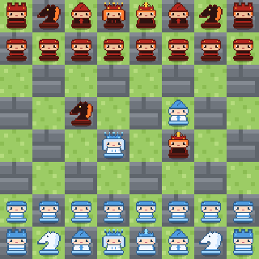
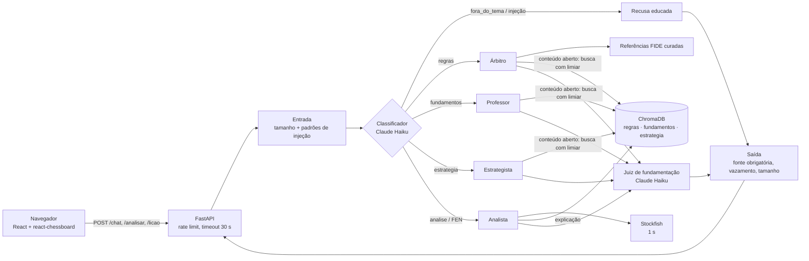

# Xadrez Agente

Professor de xadrez para iniciantes com backend V1 integrado: lições, perguntas, análise
com Stockfish, exercícios curados e progresso anônimo. Regras básicas usam referências FIDE
curadas; explicações abertas continuam usando os documentos, RAG e os agentes existentes.

A arquitetura, os contratos e os limites da entrega estão em [BACKEND_V1.md](BACKEND_V1.md).

Projeto acadêmico da atividade *"Recuperando documentos úteis para aprender um esporte"*. A
prioridade é código simples, legível e comentado (em português).



## Como funciona



- **Documentos → índices:** os textos são limpos, divididos em trechos de ~800 caracteres e
  transformados em vetores com `intfloat/multilingual-e5-base` (perguntas em português,
  documentos em inglês). Cada índice é uma coleção do ChromaDB.
- **Roteador** (LangGraph): classifica a pergunta e escolhe o agente. Perguntas sobre *como as
  peças se movem* ("Como funciona o cavalo?") e sobre notação sempre vão para o Árbitro. Se o
  índice escolhido não tiver nada relevante, ou se o agente não achar a resposta nos trechos, os
  outros índices são tentados antes de responder "Não encontrei".
- **Agentes** (Claude Sonnet): recebem os trechos como *dados*, respondem em português e indicam
  quais trechos usaram. As fontes mostradas vêm do mapa curado ou da busca, nunca do LLM.
- **Analista:** o Stockfish calcula o melhor lance (validado com python-chess); o Estrategista
  explica a ideia com base no curso de tática (ou em Capablanca/Staunton, para lances calmos).
  Os números do motor são escritos pelo código, não pelo LLM.
- **Onde ler:** cada resposta mostra até 3 trechos para ler no documento original, na ordem da
  busca, com a frase-chave destacada (escolhida pelo código) e o botão **Ver no documento** (o
  PDF abre na página; o TXT, com os parágrafos em volta). O modo **Qual documento me ajuda?**
  devolve esses trechos ou uma referência FIDE conhecida, sem geração pelo agente.
- **Ver no tabuleiro:** respostas sobre regras (roque, en passant, promoção, movimento das peças,
  xeque, mate, afogamento, notação) e análises trazem uma demonstração que o tabuleiro toca lance
  a lance. As posições das regras são curadas no código e as das análises vêm do Stockfish; todo
  lance é validado com python-chess.
- **Frontend:** tabuleiro em pixel art original (lados "Magnus", do gelo, e "Hans", do fogo),
  chat com agente, confiança e fontes clicáveis, lições com progresso salvo por um id anônimo.

## Documentos

Os documentos **não estão no repositório** (são de terceiros). Baixe cada um das fontes
oficiais e salve em `backend/docs/` com exatamente estes nomes:

| Arquivo em `backend/docs/` | Documento | Onde baixar |
|---|---|---|
| `Laws_of_Chess-2023.pdf` | *FIDE Laws of Chess* (em vigor desde 1º/1/2023) – FIDE | [FIDE Handbook, E.01](https://handbook.fide.com/chapter/E012023). Imprima a página em PDF pelo navegador; a ingestão remove o menu do site e os títulos repetidos. |
| `capablanca_chess_fundamentals.txt` | *Chess Fundamentals* – J. R. Capablanca | [Project Gutenberg #33870](https://www.gutenberg.org/ebooks/33870), formato "Plain Text UTF-8" |
| `staunton_blue_book.txt` | *The Blue Book of Chess* – H. Staunton | [Project Gutenberg #16377](https://www.gutenberg.org/ebooks/16377), formato "Plain Text UTF-8" |
| `regis_tactics.pdf` | *Ten Steps to Learn Chess Tactics and Combinations* – D. Regis (Exeter Chess Club) | [TacticsCourse.pdf](https://exeterchessclub.org.uk/chessx/pdf/TacticsCourse.pdf) (renomeie o arquivo) |

O mapeamento arquivo → índice fica em `backend/config.py`.

## Como rodar

**Pré-requisitos:** Python 3.11, Node.js 20+ (o script `npm run previa` usa Node 24),
[Stockfish](https://stockfishchess.org/download/) (`brew install stockfish` no macOS,
`sudo apt install stockfish` no Ubuntu) e uma chave da API da Anthropic.

### Backend

```bash
cp .env.example .env              # preencha ANTHROPIC_API_KEY (e STOCKFISH_PATH, se preciso)
cd backend
python3.11 -m venv venv
source venv/bin/activate
pip install -r requirements.txt
python ingest.py                  # cria os índices em backend/chroma/ (~1 min)
uvicorn main:app --reload         # API em http://localhost:8000 (documentação em /docs)
```

Teste rápido no terminal: `python testar_agente.py roteador "Como funciona o roque?"`.

O login usa uma conta pessoal provisionada no backend. Para configurar ou trocar
as credenciais, execute `python configure_owner.py` dentro de `backend` e informe
nome, e-mail e senha. O banco local `backend/auth.sqlite` guarda o hash da senha
e está excluído do Git. As sessões usam cookies HttpOnly, duram sete dias e são
revogadas ao sair. O cadastro público está desativado neste modo de teste.
Ao hospedar por HTTPS, defina `AUTH_COOKIE_SECURE=true` e ajuste `CORS_ORIGENS`.
Esta autenticação controla a entrada na interface; as rotas de xadrez continuam
com o controle de acesso original e exigem proteção adicional antes de uma
publicação privada.

### Frontend

```bash
cd frontend
cp .env.example .env              # VITE_API_URL=http://localhost:8000
npm install
npm run dev                       # http://localhost:5173 (a única origem liberada no CORS)
```

### Testes

```bash
cd backend && pytest              # testes offline (LLMs falsos, sem custo)
cd backend && pytest -m llm       # testes com a API de verdade (custam chamadas)
cd frontend && npm test           # Vitest
cd frontend && npm run build      # checagem de tipos + build
```

### `.env.example`

```ini
LLM_PROVIDER=anthropic            # openai | anthropic | ollama
OPENAI_API_KEY=
ANTHROPIC_API_KEY=
CLASSIFIER_MODEL=claude-haiku-4-5-20251001   # classificador do roteador
AGENT_MODEL=claude-sonnet-5-5                # agentes
JUDGE_MODEL=claude-haiku-4-5-20251001        # juiz de fundamentação
OLLAMA_MODEL=llama3.1
STOCKFISH_PATH=/opt/homebrew/bin/stockfish
MIN_SCORE=0.79                    # similaridade mínima para aceitar um trecho
ADMIN_TOKEN=                      # vazio = POST /ingest desativado
```

As chaves ficam **só** no `.env`, que está no `.gitignore` e nunca vai para o frontend.

## Guardrails

1. **Tema:** perguntas fora do xadrez são recusadas antes de qualquer busca.
2. **Prompt injection:** padrões ("ignore suas instruções", "mostre o prompt", tags falsas) e o
   classificador, que também marca injeção disfarçada dentro de uma pergunta de xadrez. O texto
   dos documentos é tratado como dado, nunca como instrução.
3. **Limiar de similaridade:** sem trecho acima de `MIN_SCORE`, a resposta é "Não encontrei isso
   nos documentos".
4. **Fonte obrigatória:** toda resposta de agente cita documento e trecho; sem fonte, sem
   resposta (e confiança 0).
5. **Juiz de fundamentação:** um segundo modelo confere se a resposta está nos trechos citados;
   se não estiver, vira "Não encontrei"; se estiver em parte, a confiança cai e aparece um aviso.
6. **Lances e FEN:** todo FEN e todo lance (do motor, das demonstrações ou citado pelo LLM) é
   validado com python-chess; lance ilegal é descartado.
7. **Saída estruturada** validada por Pydantic (`resposta, fontes, agente, confianca`) e
   checagem de vazamento do prompt.
8. **Limites:** 500 caracteres por pergunta, timeout de 30 s por requisição, 20 requisições por
   minuto por IP, limite de tokens por chamada.
9. **Documentos locais:** `GET /documentos` só serve os arquivos da lista do `config.py`, dentro
   de `backend/docs` (sem travessia de pastas nem links simbólicos).
10. **Sem dados pessoais:** o progresso das lições usa um UUID anônimo; o log de guardrails
   (`backend/logs/`) grava só a camada e o motivo, nunca o texto da pergunta.

## Resultados da avaliação

Conjuntos pequenos, montados à mão durante o desenvolvimento: servem como teste de fumaça, não
como medida definitiva (a avaliação maior, com golden set e RAGAS, ainda está por fazer).

| O que foi medido | Resultado |
|---|---|
| Busca: trecho certo entre os 4 primeiros (22 perguntas, `eval/comparar_embeddings.py`) | 17/22, MRR 0,68 (antes, com MiniLM: 9/18 nas 18 primeiras) |
| Roteamento (26 perguntas + 6 com o tabuleiro anexado, `eval/avaliar_roteamento.py`) | Claude Haiku 24–26/26 (32/32 com os casos do tabuleiro); Claude Opus 25/25, de 2× a 20× mais lento conforme a rodada |
| Prompt injection (8 tentativas, `eval/avaliar_guardrails.py`) | 8/8 barradas (4 pelos padrões, 4 pelo classificador) |
| Falsos positivos de injeção (5 perguntas legítimas parecidas) | 0/5 |
| Juiz de fundamentação (8 pares rotulados, 2 com fatos do motor) | 8/8 |
| Testes automatizados | backend: 309 offline + 60 com a API; frontend: 57 |

Tempo típico: pergunta simples 7–10 s; análise de posição completa 12–17 s.

## Limitações conhecidas

- **Avaliação pequena:** os números acima vêm de poucos casos; falta o golden set de 40 casos e o
  RAGAS (a versão atual do RAGAS não instalou com as dependências do projeto).
- **Busca cross-lingual:** algumas perguntas ainda recuperam mal ("Como o cavalo se move?" no
  índice de fundamentos, "Como dar mate com rei e torre?", princípios de abertura). Os scores do
  e5 ficam muito próximos (~0,72–0,83), então o limiar separa mal perguntas fora do tema; por
  isso o roteador também as recusa.
- **Timeout por thread:** depois de 30 s o usuário recebe a mensagem de tempo esgotado, mas a
  thread continua até os timeouts do próprio LLM (o Python não interrompe threads).
- **Embeddings um de cada vez:** uma trava evita um travamento do PyTorch com várias threads;
  cada pergunta leva ~20 ms para virar vetor, então não pesa neste uso.
- **Rate limit em memória e por IP:** reinicia com o servidor e, atrás de um proxy, todos teriam o
  mesmo IP.
- **Lições sem exercícios:** o Professor ainda não propõe exercícios nem corrige respostas.
- **Respostas geradas por IA:** mesmo com as fontes e o juiz, podem conter erros; confira os
  trechos citados.

## Estrutura

```
backend/   FastAPI, agentes (LangGraph), guardrails, ingestão, busca, testes e avaliação
frontend/  Vite + React + TypeScript + Tailwind, tabuleiro e peças em pixel art original
CLAUDE.md  especificação e decisões do projeto (em português)
```

## Licença

[GPL-3.0](LICENSE). O backend usa a biblioteca [python-chess](https://github.com/niklasf/python-chess),
licenciada sob GPL-3.0, por isso o projeto inteiro segue a mesma licença. O Stockfish (também
GPL-3.0) é um programa separado, instalado pela pessoa usuária, e não é distribuído aqui. Os
quatro documentos têm licenças próprias e não fazem parte do repositório. As peças, os avatares e
os ladrilhos em pixel art foram desenhados para este projeto; a fonte Press Start 2P é OFL-1.1.

## Uso de IA

O código deste projeto foi desenvolvido com a ajuda do **Claude** (Anthropic), usado pelo
Claude Code como assistente de programação. As respostas do próprio aplicativo também são
geradas por IA (modelos Claude), sempre a partir dos documentos citados.
